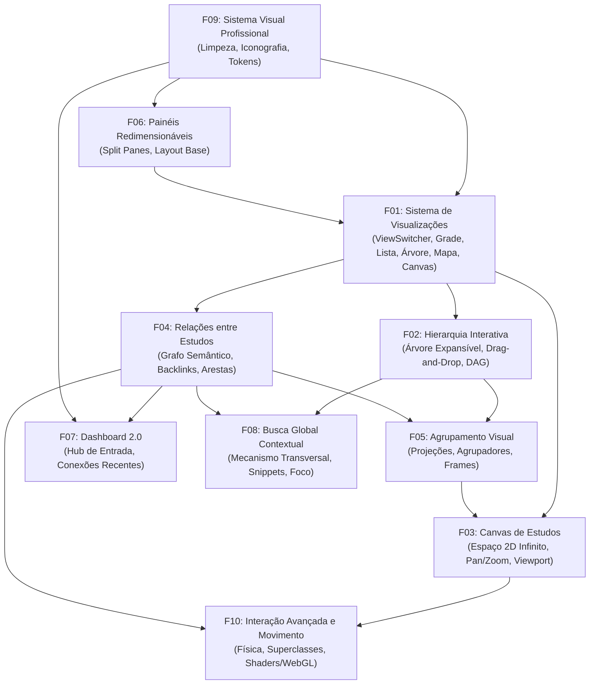

# Roadmap 0.4 — Visualização, Navegação Espacial e Interação do Conhecimento

**Data oficial de emissão:** 2026-09-19  
**Status do Roadmap:** Planejado para desenvolvimento com o GitHub Spec Kit (`speckit`).  
**Regra Geral de Estado:** Todas as dez features (**F01 a F10**) estão estritamente **NÃO INICIADAS**.  
Nenhum código experimental, componente preliminar ou rascunho anterior altera o status de qualquer entrega deste roadmap. O avanço ocorre somente através de ciclos delimitados do fluxo Spec Kit (`speckit-specify` → `speckit-clarify` → `speckit-plan` → `speckit-tasks` → `speckit-analyze` → `speckit-implement`).

---

## 1. Objetivos da Versão 0.4 e Princípios de Arquitetura

A versão **0.3** consolidou a infraestrutura fundamental de integridade, gestão de dados e persistência do Caderno de Leitura: lixeira e soft-delete transacional, taxonomia com categorias hierárquicas, capas físicas persistentes, dashboard analítico com timeline e heatmap de leitura, controle de concorrência otimista (HTTP 409), motor de superclasses de interface e backup universal em ZIP com restauração e rollback seguro.

A versão **0.4** tem como propósito transformar a experiência de exploração intelectual do leitor, elevando a aplicação de um repositório organizado de fichamentos para um **ambiente dinâmico de navegação espacial, conexões semânticas transversais e visualização multifacetada do conhecimento**.

### Princípios Fundamentais da Versão 0.4

1. **Separação Canônica de Responsabilidades (O Quadrilátero do Conhecimento):**
   - **Estrutura (Dados Canônicos):** A árvore real de dados persiste a hierarquia fundamental (Livro → Capítulo → Estudo, e estudos filhos via auto-relacionamento). A estrutura define posse e paternidade.
   - **Relações (Grafo Semântico):** Conexões conceituais transversais e independentes de capítulos ou livros (ex.: *complementa*, *contradiz*, *depende de*). Relações não alteram a posse hierárquica.
   - **Agrupamentos (Projeções Visuais):** Arranjos lógicos ou espaciais temporários ou persistidos (por categoria, livro, status, data, cluster semântico ou caixas livres). Agrupamentos não duplicam nem modificam registros.
   - **Visualizações (Renderers e Projeções):** Mecanismos de apresentação da informação (Grade, Lista, Árvore, Mapa, Canvas). A troca de visualização nunca altera o estado dos dados subjacentes.

2. **Liberdade de Perspectiva (Zero Imposição):**
   - O usuário escolhe livremente como deseja enxergar seus estudos em qualquer instante. Nenhuma visualização é mandatória. A alternância entre modos de visualização preserva o nó em foco e a continuidade da leitura.

3. **Desacoplamento entre Espaço e Semântica:**
   - Coordenadas espaciais 2D (x, y, zoom, dimensões de nós no Canvas) são metadados de layout de visualização. Mover um nó no Canvas não quebra sua relação de parentesco estrutural nem seus vínculos conceituais.

4. **Sobriedade e Rigor Intelectual:**
   - A interface comunica foco no pensamento crítico e no estudo aprofundado. Emojis informais são substituídos por iconografia técnica padronizada. Alusões residuais a "respostas de IA" são erradicadas, priorizando conceitos editoriais e de fichamento humano.

5. **Responsividade Tátil e Acessibilidade:**
   - Todas as visualizações e interações espaciais são concebidas tanto para o ambiente de mesa (mouse, trackpad, telas amplas) quanto para telas sensíveis ao toque (smartphones e tablets), com fallbacks ergonômicos e suporte integral a leitores de tela e preferências de redução de movimento.

---

## 2. O que NÃO faz parte da Versão 0.4

Para garantir foco absoluto na navegação espacial, nas relações e na estabilidade do sistema, os seguintes temas estão **expressamente fora de escopo** da versão 0.4:

- **Modo Foco / Modo Leitura Distraction-Free:** Descartado integralmente. A interface de leitura existente (com seus seletores de tamanho e tipografia) atende às necessidades de leitura contínua.
- **Atalhos Globais de Teclado e Command Palette (Ctrl+K / Spotlight):** Descartados nesta versão. O foco de interação da 0.4 é visual, espacial e tátil. A busca é tratada exclusivamente como uma ferramenta transversal contextual (F08).
- **Imposição de Visualização Única:** Nenhuma visão será imposta ao usuário como padrão fixo e irreversível.
- **Métricas Artificiais ou Gamificação:** O dashboard 2.0 (F07) não conterá contadores de pontuação, metas artificiais ou streaks fictícios; ater-se-á aos dados reais de leitura e estudo.
- **Automação por IA / Chamadas de LLM em Tempo de Execução:** A versão 0.4 foca na organização visual humana do material já catalogado.

---

## 3. Quadro Oficial de Status das Features

| ID | Feature | Descrição Resumida | Status |
| :--- | :--- | :--- | :--- |
| **F01** | **Sistema de Visualizações** | Grade, Lista, Árvore, Mapa e Canvas intercambiáveis com persistência de contexto | **NÃO INICIADA** |
| **F02** | **Hierarquia Interativa** | Árvore expansível, drag-and-drop de reordenação/aninhamento e prevenção de ciclos | **NÃO INICIADA** |
| **F03** | **Canvas de Estudos** | Espaço livre bidimensional (2D) infinito com pan, zoom, seleção e coordenadas isoladas | **NÃO INICIADA** |
| **F04** | **Relações entre Estudos** | Grafo semântico transversal (complementa, contradiz, depende de) com backlinks | **NÃO INICIADA** |
| **F05** | **Agrupamento Visual** | Projeções modulares: manual, hierarquia, categoria, livro, status, data e cluster | **NÃO INICIADA** |
| **F06** | **Painéis Redimensionáveis** | Split panes reativos ajustáveis com persistência e adaptação mobile via gavetas | **NÃO INICIADA** |
| **F07** | **Dashboard 2.0** | Hub de navegação e entrada real com blocos dinâmicos e conexões recentes | **NÃO INICIADA** |
| **F08** | **Busca Global Contextual** | Mecanismo transversal de busca com destaque contextual de termos e navegação direta | **NÃO INICIADA** |
| **F09** | **Sistema Visual Profissional** | Design sóbrio, substituição de emojis por iconografia vetorial e erradicação de rótulos de IA | **NÃO INICIADA** |
| **F10** | **Interação Avançada e Movimento** | Física inercial, shaders/WebGL para grafos densos e aceleração por Superclasses | **NÃO INICIADA** |

---

## 4. Especificações Detalhadas das Features (F01 a F10)

---

### F01 — Sistema de Visualizações

#### 1. Objetivo
Prover ao leitor uma barra de controle de visualização coesa e acessível que permita alternar instantaneamente entre cinco modos fundamentais de exploração dos estudos: **Grade**, **Lista**, **Árvore**, **Mapa** e **Canvas**, mantendo o contexto atual do leitor e o estudo em foco.

#### 2. Problema que resolve
Atualmente, os estudos e livros do acervo são consumidos predominantemente em modos bidimensionais estáticos (grade de livros e lista de capítulos/estudos), limitando a compreensão de obras densas que exigem visão topológica, relacional ou espacial.

#### 3. Comportamento esperado
- Uma barra de controle de visualizações (*ViewSwitcher*) é exibida no topo das telas de exploração (acervo e livro).
- O leitor clica ou toca em um ícone de visualização e a área principal de conteúdo transita suavemente para o renderer correspondente sem recarregar a página.
- Se o usuário estiver com um estudo selecionado, a transição para a nova visualização localiza e destaca automaticamente esse mesmo estudo.
- A visualização preferida por livro ou contexto global é salva localmente e restaurada no próximo acesso.

#### 4. Escopo detalhado
- Implementação dos 5 modos de visualização como renderers plugáveis:
  1. *Grade:* Apresentação em cards com ênfase visual, capas e resumos.
  2. *Lista:* Apresentação compacta e tabular com alta densidade de informação.
  3. *Árvore:* Apresentação em nós colapsáveis com hierarquia visual clara (base para F02).
  4. *Mapa:* Projeção em rede bidimensional com conexões semânticas (base para F04).
  5. *Canvas:* Espaço infinito livre para exploração espacial (base para F03).
- Componente seletor de visualização responsivo com ícones padronizados (F09).
- Rastreamento e sincronização do nó ativo (*activeStudyId*) entre as visões.

#### 5. Não-escopo
- Edição de posições espaciais livres dentro do modo Canvas (pertence à F03).
- Reordenação hierárquica por drag-and-drop na Árvore (pertence à F02).
- Criação de novas visualizações não especificadas (ex.: timeline tridimensional ou diagramas de Venn).

#### 6. Componentes e arquitetura
- Frontend:
  - `components/views/ViewSwitcher.vue`: Barra seletora de visualização.
  - `components/views/StudyGridView.vue`: Renderer do modo Grade.
  - `components/views/StudyListView.vue`: Renderer do modo Lista.
  - `components/views/StudyTreeView.vue`: Renderer do modo Árvore (placeholder inicial integrável com F02).
  - `components/views/StudyMapView.vue`: Renderer do modo Mapa (integrável com F04).
  - `components/views/StudyCanvasView.vue`: Renderer do modo Canvas (integrável com F03).
  - `composables/useViewPreference.ts`: Composable reativo para gestão e persistência do modo selecionado.

#### 7. Impacto no banco de dados
Nenhum impacto direto no banco de dados nesta feature. A preferência é gerida primariamente via armazenamento de sessão e local no navegador.

#### 8. Impacto na API
Nenhum novo endpoint é estritamente necessário; reutilizam-se os endpoints existentes de recuperação de livros e estudos (`GET /api/books/{id}`, `GET /api/studies/{id}`).

#### 9. Impacto no frontend
Criação da pasta `src/components/views/` para isolamento dos renderers, refatoração de `BookView.vue` para hospedar o `ViewSwitcher` e dinamizar a área de conteúdo via componentes dinâmicos do Vue (`<component :is="...">`).

#### 10. Persistência e estado
A preferência de visualização é armazenada em `localStorage` sob a chave `caderno_preferred_view_{bookId}` com fallback para a chave global `caderno_default_view`.

#### 11. Adaptação desktop vs celular
No desktop, o seletor exibe ícones acompanhados de rótulos de texto. Em dispositivos móveis, exibe ícones compactos em uma barra horizontal de toque fácil (mínimo de 44px de área de toque) ou em um menu suspenso nativo quando o espaço for inferior a 360px.

#### 12. Acessibilidade e ergonomia
O seletor deve utilizar a estrutura semântica de `role="tablist"` com `role="tab"` e atributos `aria-selected` adequados. A navegação entre abas via setas do teclado (Esquerda/Direita) deve ser suportada.

#### 13. Critérios de aceite
- [ ] O usuário consegue alternar entre Grade, Lista, Árvore, Mapa e Canvas através de um seletor visual coeso.
- [ ] A troca de visualização preserva o estudo atualmente selecionado ou inspecionado.
- [ ] A preferência de visualização é persistida no `localStorage` por livro e restaurada ao reabrir a obra.
- [ ] Nenhuma visualização quebra a renderização ou causa overflow horizontal involuntário na janela.
- [ ] O layout responde fluidamente em resoluções de desktop (1920x1080, 1366x768) e smartphones (375x667, 390x844).

#### 14. Dependências técnicas
- Conclusão da base visual profissional (F09) para iconografia sóbria.
- Integração prévia com `BookView.vue` existente da versão 0.3.

#### 15. Riscos e armadilhas
- *Overhead de montagem/desmontagem de componentes pesados:* Se a troca de visualização reconstruir a árvore inteira do DOM sem reaproveitamento, pode haver travamentos em livros com centenas de estudos. Solução: utilizar `v-show` ou manter em cache o estado reativo dos estudos.

#### 16. Perguntas essenciais para o `/speckit-specify`
1. A preferência de visualização deve ser estritamente por livro ou global para toda a aplicação?
2. Como a visualização deve se comportar caso um modo ainda não tenha dados suficientes (ex.: Mapa de relações quando nenhuma relação foi cadastrada)?

---

### F02 — Hierarquia Interativa

#### 1. Objetivo
Permitir que os estudos de um capítulo ou livro sejam estruturados em uma árvore hierárquica autêntica (estudos pais e estudos filhos), com navegação expansível/colapsável e reorganização por drag-and-drop com proteção matemática contra ciclos.

#### 2. Problema que resolve
Atualmente, no modelo da 0.3, todo `Study` vincula-se unicamente a um `chapter_id`. Não existe relação de paternidade entre estudos: teses principais, argumentos secundários e citações de apoio ficam achatados em uma lista linear, impedindo a síntese visual de raciocínios complexos.

#### 3. Comportamento esperado
- Na visualização em Árvore, os estudos exibem setas de expansão/colapso (`chevron`) ao lado do título.
- O usuário pode arrastar um estudo (ou grupo de estudos) para dentro de outro estudo para torná-lo filho, ou entre dois estudos para reordená-lo na mesma camada.
- A interface impede visualmente que um nó seja solto dentro de si mesmo ou dentro de qualquer um dos seus próprios descendentes (prevenção de ciclos em tempo real).
- O backend rejeita com código HTTP 422 qualquer tentativa de criar referências circulares de paternidade.

#### 4. Escopo detalhado
- Adição da coluna `parent_study_id` na tabela `studies` (chave estrangeira anulável com auto-relacionamento).
- Adição da coluna `position` na tabela `studies` para ordenação estável entre irmãos.
- Migração Alembic segura para o schema existente.
- Algoritmo de validação de grafo acíclico dirigido (DAG) no backend antes de persistir o novo pai.
- Biblioteca leve ou implementação nativa de drag-and-drop (HTML5 Drag and Drop ou Pointer Events) otimizada para árvores aninhadas.
- Persistência do estado de nós expandidos/colapsados em `localStorage`.

#### 5. Não-escopo
- Multi-paternidade (um estudo ter múltiplos pais estruturais). Isso pertence ao grafo semântico de relações (F04), mantendo a hierarquia estritamente como árvore simples.
- Movimentação de estudos entre livros distintos por drag-and-drop.

#### 6. Componentes e arquitetura
- Backend:
  - `app/models/study.py`: Evolução do modelo com `parent_study_id` e `position`.
  - `app/schemas/study.py`: Atualização dos esquemas com `parent_study_id` e lista de `children`.
  - `app/services/study_service.py`: Método `reorder_and_nest_study()` com verificação em profundidade (DFS) contra ciclos.
- Frontend:
  - `components/views/StudyTreeView.vue`: Componente contêiner da árvore.
  - `components/views/StudyTreeNode.vue`: Componente recursivo de nó da árvore com drag handle e drop indicators.
  - `composables/useTreeDragDrop.ts`: Composable responsável pela matemática de arrasto e cálculo de drop zones.

#### 7. Impacto no banco de dados
- Tabela `studies`:
  - `parent_study_id`: `INTEGER NULL REFERENCES studies(id) ON DELETE SET NULL`
  - `position`: `INTEGER NOT NULL DEFAULT 0`
  - Índices: `ix_studies_parent_study_id` e `ix_studies_chapter_parent_position`.

#### 8. Impacto na API
- `PATCH /api/studies/{id}/hierarchy`: Endpoint específico para alterar paternidade e posição.
  - Payload: `{ "parent_study_id": int | null, "target_position": int }`
  - Erros: HTTP 409 (conflito de concorrência via `updated_at`), HTTP 422 (tentativa de ciclo acíclico violado).

#### 9. Impacto no frontend
Implementação de renderização recursiva no Vue 3 (`StudyTreeNode` chamando a si mesmo para renderizar `children`), mantendo os IDs de elementos estáveis para transições de drag-and-drop sem flickering.

#### 10. Persistência e estado
A estrutura hierárquica é persistida no banco de dados SQLite. O estado visual de expansão (quais nós estão abertos ou fechados) é mantido em `localStorage` para não poluir o banco do usuário.

#### 11. Adaptação desktop vs celular
No desktop, a reordenação opera via drag-and-drop com mouse e indicação visual de linha de inserção. Em dispositivos móveis (touch), além do arrasto por toque com long-press, são disponibilizados botões de ação acessíveis no menu do estudo ("Recuar nó", "Promover nó", "Mover para cima", "Mover para baixo").

#### 12. Acessibilidade e ergonomia
Os nós da árvore utilizam `role="tree"` e `role="treeitem"`, com atributos `aria-expanded` para nós que possuem filhos. Suporte às teclas direcionais: Seta para Direita expande o nó, Seta para Esquerda colapsa, Cima/Baixo navegam verticalmente.

#### 13. Critérios de aceite
- [ ] Um estudo pode ser transformado em filho de outro estudo via interface visual e ter sua posição persistida.
- [ ] É impossível transformar um estudo pai em filho de um descendente seu (ciclo impedido no frontend e rejeitado pelo backend).
- [ ] O estado expandido/colapsado dos nós é preservado após recarregar a página.
- [ ] Excluir um estudo pai (soft delete) lida de forma consistente com os filhos (ocultação cascateada na árvore sem orfandade de banco).
- [ ] Usuários móveis conseguem reorganizar a hierarquia via toque ou ações contextuais sem dependência exclusiva de mouse.

#### 14. Dependências técnicas
- F01 (Árvore como um dos modos de visualização).
- Primitiva de concorrência e integridade da versão 0.3 (bloqueio otimista HTTP 409 na atualização de registros).

#### 15. Riscos e armadilhas
- *Condição de corrida na reordenação:* Dois dispositivos alterando a ordem simultaneamente podem dessincronizar o índice de `position`. Solução: usar transações explícitas no SQLite e recalcular posições em lote via CTE (Common Table Expression).

#### 16. Perguntas essenciais para o `/speckit-specify`
1. O que acontece com os filhos quando um estudo pai é enviado para a lixeira? Devem ser ocultados juntos ou promovidos para a raiz do capítulo?
2. Há limite máximo de profundidade de aninhamento (ex.: máximo 5 níveis) para prevenir layouts ininteligíveis?

---

### F03 — Canvas de Estudos

#### 1. Objetivo
Disponibilizar um espaço bidimensional infinito e livre (*spatial canvas*) onde os estudos de uma obra ou tópico possam ser organizados espacialmente pelo leitor através de coordenadas livres, com navegação por pan (arrasto de viewport), zoom fluido e seleção de blocos.

#### 2. Problema que resolve
O pensamento analítico e a leitura ativa muitas vezes não se encaixam em listas ou árvores verticais rígidas. O leitor precisa correlacionar anotações distantes lado a lado, criar blocos conceituais e organizar visualmente a topografia de um argumento.

#### 3. Comportamento esperado
- O leitor acessa a visualização Canvas e encontra uma área infinita quadriculada (ou pontilhada conforme a Superclasse ativa).
- O leitor pode navegar pelo espaço arrastando o fundo com o botão do mouse ou usando dois dedos no trackpad/celular (pan) e aproximar/afastar a visualização via scroll ou pinça (zoom).
- Cada estudo é renderizado como um card flutuante que pode ser arrastado para qualquer coordenada (x, y).
- Mover um estudo no Canvas **NÃO** altera seu capítulo nem sua paternidade na Árvore; as coordenadas são puramente espaciais.

#### 4. Escopo detalhado
- Motor de viewport bidimensional reativo (cálculo de matriz de transformação CSS `matrix()` ou `translate3d + scale`).
- Suporte a seleção simples e seleção múltipla por área retangular (*marquee selection*).
- Controles de zoom na tela (+, -, reset para 100%, centralizar em todos os nós).
- Mini-mapa de navegação (*radar view*) no canto inferior com indicação da janela de visão atual.
- Persistência das coordenadas (x, y, largura, altura, z-index) de cada nó associado ao estudo.

#### 5. Não-escopo
- Conexões semânticas com setas rotuladas desenhadas entre os nós (pertence à F04).
- Ferramenta de desenho livre vetorial à mão livre (caneta/lápis) no canvas.
- Colaboração multiusuário em tempo real via WebSockets.

#### 6. Componentes e arquitetura
- Frontend:
  - `components/views/StudyCanvasView.vue`: Contêiner do viewport com listeners de Pointer Events e Wheel.
  - `components/views/canvas/CanvasNode.vue`: Card de estudo posicionado absolutamente no espaço do canvas.
  - `components/views/canvas/CanvasMinimap.vue`: Mini-mapa interativo de orientação espacial.
  - `components/views/canvas/CanvasToolbar.vue`: Barra de ferramentas (zoom in/out, fit to view, grade).
  - `composables/useCanvasViewport.ts`: Gestão de coordenadas mundiais vs coordenadas de tela, pan, zoom e inércia.
  - `composables/useCanvasSelection.ts`: Gestão de nós selecionados e arrasto em lote.

#### 7. Impacto no banco de dados
- Criação da tabela `study_canvas_nodes`:
  - `id`: `INTEGER PRIMARY KEY`
  - `study_id`: `INTEGER NOT NULL REFERENCES studies(id) ON DELETE CASCADE`
  - `book_id`: `INTEGER NOT NULL REFERENCES books(id) ON DELETE CASCADE`
  - `pos_x`: `FLOAT NOT NULL DEFAULT 0.0`
  - `pos_y`: `FLOAT NOT NULL DEFAULT 0.0`
  - `width`: `FLOAT NULL`
  - `height`: `FLOAT NULL`
  - `z_index`: `INTEGER NOT NULL DEFAULT 0`
  - `color_tag`: `TEXT NULL`
  - `updated_at`: `DATETIME NOT NULL`
  - Índice: `ix_canvas_nodes_book_study` (único por estudo e livro).

#### 8. Impacto na API
- `GET /api/books/{id}/canvas`: Retorna todos os nós e coordenadas espaciais dos estudos do livro.
- `PUT /api/books/{id}/canvas`: Atualização em lote de posições de nós (`[{ study_id, pos_x, pos_y, z_index }]`).

#### 9. Impacto no frontend
Isolamento do loop de renderização do canvas através de aceleração por GPU (`will-change: transform`), garantindo taxa de 60fps durante pan e zoom mesmo com dezenas de nós em tela.

#### 10. Persistência e estado
As posições dos nós são persistidas no banco de dados via API. O estado do viewport (último zoom e deslocamento x/y de pan do leitor) é salvo no `localStorage` sob `caderno_canvas_viewport_{bookId}` para que o leitor retome a visualização exatamente de onde parou.

#### 11. Adaptação desktop vs celular
No desktop, navegação com mouse (arrasto de tela, scroll wheel para zoom, arrasto de cards com cursor de movimento). Em dispositivos móveis, suporte a gestos multitoque padrão: um dedo arrasta cards ou navega se tocar no fundo; gesto de pinça (*pinch-to-zoom*) ajusta a escala suavemente; botões fixos de zoom auxiliam o controle com uma só mão.

#### 12. Acessibilidade e ergonomia
O Canvas oferece um modo de lista/grade acessível alternativo imediato (F01). Usuários de teclado podem navegar entre nós com Tab e movê-los no espaço usando Shift + Setas direcionais.

#### 13. Critérios de aceite
- [ ] O usuário consegue navegar no canvas com pan e zoom contínuos sem perda de nitidez ou congelamento do navegador.
- [ ] Cards de estudos podem ser movidos livremente e suas posições persistem após recarregar a página.
- [ ] O botão "Ajustar à Tela" (*Fit to View*) reposiciona o viewport centralizando todos os nós existentes.
- [ ] As coordenadas do canvas não interferem na hierarquia da Árvore nem na ordem de capítulos.
- [ ] A navegação por toque em smartphones (pan e pinch-to-zoom) é fluida e não interfere no scroll nativo da página fora do canvas.

#### 14. Dependências técnicas
- F01 (Canvas integrado como renderer selecionável).
- T09 da versão 0.3 (migração limpa de banco para `study_canvas_nodes`).

#### 15. Riscos e armadilhas
- *Degradação de performance por acúmulo de nós no DOM:* Mais de 200 estudos com conteúdo denso renderizados simultaneamente no Canvas podem causar perda de frames. Solução: técnica de *viewport culling* (ocultar conteúdo de nós fora dos limites visíveis do viewport).

#### 16. Perguntas essenciais para o `/speckit-specify`
1. Quando um novo estudo é criado sem coordenadas prévias, onde ele deve ser alocado no canvas (posição padrão em grade, centro da tela ou próximo ao capítulo)?
2. As coordenadas de canvas pertencem exclusivamente ao contexto de um livro ou podem existir telas de canvas transversais que misturam múltiplos livros?

---

### F04 — Relações entre Estudos

#### 1. Objetivo
Instituir uma malha semântica de conexões explícitas entre estudos, permitindo relacionar conceitos através de vínculos tipados e bidirecionais (ex.: *complementa*, *contradiz*, *depende de*, *mesmo tema*, *desdobramento*), independentemente de capítulos ou livros de origem.

#### 2. Problema que resolve
O conhecimento humano raramente é puramente hierárquico. Um estudo do Capítulo 5 pode refutar ou desdobrar uma premissa estabelecida no Capítulo 1 ou em outro livro. Sem relações semânticas, essas pontes intelectuais ficam invisíveis ou perdidas em anotações textuais dispersas.

#### 3. Comportamento esperado
- Dentro da visualização de um estudo (ou de seu painel lateral), existe uma seção "Relações e Conexões".
- O leitor pode clicar em "Adicionar Relação", selecionar outro estudo através de busca rápida e definir a natureza do vínculo (ex.: "contradiz" ou "complementa").
- Ao abrir o estudo de destino, o leitor vê automaticamente o vínculo reverso (*backlink* / referência cruzada).
- No modo Mapa (F01) e no Canvas (F03), as relações são renderizadas visualmente como linhas de conexão com rótulos semânticos e setas direcionais.

#### 4. Escopo detalhado
- Criação do modelo de dados de relações entre estudos com tipologia formal:
  - `relacionado_com` (simétrico/neutro)
  - `complementa` (direcional: origem adiciona argumentos ao destino)
  - `contradiz` (simétrico ou direcional: origem contesta o destino)
  - `depende_de` (direcional: origem requer o destino como pré-requisito)
  - `mesmo_tema` (simétrico: afinidade temática)
  - `desdobramento_de` (direcional: origem é consequência do destino)
- Campo opcional de anotação/justificativa textual da relação (`description`).
- Endpoints para criação, listagem e remoção transacional de relações.
- Componente de visualização de conexões e backlinks dentro da tela de leitura e edição.
- Projeção das arestas relacionais no modo Mapa.

#### 5. Não-escopo
- Inferência automatizada de relações via análise semântica de IA (a catalogação é estritamente manual e deliberada pelo leitor).
- Grafo de ontologia complexa com lógica de primeira ordem ou inferência OWL/RDF.

#### 6. Componentes e arquitetura
- Backend:
  - `app/models/study_relation.py`: Modelo SQLAlchemy com chaves estrangeiras duplas para `studies`.
  - `app/schemas/study_relation.py`: Pydantic schemas com validação de tipos de relação permitidos.
  - `app/services/study_relation_service.py`: Lógica de integridade e consultas de backlinks.
  - `app/api/routers/study_relations.py`: Router REST com operações CRUD.
- Frontend:
  - `components/relations/StudyRelationsList.vue`: Exibição de vínculos ativos e backlinks.
  - `components/relations/CreateRelationModal.vue`: Modal para conectar estudos com busca rápida e seleção de tipo.
  - `components/views/StudyMapView.vue`: Renderização do grafo bidimensional de relações.

#### 7. Impacto no banco de dados
- Criação da tabela `study_relations`:
  - `id`: `INTEGER PRIMARY KEY`
  - `source_study_id`: `INTEGER NOT NULL REFERENCES studies(id) ON DELETE CASCADE`
  - `target_study_id`: `INTEGER NOT NULL REFERENCES studies(id) ON DELETE CASCADE`
  - `relation_type`: `TEXT NOT NULL` (CheckConstraint validando os tipos aceitos)
  - `description`: `TEXT NOT NULL DEFAULT ''`
  - `created_at`: `DATETIME NOT NULL DEFAULT CURRENT_TIMESTAMP`
  - Constraints: `CheckConstraint("source_study_id != target_study_id", name="no_self_relation")`
  - Índice único: `ux_study_relations_source_target_type` em `(source_study_id, target_study_id, relation_type)`.
  - Índice reverso: `ix_study_relations_target` para rápida resolução de backlinks.

#### 8. Impacto na API
- `GET /api/studies/{id}/relations`: Retorna relações ativas de saída e backlinks de entrada.
- `POST /api/studies/{id}/relations`: Cria uma nova conexão semântica.
- `DELETE /api/studies/{id}/relations/{relation_id}`: Remove uma conexão semântica existente.

#### 9. Impacto no frontend
Integração com o painel lateral de contexto (F06) e emissão de eventos reativos para atualizar linhas no Canvas (F03) e Mapa (F01).

#### 10. Persistência e estado
Todas as relações são persistidas de forma relacional estrita no SQLite, com integridade referencial total e remoção em cascata caso um dos estudos seja excluído definitivamente.

#### 11. Adaptação desktop vs celular
No desktop, visualização completa em painel lateral dedicado com preview flutuante do estudo conectado ao passar o cursor sobre o link. No celular, os vínculos aparecem como cards expansíveis no rodapé do estudo, abrindo o estudo conectado em uma gaveta sobreposta (*bottom sheet*).

#### 12. Acessibilidade e ergonomia
Os links relacionais são elementos de âncora ou botões acessíveis com textos descritivos explícitos (ex.: "Estudo X complementa Estudo Y: [Título do Estudo Y]").

#### 13. Critérios de aceite
- [ ] O leitor consegue criar uma relação semântica tipada entre dois estudos quaisquer e adicionar uma nota explicativa.
- [ ] Relações são visíveis tanto a partir do estudo de origem quanto no estudo de destino (backlink automático).
- [ ] É proibido conectar um estudo a si mesmo (rejeição no backend com 422 e prevenção no seletor do frontend).
- [ ] Se um estudo for movido para a lixeira (soft delete), suas relações ficam ocultas mas não são destruídas; se restaurado, as relações reaparecem intactas.
- [ ] No modo Mapa, os estudos são exibidos como nós e as relações como arestas conectadas.

#### 14. Dependências técnicas
- Modelo `Study` estável da 0.3.
- F01 para o modo Mapa.

#### 15. Riscos e armadilhas
- *Consultas N+1 na listagem de estudos:* Buscar relações para cada estudo individualmente em listas grandes degrada a performance do banco. Solução: carregar relações em batch via junção (`joinedload` ou query agregada em um único passo).

#### 16. Perguntas essenciais para o `/speckit-specify`
1. Relações podem ser estabelecidas entre estudos de livros diferentes ou apenas dentro do mesmo livro na versão 0.4?
2. A remoção de uma relação exige confirmação explícita em modal ou apenas ação direta com notificação de desfecho?

---

### F05 — Agrupamento Visual

#### 1. Objetivo
Oferecer ao leitor a capacidade de projetar e reagrupar os estudos sob múltiplos critérios de visualização (manual, hierárquico, por categoria, por livro, por status de leitura, por data, por proximidade ou por cluster relacional) sem duplicar registros ou alterar a estrutura original dos dados.

#### 2. Problema que resolve
Um acervo de estudos organizado apenas pela ordem física dos capítulos do livro impede análises transversais. O leitor frequentemente quer enxergar todos os estudos que tratam de um tema específico, estudos pendentes de revisão ou estudos criados em um dado período, agrupados em blocos visuais claros.

#### 3. Comportamento esperado
- Um seletor de agrupamento (*GroupBy*) permite escolher o modelo de agrupamento ativo.
- Ao selecionar um agrupamento (ex.: "Por Categoria"), os estudos são reorganizados em seções visuais ou "raias" (*swimlanes*) correspondentes às categorias, mantendo suas informações intactas.
- No Canvas (F03), o agrupamento manual permite criar "caixas/molduras de agrupamento" (*frames*) coloridas onde o usuário arrasta nós para dentro.
- Ao restaurar o agrupamento padrão ("Por Capítulo"), a visão retorna à ordenação canônica do livro.

#### 4. Escopo detalhado
- Modelos de agrupamento suportados:
  1. *Manual:* Molduras/frames customizáveis criados pelo leitor no Canvas.
  2. *Hierárquico:* Agrupamento centrado nos estudos raiz e suas ramificações.
  3. *Por Categoria:* Agrupamento com base na taxonomia hierárquica herdada do livro/estudo (0.3).
  4. *Por Livro:* Agrupamento macro quando em visões transversais do acervo.
  5. *Por Status:* Agrupamento por estado de maturação (ex.: Fichamento Inicial, Em Aprofundamento, Concluído).
  6. *Por Data:* Agrupamento cronológico (Hoje, Esta Semana, Este Mês, Anteriores).
  7. *Por Relação:* Agrupamento de nós fortemente conectados por vínculos semânticos (F04).
  8. *Por Proximidade Espacial:* Agrupamento automático por densidade de nós no Canvas.
- Composable de ordenação e particionamento reativo no frontend.

#### 5. Não-escopo
- Criação de tabelas intermediárias no banco para agrupamentos efêmeros (apenas agrupamentos manuais de frames no canvas exigem persistência).
- Filtragem destrutiva de dados (agrupar não significa ocultar itens não agrupados; itens sem grupo ficam na seção "Outros" ou "Não categorizados").

#### 6. Componentes e arquitetura
- Frontend:
  - `components/views/GroupBySelector.vue`: Dropdown/botão de seleção do critério de agrupamento.
  - `components/views/GroupSection.vue`: Contêiner visual de grupo com cabeçalho, contagem de itens e colapso de seção.
  - `components/views/canvas/CanvasFrame.vue`: Moldura visual retangular no Canvas para agrupamento manual.
  - `composables/useStudyGrouping.ts`: Motor funcional de particionamento e ordenação de estudos baseado no critério ativo.

#### 7. Impacto no banco de dados
- Adição da coluna `reading_status` na tabela `studies` para viabilizar agrupamento por status:
  - `reading_status`: `TEXT NOT NULL DEFAULT 'draft'` (valores: `draft`, `in_progress`, `reviewed`, `archived`).
- Criação da tabela `canvas_frames` para persistência das molduras manuais do Canvas:
  - `id`: `INTEGER PRIMARY KEY`
  - `book_id`: `INTEGER NOT NULL REFERENCES books(id) ON DELETE CASCADE`
  - `title`: `TEXT NOT NULL`
  - `color`: `TEXT NOT NULL DEFAULT 'neutral'`
  - `pos_x`: `FLOAT NOT NULL`
  - `pos_y`: `FLOAT NOT NULL`
  - `width`: `FLOAT NOT NULL`
  - `height`: `FLOAT NOT NULL`

#### 8. Impacto na API
- `GET /api/books/{id}/canvas/frames`: Recupera as molduras visuais do livro.
- `POST /api/books/{id}/canvas/frames`: Cria uma nova moldura de agrupamento.
- `PATCH /api/studies/{id}/status`: Atualiza rapidamente o status de leitura do estudo.

#### 9. Impacto no frontend
O composable `useStudyGrouping` opera em memória com alta eficiência sobre a lista reativa de estudos, emitindo listas particionadas sem disparar refetches desnecessários na API.

#### 10. Persistência e estado
O critério de agrupamento selecionado na interface é salvo em `localStorage` por visualização (`caderno_groupby_{viewMode}`). Frames do canvas são salvos no banco SQLite.

#### 11. Adaptação desktop vs celular
No desktop, agrupamentos podem ser dispostos em colunas horizontais (estilo kanban) ou seções verticais expansíveis. No celular, os agrupamentos são apresentados estritamente como seções verticais com cabeçalhos aderentes (*sticky headers*) e contadores claros de itens.

#### 12. Acessibilidade e ergonomia
Cada grupo gerado é delimitado por uma tag semântica `<section>` com seu cabeçalho associado via `aria-labelledby`. O leitor pode expandir ou colapsar grupos inteiros via teclado usando a barra de espaço ou Enter no cabeçalho.

#### 13. Critérios de aceite
- [ ] O leitor pode alternar entre agrupamentos por Capítulo, Status, Categoria e Data na Grade e na Lista.
- [ ] Mudar o critério de agrupamento reordena a apresentação visual sem modificar os registros de estudo no banco.
- [ ] No Canvas, o leitor pode desenhar e nomear molduras (*frames*) visuais e mover nós para dentro delas.
- [ ] Itens sem correspondência no critério ativo são reunidos em uma seção clara de "Não classificados".
- [ ] O status de leitura do estudo pode ser atualizado diretamente a partir do cabeçalho de grupo ou card.

#### 14. Dependências técnicas
- F01 (Renderers de visualização).
- F03 (Para os frames espaciais do Canvas).
- F04 (Para o agrupamento por clusters relacionais).

#### 15. Riscos e armadilhas
- *Perda de nós no Canvas ao mudar de agrupador:* Agrupar não pode resetar as coordenadas manuais personalizadas do usuário no Canvas. As molduras e layouts automáticos devem ser comutáveis ou aplicados como sugestões sem sobrescrever coordenadas silenciosamente.

#### 16. Perguntas essenciais para o `/speckit-specify`
1. Quais devem ser os rótulos e valores oficiais do ciclo de status de estudos (`reading_status`)?
2. O agrupamento por status de leitura deve ser ativado por padrão ou ser apenas uma opção configurável?

---

### F06 — Painéis Redimensionáveis

#### 1. Objetivo
Estruturar a área de trabalho da aplicação com painéis laterais ajustáveis e redimensionáveis (*split panes*), separando Navegação/Árvore (esquerda), Área Principal de Leitura/Visualização (centro) e Inspetor de Metadados/Relações (direita), com limites físicos seguros e persistência de largura.

#### 2. Problema que resolve
Telas de tamanho fixo forçam o usuário a saltar continuamente entre páginas diferentes para consultar o índice, ler o conteúdo de um estudo e checar referências. Monitores amplos ficam subutilizados e telas compactas sofrem com poluição visual quando todos os controles estão abertos.

#### 3. Comportamento esperado
- A interface de leitura e visualização é dividida em três colunas:
  - *Painel Esquerdo (Navegador):* Lista de capítulos, árvore de estudos ou filtros.
  - *Painel Central (Palco Principal):* Área de leitura do estudo, canvas ou grade.
  - *Painel Direito (Inspetor/Contexto):* Metadados, conexões semânticas (F04) e anotações complementares.
- Entre os painéis, existe uma barra divisora sutil (*splitter/gutter*) que pode ser arrastada para redimensionar a largura das colunas.
- Cada painel possui botões de colapso rápido de um clique para maximizar a área de trabalho central.
- A largura de cada painel respeita limites mínimos (ex.: 240px) e máximos (ex.: 600px) para evitar layouts ilegíveis.

#### 4. Escopo detalhado
- Componente flexível de split layout em Vue 3 com suporte a múltiplos painéis e divisores redimensionáveis.
- Suporte a eventos de mouse (drag) e toque (touch) na barra divisora.
- Persistência das larguras customizadas no `localStorage`.
- Transições animadas suaves de colapso e expansão (respeitando a Superclasse ativa).
- Adaptação responsiva com colapso automático em resoluções inferiores a 1024px.

#### 5. Não-escopo
- Janelas flutuantes livres desvinculadas da tela (estilo janelas do sistema operacional Windows/macOS).
- Divisão arbitrária de painéis em grade matricial 4x4 (o sistema foca no layout canônico de 3 colunas: Navegação, Palco e Inspetor).

#### 6. Componentes e arquitetura
- Frontend:
  - `components/layout/SplitLayout.vue`: Contêiner geral que gerencia as proporções das colunas.
  - `components/layout/SplitPane.vue`: Painel individual com controle de largura mínima, máxima e estado colapsado.
  - `components/layout/SplitGutter.vue`: Barra de separação interativa com cursor de redimensionamento e indicadores táteis.
  - `composables/useSplitPanes.ts`: Gestão de largura, redimensionamento em tempo real e persistência de dimensões.

#### 7. Impacto no banco de dados
Nenhum impacto no banco de dados. Toda a geometria de layout de interface é de responsabilidade do cliente frontend.

#### 8. Impacto na API
Nenhum novo endpoint necessário.

#### 9. Impacto no frontend
Reestruturação do layout de `BookView.vue` e `StudyView.vue` para hospedar o `SplitLayout`, permitindo manter a árvore de navegação visível enquanto o estudo é lido ou editado no palco central.

#### 10. Persistência e estado
As larguras e o estado (aberto/fechado) dos painéis esquerdo e direito são gravados em `localStorage` sob a chave `caderno_pane_sizes_{viewContext}`.

#### 11. Adaptação desktop vs celular
- *Desktop (>= 1024px):* Os três painéis podem coexistir simultaneamente com split panes ajustáveis.
- *Tablet (768px a 1023px):* O painel direito inicia colapsado por padrão e sobrepõe-se como gaveta lateral quando acionado.
- *Celular (< 768px):* O layout split é automaticamente desativado. A navegação e o inspetor tornam-se gavetas deslizantes completas (*drawers* ou *bottom sheets*) acionadas por barras de ação inferiores ou botões de topo, mantendo o foco integral na leitura.

#### 12. Acessibilidade e ergonomia
Os divisores (*gutters*) devem ter `role="separator"` com atributos `aria-valuenow`, `aria-valuemin`, `aria-valuemax` e `aria-orientation="vertical"`. O usuário de teclado pode focar na divisória e usar as setas Esquerda/Direita para redimensionar o painel em passos discretos de 10px.

#### 13. Critérios de aceite
- [ ] O leitor consegue arrastar os divisores laterais para ajustar a largura dos painéis dentro dos limites min/max definidos.
- [ ] O duplo clique na barra divisora redefine a largura para o tamanho padrão.
- [ ] Botões de alternância rápida colapsam e expandem os painéis com transições suaves.
- [ ] As dimensões escolhidas persistem entre recarregamentos de página.
- [ ] Em smartphones, o layout se converte transparentemente em gavetas deslizantes sem quebra de tela.

#### 14. Dependências técnicas
- F09 (Design visual sóbrio dos divisores e cursores de interação).

#### 15. Riscos e armadilhas
- *Captura de eventos de mouse com iframes ou seleção acidental de texto:* Durante o arrasto rápido do divisor, o texto da tela pode ser selecionado acidentalmente. Solução: adicionar temporariamente a classe `select-none` no body durante o arrasto e capturar ponteiro global via `setPointerCapture`.

#### 16. Perguntas essenciais para o `/speckit-specify`
1. Qual deve ser o comportamento padrão ao abrir um livro pela primeira vez: painel direito de contexto aberto ou recolhido?
2. Deve haver atalhos de teclado opcionais para abrir/fechar os painéis laterais (ex.: tecla `[` e `]`)?

---

### F07 — Dashboard 2.0

#### 1. Objetivo
Evoluir a tela de Dashboard da versão 0.3 (atualmente focada em estatísticas agregadas, calendário e timeline) para transformá-la no **ponto de entrada operacional e central de navegação** do leitor, com blocos modulares dinâmicos baseados em dados reais que oferecem acesso direto às frentes ativas de estudo.

#### 2. Problema que resolve
O dashboard atual é passivo: exibe gráficos e contadores, mas não serve como cockpit para retomar imediatamente o trabalho de onde o leitor parou, nem expõe a riqueza das conexões semânticas ou estudos pendentes de aprofundamento.

#### 3. Comportamento esperado
- Ao abrir o Caderno de Leitura, o leitor tem diante de si um painel articulado com:
  - *Continuar Estudos:* Cartões diretos para os últimos livros e estudos manipulados, com atalho de 1 clique para retomar a leitura no ponto exato.
  - *Mapa Síntese de Conexões Recentes:* Mini-grafo interativo demonstrando as últimas relações semânticas (F04) estabelecidas no acervo.
  - *Fichamentos Recentes e Estudos Órfãos:* Painel que identifica estudos que ainda não possuem relações ou que necessitam de revisão.
  - *Calendário e Timeline Integrados:* Versão refinada e ergonômica do heatmap e da timeline da 0.3, com navegação temporal direta.
- Todos os blocos são estritamente ancorados em dados reais do banco de dados (zero métricas fabricadas ou contadores motivacionais artificiais).

#### 4. Escopo detalhado
- Reestruturação de `DashboardView.vue` em um layout modular de cartões funcionais.
- Criação do bloco "Retomar Leitura" com indicador de data de atualização e atalho direto.
- Criação do bloco "Estudos Sem Vínculos" (apoio à sistematização do conhecimento para que o leitor crie relações).
- Criação do bloco "Visão Topológica Rápida" (resumo quantitativo de categorias ativas, densidade de conexões e volume de fichamentos).
- Integração da timeline da 0.3 com filtros rápidos por livro e período.

#### 5. Não-escopo
- Métricas de gamificação (streaks de leitura diária forçada, metas de páginas lidas, pontuações de hábitos).
- Relatórios financeiros ou de compras de livros.

#### 6. Componentes e arquitetura
- Backend:
  - `app/services/dashboard_service.py`: Ampliação do serviço para incluir endpoints de atividades recentes consolidadas e métricas de conectividade do grafo.
  - `app/api/routers/dashboard.py`: Novos campos no retorno do dashboard (`recent_active_studies`, `orphan_studies_count`, `graph_density`).
- Frontend:
  - `views/DashboardView.vue`: Vista principal reconfigurada.
  - `components/dashboard/ResumeStudyCard.vue`: Card de retoma rápida de estudo.
  - `components/dashboard/OrphanStudiesWidget.vue`: Widget identificador de estudos para aprofundamento.
  - `components/dashboard/RecentConnectionsWidget.vue`: Widget com as relações semânticas recentes.

#### 7. Impacto no banco de dados
Nenhum novo modelo; reutilizam-se queries otimizadas sobre as tabelas existentes `studies`, `books`, `chapters` e a nova `study_relations` (F04).

#### 8. Impacto na API
- Atualização do schema de resposta de `GET /api/dashboard/summary`:
  - Inclusão da lista `recent_studies` (últimos 5 estudos atualizados com título do livro e capítulo).
  - Inclusão de `unlinked_studies_count` (estudos sem conexões ativas na tabela `study_relations`).
  - Inclusão de `latest_relations` (últimas 5 relações semânticas adicionadas).

#### 9. Impacto no frontend
Transformação de `DashboardView.vue` de uma tela puramente analítica para a tela inicial recomendada da aplicação, mantendo a rota `/` direcionada ao Dashboard ou Acervo de acordo com a preferência configurada pelo leitor.

#### 10. Persistência e estado
Os dados do dashboard são gerados sob demanda a partir das consultas SQL. Preferências de visibilidade de blocos podem ser salvas no `localStorage`.

#### 11. Adaptação desktop vs celular
No desktop, os blocos são dispostos em uma grade fluida de 2 a 3 colunas balanceadas. No celular, os blocos se empilham verticalmente em ordem prioritária (Retomar Leitura no topo, seguido de Fichamentos Recentes e Heatmap condensado).

#### 12. Acessibilidade e ergonomia
Todos os blocos contêm títulos de nível `<h2>` acessíveis e botões com rótulos semânticos claros ("Continuar estudo sobre [Título]"). Foco ordenado e lógico ao navegar por Tab.

#### 13. Critérios de aceite
- [ ] O dashboard exibe os estudos e livros recentemente acessados com links diretos que abrem o estudo no modo correto.
- [ ] O bloco de conexões recentes exibe os vínculos criados em F04 com atualização em tempo real.
- [ ] O leitor pode identificar com facilidade estudos isolados para conectá-los a outras ideias.
- [ ] Nenhuma métrica artificial ou contador sem respaldo no banco é exibido.
- [ ] A performance de carregamento do dashboard é inferior a 300ms com um acervo de milhares de estudos.

#### 14. Dependências técnicas
- Dashboard prévio da 0.3 (T08).
- F04 (para dados do grafo de relações recentes).
- F09 (para estilo visual sóbrio e sem emojis).

#### 15. Riscos e armadilhas
- *Consultas lentas para identificar estudos órfãos:* Fazer subqueries correlacionadas em tabelas grandes de estudos pode causar lentidão no SQLite. Solução: utilizar `LEFT JOIN study_relations ON ... WHERE study_relations.id IS NULL` com índices cobrindo as chaves estrangeiras.

#### 16. Perguntas essenciais para o `/speckit-specify`
1. A rota inicial padrão (`/`) da aplicação deve passar a ser o Dashboard 2.0 ou permanecer na lista de livros (Acervo)?
2. O usuário deve poder reordenar ou ocultar os blocos do dashboard de acordo com seu fluxo pessoal?

---

### F08 — Busca Global Contextual

#### 1. Objetivo
Implementar um mecanismo transversal de busca e localização de conteúdo em toda a aplicação, indexando livros, capítulos, estudos, anotações, conceitos e referências com realce visual dos termos encontrados e navegação direta para o resultado com contexto preservado.

#### 2. Problema que resolve
Na versão 0.3, a busca é restrita ao acervo de livros (título e autor) e à filtragem superficial de categorias. Quando o leitor deseja encontrar onde anotou determinado conceito filosófico, termo técnico ou citação histórica, é forçado a abrir livro por livro e inspecionar capítulo por capítulo.

#### 3. Comportamento esperado
- O leitor aciona a busca global através de um botão visível no cabeçalho superior da aplicação.
- Um modal ou barra de pesquisa dedicada se abre com campo de busca com debounce reativo.
- À medida que o leitor digita, os resultados são exibidos agrupados por livro e capítulo, com fragmentos de texto (*snippets*) exibindo o termo pesquisado destacado com `<mark>`.
- O leitor pode filtrar os resultados por livro específico ou categoria taxonômica.
- Ao clicar em um resultado, a aplicação navega diretamente para a obra, abre a visualização correspondente, expande a hierarquia necessária e posiciona a tela sobre o estudo encontrado com pulso visual de destaque.

#### 4. Escopo detalhado
- Mecanismo de busca no backend com suporte a consultas com múltiplos termos e acentuação da língua portuguesa (SQLite FTS5 ou consultas combinadas otimizadas sobre as colunas textuais).
- Rota unificada de busca transversal: `GET /api/search`.
- Componente de busca global com histórico recente de pesquisas locais.
- Algoritmo de geração de fragmentos de contexto (snippet de ~120 caracteres destacando o match).
- Sistema de foco e scroll automático até o estudo de destino após a navegação.

#### 5. Não-escopo
- Busca semântica por embeddings vetoriais ou modelos de linguagem locais (a busca é lexical/textual de alta precisão).
- Indexação de arquivos binários externos (ex.: PDFs ou imagens fora do banco).

#### 6. Componentes e arquitetura
- Backend:
  - `app/services/search_service.py`: Serviço de busca com montagem de snippets e realce.
  - `app/api/routers/search.py`: Router REST para `/api/search`.
  - Configuração de tabela virtual FTS5 em SQLite ou query multi-campo otimizada com índices funcionais.
- Frontend:
  - `components/search/GlobalSearchModal.vue`: Modal de busca global com input, filtros e lista de resultados.
  - `components/search/SearchResultItem.vue`: Card de resultado com destaque (`<mark>`) e caminho do estudo (Livro > Capítulo > Estudo).
  - `composables/useGlobalSearch.ts`: Composable com debounce, requisição assíncrona e navegação contextual.

#### 7. Impacto no banco de dados
- Avaliação e implementação de tabela virtual SQLite FTS5 (`studies_fts`) sincronizada via triggers com `studies`, cobrindo as colunas `title`, `summary`, `explanation`, `concepts`, `references` e `notes`.
- Alternativa leve: Queries parametrizadas com `LIKE` otimizado e índices cobrindo `title` e `concepts` para compatibilidade estrita em ambientes onde módulos FTS5 não estejam habilitados por padrão no compilador SQLite local.

#### 8. Impacto na API
- Novo endpoint `GET /api/search`:
  - Query params: `q` (termo de busca, mín. 2 caracteres), `book_id` (opcional), `category_id` (opcional), `limit` (padrão 20).
  - Retorno: lista de correspondências com `study_id`, `study_title`, `chapter_name`, `book_id`, `book_title`, `snippet` e `matched_field`.

#### 9. Impacto no frontend
Adição do botão de busca rápida na barra superior global (`App.vue`), acessível de qualquer tela da aplicação.

#### 10. Persistência e estado
As últimas 5 buscas realizadas pelo leitor são guardadas no `localStorage` sob `caderno_recent_searches` para conveniência de navegação.

#### 11. Adaptação desktop vs celular
No desktop, o modal se abre centralizado na tela com foco imediato no teclado e pré-visualização do estudo na lateral. No celular, a busca abre em tela cheia (*full screen overlay*) com teclado virtual ativado e cards de toque espaçados.

#### 12. Acessibilidade e ergonomia
O modal de busca captura o foco via trap de acessibilidade (`focus trap`), anuncia o número de resultados encontrados através de `aria-live="polite"` e permite fechar via botão Esc ou toque fora do contêiner.

#### 13. Critérios de aceite
- [ ] A busca encontra ocorrências do termo digitado nos campos de título, notas, conceitos, explicações e referências dos estudos.
- [ ] Os termos encontrados são destacados nos trechos de contexto exibidos nos resultados.
- [ ] Ao clicar em um resultado de estudo, a tela do estudo abre instantaneamente com o conteúdo carregado e destacado.
- [ ] A busca funciona corretamente com caracteres acentuados da língua portuguesa (ex.: "concepção", "lógica", "análise").
- [ ] A busca ignora itens que estejam na lixeira (respeito irrestrito ao soft delete da versão 0.3).

#### 14. Dependências técnicas
- Soft delete de T02 (a busca nunca pode retornar registros com `deleted_at IS NOT NULL`).
- F09 para iconografia e apresentação elegante de estados vazios.

#### 15. Riscos e armadilhas
- *Desempenho de busca com LIKE em bases volumosas:* Sem índice de texto completo (FTS), buscas com `%termo%` realizam table scan no SQLite. Solução: utilizar FTS5 nativo ou limitar o tamanho mínimo do termo e o volume máximo de registros consultados.

#### 16. Perguntas essenciais para o `/speckit-specify`
1. A busca deve utilizar FTS5 obrigatoriamente ou manter um fallback com `LIKE` para garantir portabilidade em qualquer compilação do Python/SQLite no Windows?
2. Livros e capítulos devem aparecer nos resultados de busca ou a busca deve ser focada exclusivamente no conteúdo dos estudos?

---

### F09 — Sistema Visual Profissional

#### 1. Objetivo
Refinar integralmente a identidade visual e a ergonomia de toda a aplicação, substituindo emojis informais por iconografia vetorial sóbria, erradicando alusões a "respostas de IA", padronizando estados de interface (vazio, carregando, erro, feedback) e polindo o design system em consonância com as Superclasses de Interface da versão 0.3.

#### 2. Problema que resolve
A aplicação ainda exibe traços de prototipagem informal, como emojis espalhados em títulos, botões e labels (ex.: 📚, 🗑️, ⚙️, 📖), referências anacrônicas a "IA" em campos de estudo, e inconsistências na apresentação de estados de carregamento e mensagens de alerta entre telas diferentes.

#### 3. Comportamento esperado
- Toda a interface apresenta linguagem visual sóbria, elegante e de nível editorial profissional.
- Emojis são 100% substituídos por ícones vetoriais monocromáticos ou de acento calibrado (usando uma biblioteca consistente e leve como Lucide Icons ou conjunto SVG inline padronizado).
- Textos e campos de formulário abandonam terminologias de IA: "Resposta da IA" torna-se "Fichamento / Texto Analítico", "Prompt" torna-se "Fonte / Contexto da Leitura", destacando a autoria e a curadoria humana do leitor.
- Componentes de esqueleto de carregamento (*skeletons*), estados vazios (*empty states*) ilustrados e badges informativos seguem um padrão visual uniforme em todas as views.

#### 4. Escopo detalhado
- Auditoria e limpeza de todos os emojis presentes nos arquivos Vue e templates do frontend.
- Adoção de pacote de ícones vetoriais padronizado (ex.: `lucide-vue-next` ou SVGs isolados acessíveis).
- Padronização do componente `EmptyState.vue` para listas, acervo, lixeira e relações vazias.
- Padronização do componente `LoadingSkeleton.vue` para carregamento suave de cards e listas.
- Revisão semântica de todos os rótulos de interface de estudos, fichamentos e configurações.
- Harmonização com os tokens CSS das 5 Superclasses (Zero-G, Mecânica, Invisível, Dimensional, Monolítica).

#### 5. Não-escopo
- Redesenho completo do motor de temas ou substituição dos tokens de cores da versão 0.3 (trata-se de refinamento, padronização e elevação profissional da base existente).
- Criação de ilustrações 3D pesadas em páginas de erro.

#### 6. Componentes e arquitetura
- Frontend:
  - `components/ui/Icon.vue`: Componente envelope unificado de ícones vetoriais.
  - `components/ui/EmptyState.vue`: Componente padronizado para telas e seções sem conteúdo.
  - `components/ui/LoadingSkeleton.vue`: Componente configurável para placeholders de carregamento.
  - `components/ui/StatusBadge.vue`: Badges padronizados para status, categorias e contadores.
  - `styles/superclasses/`: Ajuste fino dos tokens de borda, sombra e contraste.

#### 7. Impacto no banco de dados
Nenhum impacto estrutural em tabelas. Eventuais migrações de dados de seed apenas para atualizar rótulos de exemplo, sem afetar dados do usuário.

#### 8. Impacto na API
Nenhum novo endpoint necessário; limpeza de mensagens de erro retornadas para adotar tom sóbrio e profissional em português.

#### 9. Impacto no frontend
Varredura abrangente em todas as views (`BooksView.vue`, `BookView.vue`, `StudyView.vue`, `StudyEditView.vue`, `SettingsView.vue`, `TrashView.vue`, `DashboardView.vue`) para aplicar a nova iconografia e componentes padronizados.

#### 10. Persistência e estado
Nenhum estado adicional a persistir além dos tokens de aparência já gerenciados pela 0.3.

#### 11. Adaptação desktop vs celular
Ícones dimensionados ergonomicamente para toque em telas pequenas (área clicável mínima de 44x44px com alinhamento central). Em desktop, densidade visual calibrada para não consumir espaço vertical excessivo.

#### 12. Acessibilidade e ergonomia
Todos os ícones que exercem função de botão devem conter atributo `aria-label` descritivo ou texto visual associado. Ícones puramente decorativos devem conter `aria-hidden="true"`. Cores de texto e badges devem respeitar a taxa mínima de contraste WCAG AA (4.5:1).

#### 13. Critérios de aceite
- [ ] Nenhum emoji permanece na interface como substituto de ícone oficial de controle ou cabeçalho.
- [ ] Uma biblioteca vetorial coesa (ou conjunto SVG padronizado) é utilizada em 100% dos botões e menus.
- [ ] Todos os termos que aludiam a "IA" são substituídos por terminologias editoriais e de estudos rigorosos.
- [ ] Todas as telas possuem estados de carregamento elegantes (*skeletons*) e estados vazios informativos (*empty states*).
- [ ] A identidade estética respeita os temas Claro, Escuro e Sépia e as 5 Superclasses de interface.

#### 14. Dependências técnicas
- Nenhuma dependência externa. Esta feature é fundacional e deve ser executada com prioridade para dar suporte às demais.

#### 15. Riscos e armadilhas
- *Aumento do tamanho do bundle com bibliotecas completas de ícones:* Importar bibliotecas inteiras de ícones sem tree-shaking pode inflar o build do Vite. Solução: utilizar importações nomeadas específicas ou plugin unplugin-icons com tree-shaking rigoroso.

#### 16. Perguntas essenciais para o `/speckit-specify`
1. Qual biblioteca de ícones vetoriais deve ser adotada oficialmente (`lucide-vue-next`, `heroicons` ou componentes SVG internos)?
2. Qual nomenclatura exata deve substituir definitivamente o antigo campo `source_response` nos formulários de edição?

---

### F10 — Interação Avançada, Movimento e Experiências Visuais

#### 1. Objetivo
Amadurecer as 5 Superclasses de Interface (Zero-G, Mecânica, Invisível, Dimensional e Monolítica) criadas na versão 0.3, introduzindo dinâmicas avançadas de movimento, física inercial calibrada, aceleração por GPU/WebGL para grafos densos e micro-interações táteis de alta precisão, mantendo sobriedade e respeito estrito a dispositivos de baixa potência.

#### 2. Problema que resolve
Na versão 0.3, as superclasses foram estruturadas principalmente através de variáveis de CSS (tokens de borda, sombra e transições simples). Falta a elas a profundidade cinemática e o comportamento físico diferenciado que caracteriza cada uma na exploração espacial e manipulação de nós no Canvas e Mapa.

#### 3. Comportamento esperado
- Conforme a Superclasse selecionada na Central de Aparência, o comportamento do Canvas (F03) e do Mapa (F01/F04) assume características físicas distintas:
  - *Zero-G:* Movimento inercial suave ao arrastar o canvas ou nós, simulando ausência de atrito; conexões ondulatórias fluidas com sensação de flutuação cósmica.
  - *Mecânica:* Movimento snap-to-grid com cliques visuais secos, amortecimento elástico milimétrico ao soltar nós e respostas táteis bem definidas.
  - *Invisível:* Interface hiper-limpa com ausência quase total de molduras; arestas e controles surgem apenas na proximidade do cursor ou sob seleção ativa.
  - *Dimensional:* Efeito de profundidade 2.5D com parallax em múltiplas camadas de zoom, iluminação direcional simulada nos cards e elevação sombreada dramática.
  - *Monolítica:* Alta estabilidade brutalista, blocos sólidos sem inércia ou oscilação, bordas angulares e transições instantâneas de alta densidade visual.
- Para grafos com grande volume de nós e arestas, o motor comuta automaticamente para renderização acelerada por hardware (Canvas 2D / WebGL) garantindo 60fps constantes.
- Usuários com `prefers-reduced-motion` ativado no sistema operacional têm todas as animações inerciais instantaneamente desativadas.

#### 4. Escopo detalhado
- Integração de física de molas (*spring physics*) leve e desacoplada em composables Vue para interpolação de posições.
- Adoção de biblioteca de alta performance gráfica (ex.: Pixi.js, Three.js leve ou motor Canvas 2D customizado) para desenhar arestas e nós no modo Mapa quando a contagem ultrapassar o limiar de conforto do DOM.
- Transições de entrada e saída com orquestração de estados refinada.
- Suporte a feedback háptico visual (vibração visual sutil) em ações críticas como conexão de nós e snap.
- Detecção de hardware e desativação graciosa de efeitos pesados em aparelhos celulares ou máquinas lentas.

#### 5. Não-escopo
- Jogos interativos ou elementos lúdicos não relacionados à leitura e estudo.
- Efeitos visuais intrusivos que atrasem o trabalho do leitor ou consumam bateria desnecessariamente.
- Substituição do HTML/CSS padrão dos textos de leitura por WebGL (a leitura do texto permanece sempre em HTML semântico legível).

#### 6. Componentes e arquitetura
- Frontend:
  - `composables/useSuperclassPhysics.ts`: Motor de física inercial e interpolação matemática parametrizado pela superclasse ativa.
  - `components/views/canvas/WebGLGraphRenderer.vue`: Componente opcional de renderização acelerada para grafos densos.
  - `styles/superclasses/physics.css`: Variáveis cinemáticas e curvas de bezier específicas para cada superclasse.

#### 7. Impacto no banco de dados
Nenhum impacto no banco de dados.

#### 8. Impacto na API
Nenhum novo endpoint necessário.

#### 9. Impacto no frontend
Modularização dos scripts pesados de WebGL com carregamento dinâmico (*code splitting* via `import()`), garantindo que o leitor só baixe os módulos visuais pesados se entrar na visualização avançada do Mapa/Canvas.

#### 10. Persistência e estado
A preferência por aceleração gráfica e nível de fidelidade visual é sincronizada com o slider de intensidade da Superclasse já persistido pela versão 0.3 (`caderno_superclass_intensity`).

#### 11. Adaptação desktop vs celular
No celular, a física inercial nativa do navegador (touch scrolling) é priorizada sobre simulações customizadas de JavaScript, prevenindo sobreaquecimento do dispositivo e economizando bateria. Efeitos de shaders e profundidade são reduzidos a sombras CSS simples em telas mobile.

#### 12. Acessibilidade e ergonomia
Respeito estrito à media query `@media (prefers-reduced-motion: reduce)`. Se ativada, todas as acelerações inerciais, oscilações e efeitos de parallax são desligados imediatamente, operando em modo de transição estática instantânea.

#### 13. Critérios de aceite
- [ ] Cada uma das 5 superclasses exibe comportamento cinemático e tátil nitidamente diferenciado no Canvas e no Mapa.
- [ ] A taxa de quadros se mantém estável a 60fps durante pan, zoom e movimentação de nós.
- [ ] Ao ativar a redução de movimento no sistema operacional, as animações inerciais são integralmente suprimidas.
- [ ] Os módulos de WebGL e física são carregados via code splitting sob demanda sem sobrecarregar a inicialização do app.
- [ ] A experiência de leitura e edição textual não é afetada nem poluída por efeitos visuais.

#### 14. Dependências técnicas
- F01 (Sistema de visualizações), F03 (Canvas) e F04 (Relações no Mapa).
- Superclasses de interface existentes da versão 0.3.

#### 15. Riscos e armadilhas
- *Consumo excessivo de memória em WebGL context loss:* Criar e destruir múltiplos contextos de Canvas/WebGL ao navegar entre páginas pode vazar memória no navegador. Solução: encapsular o ciclo de vida do contexto gráfico, liberando texturas e cancelando listeners no hook `onUnmounted` do Vue.

#### 16. Perguntas essenciais para o `/speckit-specify`
1. Quais bibliotecas externas de renderização de grafos são aceitáveis para o projeto (ex.: Pixi.js, Cytoscape, ou uma solução nativa em Canvas 2D sem dependências pesadas)?
2. Qual deve ser o limiar numérico de nós para comutar da renderização em DOM regular para o motor acelerado de Canvas/WebGL?

---

## 5. Grafo de Dependências e Ordem Técnica Recomendada de Execução

Para garantir uma construção sólida, sem retrabalho e com respeito rigoroso às camadas arquiteturais, as features da versão 0.4 devem ser especificadas e desenvolvidas na seguinte sequência técnica:



### Racional da Sequência de Implementação

1. **F09 (Sistema Visual Profissional):** Estabelece a iconografia vetorial definitiva, os estados vazios e o design system sóbrio. Todas as telas e componentes subsequentes já nascerão aderentes ao padrão visual sem retrabalho.
2. **F06 (Painéis Redimensionáveis):** Constrói a infraestrutura de split panes que receberá o palco principal de visualizações, a navegação de árvore e o painel de contexto.
3. **F01 (Sistema de Visualizações):** Entrega a barra de controle (*ViewSwitcher*) e os renderers fundamentais, estabelecendo os modos para onde as features subsequentes projetarão seus dados.
4. **F02 (Hierarquia Interativa):** Introduz a coluna `parent_study_id`, o auto-relacionamento no banco de dados e o controle de árvores expansíveis acíclicas.
5. **F04 (Relações entre Estudos):** Cria a tabela relacional `study_relations`, o vocabulário semântico e a mecânica de backlinks transversais.
6. **F05 (Agrupamento Visual):** Usa os dados de hierarquia (F02) e relações (F04) para permitir particionamentos modulares por categoria, status, data e frames no canvas.
7. **F03 (Canvas de Estudos):** Implementa o viewport infinito 2D, as coordenadas espaciais isoladas e a navegação livre para os nós estruturados e agrupados.
8. **F07 (Dashboard 2.0):** Integra as relações de F04 e as visualizações de F01 para prover o cockpit de entrada e navegação em frentes de trabalho ativas.
9. **F08 (Busca Global Contextual):** Provê indexação transversal em toda a base de dados, permitindo localizar e abrir qualquer estudo instantaneamente em qualquer uma das visualizações.
10. **F10 (Interação Avançada, Movimento e Experiências Visuais):** Camada de sofisticação máxima, aplicando física inercial, shaders e renderização acelerada por GPU sobre o Canvas (F03) e Mapa (F04) já consolidados.

---

## 6. Critérios de Conclusão da Versão 0.4

A versão **0.4** será considerada integralmente concluída quando:

1. Todas as dez features (**F01 a F10**) tiverem sido especificadas, planejadas, implementadas e testadas através de seus respectivos ciclos formais do GitHub Spec Kit (`speckit`).
2. Todos os itens de checklist de critérios de aceite contidos neste documento estiverem devidamente validados e marcados como concluídos.
3. A suíte completa de testes automatizados do backend (pytest) e do frontend (node/vitest/playwright) passar com **100% de sucesso**, com cobertura específica para a integridade do grafo semântico, prevenção de ciclos de hierarquia e transações de banco.
4. O build de produção do frontend (`npm run build`) compilar com **zero erros e zero avisos bloqueantes**.
5. A privacidade e o isolamento dos dados do usuário permanecerem intactos, em estrito cumprimento às regras do arquivo `AGENTS.md`.

---

## 7. Próximo Passo Imediato

Com a aprovação deste documento pelo usuário, o próximo passo no fluxo de desenvolvimento do projeto será iniciar a especificação formal da primeira fatia técnica recomendada (**F09 — Sistema Visual Profissional**) executando o comando do Spec Kit:

```bash
/speckit-specify F09 - Sistema Visual Profissional
```
