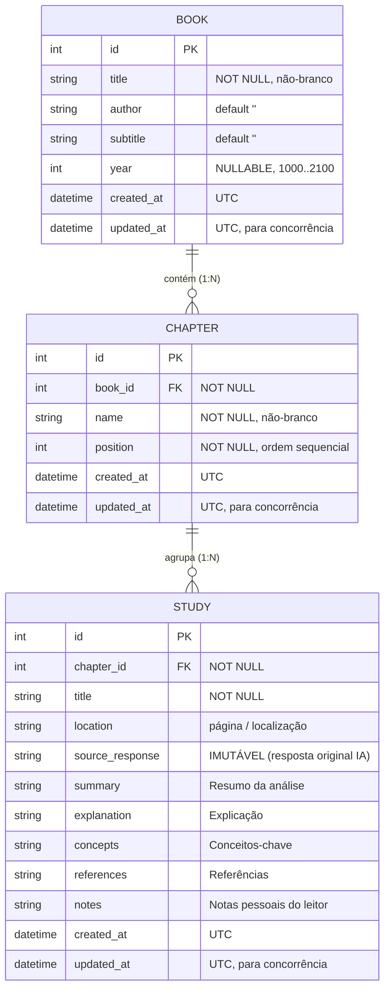

# Data Model: Edição de Metadados de Livros, Capítulos e Estudos

**Feature**: `002-edicao-livros-estudos`  
**Date**: 2026-09-17  
**Status**: Ready  

---

## 1. Entidades e Esquema Lógico

---

## 2. Regras de Validação e Integridade

### A. Livro (`Book`)
- **`title`**: String de 1 a 300 caracteres, com remoção de espaços em branco nas extremidades. Não pode ser vazio (`NonBlankText`).
- **`author`**: String de até 200 caracteres. Se omitido, assume string vazia `""`.
- **`subtitle`**: String de até 300 caracteres. Se omitido, assume string vazia `""`.
- **`year`**: Inteiro opcional. Se preenchido, deve estar no intervalo `1000 <= year <= 2100`.
- **`updated_at`**: Atualizado para o timestamp UTC corrente a cada alteração confirmada.

### B. Capítulo (`Chapter`)
- **`name`**: String de 1 a 200 caracteres, não-branco (`NonBlankText`).
- **`position`**: Inteiro não-negativo (`position >= 0`). Determina a ordenação dos capítulos na interface (`ORDER BY position, id`).
- **Reordenação**: Ao mover um capítulo para cima ou para baixo, sua posição é trocada com a do capítulo adjacente dentro da mesma transação, preservando a continuidade dos índices.

### C. Estudo (`Study`)
- **`source_response`**: Imutável. A rota de edição de estudos (`PATCH /studies/{id}`) rejeita ou ignora qualquer tentativa de alterar a origem literal da IA.
- **`title`**: String não-vazia. Se alterado para vazio, retorna erro de validação (HTTP 422).
- **Campos de análise (`summary`, `explanation`, `concepts`, `references`)**: Pelo menos uma das quatro seções deve conter texto válido.
- **`notes`**: Anotações livres do leitor. Podem ser esvaziadas deliberadamente.

---

## 3. Controle de Concorrência Otimista

- Ao consultar um item (`GET`), o cliente recebe o campo `updated_at` (em formato ISO 8601 UTC).
- Ao enviar a atualização (`PATCH`), o cliente envia opcionalmente o campo `if_unmodified_since` ou o `updated_at` conhecido.
- Se o registro no banco tiver sido modificado por outro cliente posteriormente (`banco.updated_at > payload.updated_at`), o servidor recusa a operação com status `409 Conflict`, devolvendo a versão atual do registro para comparação.
