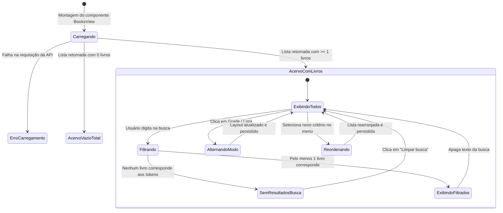

# Modelo de Dados: Acervo — Visualização, Busca e Ordenação

**Feature**: Acervo: Visualização, Busca e Ordenação  
**Branch**: `005-acervo-busca-ordenacao`  
**Data**: 2026-09-18  

---

## 1. Entidades de Dados

### 1.1 Book (Livro)

Representa cada obra do acervo. Todos os atributos persistem na tabela `books` do SQLite.

```text
+-------------------+--------------------+---------------------------------------------------+
| Campo             | Tipo               | Descrição e Papel na Visualização / Busca         |
+-------------------+--------------------+---------------------------------------------------+
| id                | INTEGER PK         | Identificador estável do livro.                   |
| title             | TEXT NOT NULL      | Título da obra (termo principal de busca/ordem).  |
| subtitle          | TEXT NOT NULL      | Subtítulo opcional (termo de busca secundário).   |
| author            | TEXT NULL          | Autor da obra (termo de busca e ordenação A–Z).   |
| year              | INTEGER NULL       | Ano de publicação (ordenação cronológica).        |
| cover_image       | TEXT NULL          | Nome do arquivo da capa WebP (ou null se s/ capa).|
| created_at        | DATETIME (UTC)     | Data de inclusão ("Recentemente adicionados").     |
| updated_at        | DATETIME (UTC)     | Data da última atividade ("Recentemente modif."). |
| deleted_at        | DATETIME NULL      | Se preenchido, item está na lixeira (ignorado).   |
+-------------------+--------------------+---------------------------------------------------+
```

#### Regras de Validação e Integridade
- Livros ativos: `deleted_at IS NULL`.
- Busca textual: deve incidir sobre a concatenação `title + " " + (subtitle or "") + " " + (author or "")`.
- Formatação de data no frontend: converter datas UTC para representação amigável local do usuário (ex.: `18/09/2026` ou formato relativo).

---

### 1.2 ViewPreferences (Preferências de Visualização e Filtro)

Estrutura de estado no frontend que controla como o acervo é apresentado.

```typescript
export type LibraryViewMode = 'grid' | 'list'

export type BookSortOption =
  | 'title-asc'       // Título (A–Z)
  | 'title-desc'      // Título (Z–A)
  | 'author-asc'      // Autor (A–Z)
  | 'recent-created'  // Recentemente adicionados (mais novos primeiro)
  | 'recent-updated'  // Recentemente modificados (última atividade primeiro)
  | 'oldest-created'  // Mais antigos adicionados (mais antigos primeiro)
  | 'year-desc'       // Ano de publicação (mais recentes primeiro)

export interface LibraryFilterState {
  searchQuery: string          // Termo de busca digitado pelo usuário
  viewMode: LibraryViewMode     // 'grid' (grade de capas) ou 'list' (linhas compactas)
  sortBy: BookSortOption       // Opção de ordenação ativa
}
```

---

## 2. Estados da Interface de Acervo



---

## 3. Matriz de Ordenação

| Código de Ordenação | Rótulo Exibido no Menu | Critério Primário | Critério de Desempate |
|---|---|---|---|
| `recent-updated` | Recentemente modificados | `updated_at DESC` | `id DESC` |
| `recent-created` | Recentemente adicionados | `created_at DESC` | `id DESC` |
| `oldest-created` | Mais antigos adicionados | `created_at ASC` | `id ASC` |
| `title-asc` | Título (A–Z) | `title ASC` (Collation pt-BR) | `author ASC` |
| `title-desc` | Título (Z–A) | `title DESC` (Collation pt-BR) | `author ASC` |
| `author-asc` | Autor (A–Z) | `author ASC` (nulos por último) | `title ASC` |
| `year-desc` | Ano de publicação | `year DESC` (nulos por último) | `title ASC` |
