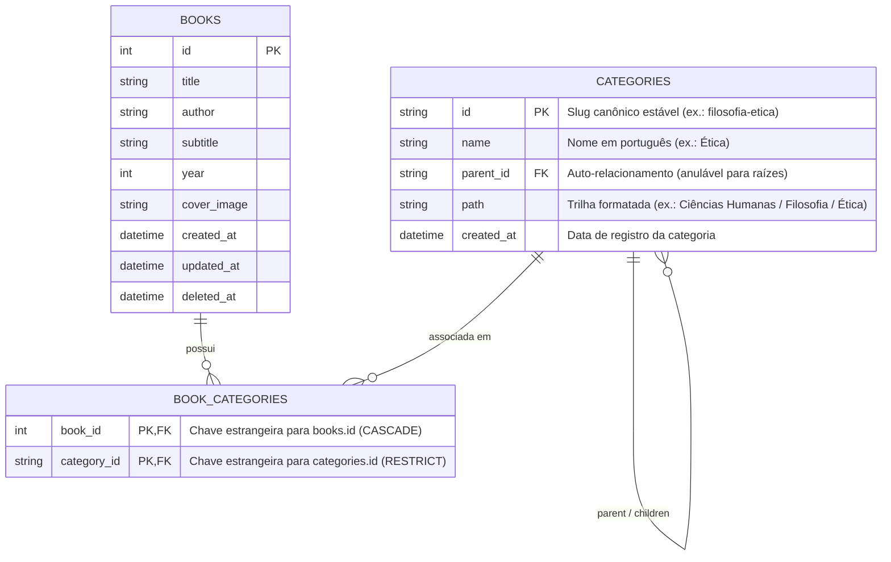

# Data Model: Categorias e Taxonomia de Livros (T05)

**Feature**: `006-categorias-taxonomia`  
**Date**: 2026-09-18  
**Status**: Ready

---

## 1. Diagrama Entidade-Relacionamento



---

## 2. Tabelas e Definições de Esquema

### 2.1 Tabela `categories`
Armazena as categorias canônicas da taxonomia estruturada.

| Coluna | Tipo | Nulo? | Padrão | Restrições / Descrição |
|---|---|---|---|---|
| `id` | `TEXT` | NÃO | - | Chave primária. Slug único e estável (ex.: `literatura-brasileira`). |
| `name` | `TEXT` | NÃO | - | Nome da categoria em português. `length(trim(name)) > 0`. |
| `parent_id` | `TEXT` | SIM | `NULL` | Chave estrangeira referenciando `categories(id)` com `ON DELETE RESTRICT`. |
| `path` | `TEXT` | NÃO | - | Caminho hierárquico desnormalizado para exibição e busca rápida. |
| `created_at` | `DATETIME` | NÃO | `CURRENT_TIMESTAMP` | Data/hora UTC de inclusão. |

**Índices e Restrições**:
- Chave primária: `id`.
- `CheckConstraint("length(trim(id)) > 0", name="category_id_not_blank")`.
- `CheckConstraint("length(trim(name)) > 0", name="category_name_not_blank")`.
- `Index("ix_categories_parent_id", "parent_id")`.
- `Index("ix_categories_path", "path")`.

### 2.2 Tabela `book_categories`
Tabela associativa que implementa o relacionamento muitos-para-muitos (N:N) entre livros e categorias.

| Coluna | Tipo | Nulo? | Padrão | Restrições / Descrição |
|---|---|---|---|---|
| `book_id` | `INTEGER` | NÃO | - | FK referenciando `books(id)` com `ON DELETE CASCADE`. |
| `category_id` | `TEXT` | NÃO | - | FK referenciando `categories(id)` com `ON DELETE RESTRICT`. |

**Índices e Restrições**:
- Chave primária composta: `(book_id, category_id)`.
- `Index("ix_book_categories_category_book", "category_id", "book_id")` para aceleração de filtros reversos por categoria.

---

## 3. Modelo SQLAlchemy 2.0

### `app/models/category.py`
```python
class Category(Base):
    __tablename__ = "categories"
    __table_args__ = (
        CheckConstraint("length(trim(id)) > 0", name="category_id_not_blank"),
        CheckConstraint("length(trim(name)) > 0", name="category_name_not_blank"),
        Index("ix_categories_parent_id", "parent_id"),
        Index("ix_categories_path", "path"),
    )

    id: Mapped[str] = mapped_column(Text, primary_key=True)
    name: Mapped[str] = mapped_column(Text, nullable=False)
    parent_id: Mapped[str | None] = mapped_column(
        Text, ForeignKey("categories.id", ondelete="RESTRICT"), nullable=True, default=None
    )
    path: Mapped[str] = mapped_column(Text, nullable=False)
    created_at: Mapped[datetime] = mapped_column(
        UTCDateTime(), default=utc_now, server_default=text("CURRENT_TIMESTAMP"), nullable=False
    )

    parent: Mapped[Category | None] = relationship(
        "Category", remote_side=[id], back_populates="children"
    )
    children: Mapped[list[Category]] = relationship(
        "Category", back_populates="parent", order_by="Category.name"
    )
    books: Mapped[list[Book]] = relationship(
        "Book", secondary="book_categories", back_populates="categories"
    )
```

### Extensão em `app/models/book.py`
```python
# Na classe Book:
categories: Mapped[list[Category]] = relationship(
    "Category",
    secondary="book_categories",
    back_populates="books",
    order_by="Category.path",
)
```

---

## 4. Regras de Integridade e Transições

1. **Ausência de Ciclos (DAG em árvore)**:
   - A árvore taxonômica é estritamente acíclica. Cada categoria possui zero ou um pai (`parent_id`).
   - O algoritmo de validação computa a linhagem e bloqueia qualquer inserção com ciclo.
2. **Ciclo de Vida com a Lixeira**:
   - Enviar livro para lixeira (`deleted_at IS NOT NULL`): os registros em `book_categories` permanecem 100% intactos. Ao restaurar o livro, suas categorias ressurgem automaticamente.
3. **Exclusão Definitiva**:
   - `permanent_delete_book`: a exclusão de um livro apaga suas entradas em `book_categories` via `CASCADE`, mantendo as categorias intactas no catálogo geral.
4. **Idempotência de Seed/Sincronização**:
   - A execução de `sync_canonical_categories()` realiza um upsert: categorias ausentes são inseridas; existentes têm `name`, `parent_id` e `path` atualizados se necessário; nenhuma categoria é removida.
