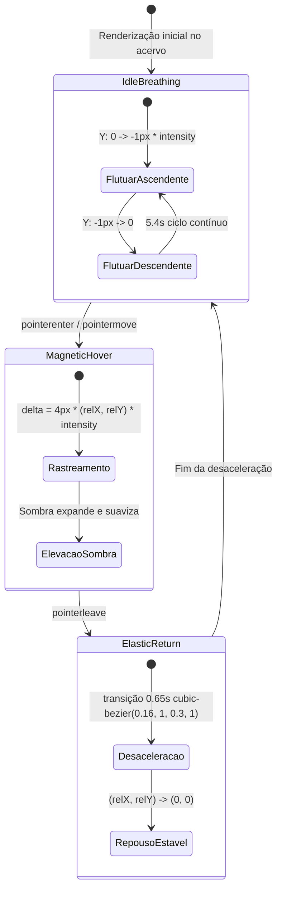

# Data Model: 007 — Zero-G: Superclasse Flutuante & Magnética

**Date**: 2026-09-19  
**Feature**: 007 — Zero-G: Superclasse Flutuante & Magnética  
**Status**: Ready  

---

## 1. Domain Entities & Type Definitions

### 1.1 `SuperclassType`
Identificador tipado do arquétipo de interface ativo.

```typescript
export type SuperclassType =
  | 'none'
  | 'zero-g'
  | 'mecanica'
  | 'invisivel'
  | 'dimensional'
  | 'monolitica';
```

- **Default**: `'none'`
- **Validation**: Deve ser estritamente um dos valores do catálogo fechado.

---

### 1.2 `SuperclassIntensity`
Fator de escala da intensidade física aplicada pela Superclasse.

```typescript
export type SuperclassIntensity =
  | 'standard' // 1.0x (Padrão)
  | 'subtle'   // 0.5x (Sutil)
  | 'high'     // 1.5x (Alta)
  | 'off';     // 0.0x (Desativada)
```

- **Default**: `'standard'`
- **Validation**: Deve ser um dos 4 níveis homologados.

---

### 1.3 `AppearancePreferences` (Extensão)
Extensão das preferências existentes do usuário armazenadas em `caderno.aparencia.v2`.

```typescript
export type AppearancePreferences = {
  // Campos existentes 100% preservados
  theme: 'porcelana' | 'breu' | 'pergaminho' | 'e-ink' | 'vespera'
    | 'solario' | 'fiorde' | 'vinil' | 'sequoia' | 'voltagem';
  style: 'rounded' | 'square';
  font: string;
  accent: 'theme' | 'blue' | 'green' | 'purple' | 'orange';
  density: 'standard' | 'compact' | 'comfortable';
  align: 'left' | 'justify';
  highlight: 'background' | 'underline' | 'bold';
  motion: 'off' | 'on';
  surface: 'raised' | 'flat';
  'button-style': 'solid' | 'outline' | 'ghost';
  'button-width': 'auto' | 'block';
  tabs: 'underline' | 'segmented' | 'folders';
  library: 'grid' | 'list';
  container: 'contained' | 'fluid';
  'reader-size': string;

  // Novos campos das Superclasses
  superclass: SuperclassType;
  'superclass-intensity': SuperclassIntensity;
};
```

---

## 2. CSS Custom Properties Model

As variáveis CSS alimentam a renderização dinâmica na raiz do documento (`:root`) e em instâncias locais de elementos interativos:

| Variável | Escopo | Tipo / Unidade | Valores / Fórmula | Descrição |
|---|---|---|---|---|
| `--sc-intensity` | `:root` | Number (unitless) | `0.0`, `0.5`, `1.0`, `1.5` | Fator multiplicador global de física |
| `--sc-base-translate` | `.book-card` | Length | `4px` | Deslocamento escalar base de atração magnética |
| `--sc-base-idle` | `.book-grid > li` | Length | `1px` | Amplitude base da oscilação de repouso |
| `--sc-magnetic-x` | `.book-card` (inline) | Number (unitless) | `[-1.0, 1.0]` | Posição normalizada do cursor no eixo X |
| `--sc-magnetic-y` | `.book-card` (inline) | Number (unitless) | `[-1.0, 1.0]` | Posição normalizada do cursor no eixo Y |
| `--card-index` | `.book-grid > li` (inline) | Integer | `0, 1, 2, ...` | Índice do cartão para defasagem assíncrona de fase |
| `--sc-zero-g-shadow` | `:root` | CSS shadow | `0 12px 32px -4px rgba(0, 0, 0, ...)` | Sombra ampla e suave com base na elevação |

---

## 3. State Transitions & Lifecycle

### Ciclo de Estados de um Cartão do Acervo sob Zero-G



### Regra de Neutralização de Movimento
Se `data-motion="off"` OU `prefers-reduced-motion: reduce`:
- O estado entra em `DisabledMotion` permanente.
- `--sc-intensity` é fixado em `0.0`.
- Todas as translações avaliam para `0px`.
- Nenhuma animação ou transição cinemática é executada.
