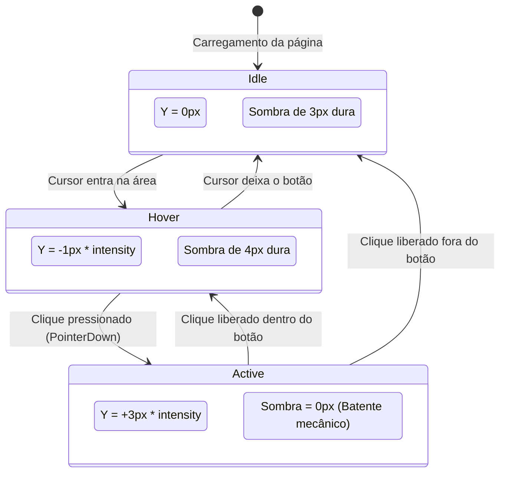

# Data Model: 008 — Mecânica: Superclasse Tátil & Responsiva

**Date**: 2026-09-19  
**Feature**: 008 — Mecânica: Superclasse Tátil & Responsiva  
**Status**: Ready  

---

## 1. Domain Entities & Tokens Model

### 1.1 Variáveis e Tokens Específicos da Superclasse Mecânica

| Variável CSS | Escopo | Tipo / Unidade | Valor / Fórmula | Descrição |
|---|---|---|---|---|
| `--sc-border-radius` | `.superclass-mecanica` | Length | `2px` | Cantos quase secos de acabamento mecânico |
| `--sc-shadow-idle` | `.superclass-mecanica` | Shadow | `0 calc(3px * var(--sc-intensity)) 0 var(--color-shadow, rgba(0,0,0,0.35))` | Sombra sólida dura sem desfoque |
| `--sc-shadow-hover` | `.superclass-mecanica` | Shadow | `0 calc(4px * var(--sc-intensity)) 0 var(--color-shadow, rgba(0,0,0,0.45))` | Expansão sólida rápida de 1px |
| `--sc-shadow-active` | `.superclass-mecanica` | Shadow | `0 0 0 transparent` | Anulação total da sombra no fim de curso |
| `--sc-transition-duration` | `.superclass-mecanica` | Time | `100ms` | Resposta ultrarrápida de chave mecânica |
| `--sc-transition-easing` | `.superclass-mecanica` | Easing | `linear` | Cinemática sem curvas elásticas ou inércia |
| `--sc-intensity` | `:root` | Number (unitless) | `0.0` (Off), `0.5` (Sutil), `1.0` (Padrão), `1.5` (Alta) | Multiplicador herdado da arquitetura base |

---

## 2. Diagrama de Estados do Ciclo Físico de Elementos (Push-Down)

---

## 3. Modelo de Entidades de Interface e Formulários

1. **Botões e Cards (`button`, `.button`, `.btn`, `.book-card`, `.book-list-item`)**:
   - `border-radius: var(--sc-border-radius)`.
   - `box-shadow: var(--sc-shadow-idle)`.
   - `:hover` $\to$ `transform: translateY(calc(-1px * var(--sc-intensity)))` + `box-shadow: var(--sc-shadow-hover)`.
   - `:active` $\to$ `transform: translateY(calc(3px * var(--sc-intensity)))` + `box-shadow: var(--sc-shadow-active)`.
2. **Campos de Entrada (`input`, `textarea`, `select`)**:
   - `border-radius: var(--sc-border-radius)`.
   - `box-shadow: inset 0 1px 3px rgba(0,0,0,0.12)`.
   - `:focus` $\to$ Borda sólida espessada instantaneamente sem translação vertical.
3. **Switches / Toggles (`[role="switch"]`, `.switch`, `.toggle`)**:
   - Transição linear de pino entre `50ms` e `80ms` (estalo seco).
4. **Painéis e Ajustes (`.appearance-group`, `.panel`, `.form-panel`)**:
   - `border-radius: var(--sc-border-radius)`.
   - Borda contrastada e sombra sólida dura, simulando chapas metálicas aparafusadas ao painel.
5. **Transição de Rota Vue Router (`.page-enter-active`, `.page-leave-active`)**:
   - `transition: opacity 100ms linear`.
