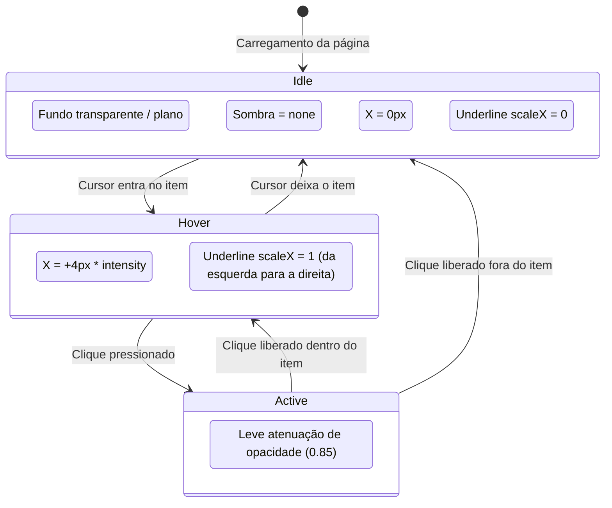
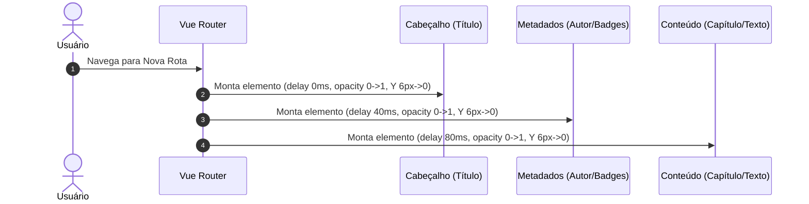

# Data Model: 009 — Invisível: Superclasse Silenciosa & Editorial e Limpeza de Ajustes

**Date**: 2026-09-19  
**Feature**: 009 — Invisível: Superclasse Silenciosa & Editorial e Limpeza de Ajustes  
**Status**: Ready  

---

## 1. Domain Entities & Tokens Model

### 1.1 Tokens da Superclasse Invisível

| Variável CSS | Escopo | Tipo / Unidade | Valor / Fórmula | Descrição |
|---|---|---|---|---|
| `--sc-border-radius` | `.superclass-invisivel` | Length | `0px` | Ausência de curvaturas artificiais de caixa |
| `--sc-shadow-idle` | `.superclass-invisivel` | Shadow | `none` | Desmaterialização total de sombras em repouso |
| `--sc-shadow-hover` | `.superclass-invisivel` | Shadow | `none` | Ausência de sombras flutuantes no hover |
| `--sc-reading-shift-x` | `.superclass-invisivel` | Length | `calc(4px * var(--sc-intensity))` | Deslocamento horizontal de leitura no hover |
| `--sc-transition-duration` | `.superclass-invisivel` | Time | `200ms` | Ritmo suave de leitura editorial |
| `--sc-transition-easing` | `.superclass-invisivel` | Easing | `cubic-bezier(0.2, 0, 0, 1)` | Desaceleração orgânica de página impressa |
| `--sc-intensity` | `:root` | Number (unitless) | `0.0` (Off), `0.5` (Sutil), `1.0` (Padrão), `1.5` (Alta) | Multiplicador de amplitude herdado da base |

---

## 2. Modelo de Preferências de Aparência Limpo (Pós-Poda)

### 2.1 Campos Oficiais Ativos (`AppearancePreferences`)

```typescript
export type AppearancePreferences = {
  // Cromática & Identidade
  theme: 'porcelana' | 'breu' | 'pergaminho' | 'e-ink' | 'vespera'
       | 'solario' | 'fiorde' | 'vinil' | 'sequoia' | 'voltagem'
  accent: 'theme' | 'blue' | 'green' | 'purple' | 'orange'

  // Leitura & Tipografia
  font: 'inter' | 'merriweather' | 'lora' | 'roboto-serif' | 'source-serif-4'
      | 'literata' | 'eb-garamond' | 'libre-baskerville' | 'crimson-pro'
      | 'noto-serif' | 'bitter' | 'fira-sans' | 'source-sans-3' | 'noto-sans'
      | 'atkinson-hyperlegible' | 'opendyslexic' | 'nunito-sans'
      | 'ibm-plex-sans' | 'ibm-plex-serif' | 'jetbrains-mono' | 'victor-mono'
      | 'ibm-plex-mono' | 'source-code-pro' | 'roboto-mono'
  'reader-size': '100' | '110' | '120' | '130' | '140' | '150' | '160' | '170' | '180' | '190' | '200'
  align: 'left' | 'justify'
  highlight: 'background' | 'underline' | 'bold'

  // Layout & Estrutura
  density: 'standard' | 'compact' | 'comfortable'
  container: 'contained' | 'fluid'
  library: 'grid' | 'list'
  tabs: 'underline' | 'segmented' | 'folders'
  'button-width': 'auto' | 'block'

  // Motor Físico (Superclasses)
  superclass: 'none' | 'zero-g' | 'mecanica' | 'invisivel' | 'dimensional' | 'monolitica'
  'superclass-intensity': 'standard' | 'subtle' | 'high' | 'off'
  motion: 'off' | 'on'
}
```

### 2.2 Campos Removidos do Frontend (Absorvidos pelas Superclasses)
- `style`: "Formato das caixas" (geometria de cantos controlada por `--sc-border-radius`)
- `surface`: "Contraste da interface - Cartões" (elevação e sombras controladas por `--sc-shadow-idle`)
- `button-style`: "Botões - Preenchimento" (estilo e física de botões controlados pelas Superclasses)

---

## 3. Diagrama de Estados das Microinterações Editoriais



---

## 4. Diagrama de Cascata Temporal na Entrada de Página (*Staggered Fade-Up*)


