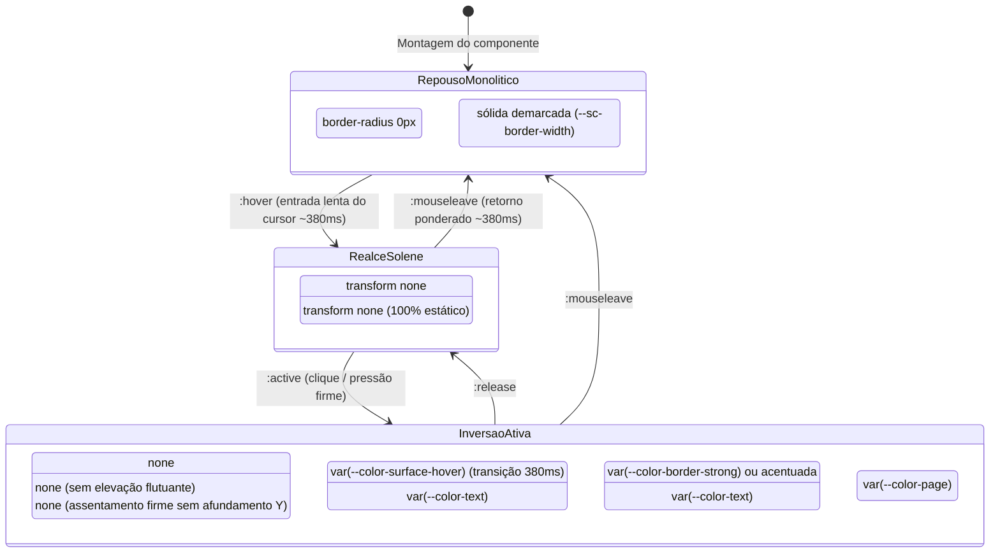

# Data Model & Physical State Specification: 011 — Monolítica

**Feature**: 011 — Monolítica: Superclasse Pesada & Solene (Brutalista & Arquitetura em Pedra)  
**Date**: 2026-09-19  
**Status**: Completed  

---

## 1. Modelo de Tokens e Variáveis CSS da Monolítica

A Superclasse Monolítica governa geometria de prismas retos, supressão de sombras e transições solenes sem alterar estruturas de dados no backend (100% no cliente frontend).

### Mapeamento de Tokens Físicos

| Token CSS | Escopo | Valor Padrão (1.0x) | Finalidade / Papel Arquitetural |
|---|---|---|---|
| `--sc-border-radius` | `:is(:root[data-superclass="monolitica"], .superclass-monolitica)` | `0px !important` | Cantos estritamente retos e prismáticos |
| `--sc-border-width` | `:is(:root[data-superclass="monolitica"], .superclass-monolitica)` | `calc(var(--border-width, 1px) + 1px)` | Bordas estruturais sólidas de alto impacto |
| `--sc-shadow-idle` | `:is(:root[data-superclass="monolitica"], .superclass-monolitica)` | `none !important` | Supressão de sombras flutuantes de repouso |
| `--sc-shadow-hover` | `:is(:root[data-superclass="monolitica"], .superclass-monolitica)` | `none !important` | Supressão de sombras de elevação no hover |
| `--sc-shadow-active` | `:is(:root[data-superclass="monolitica"], .superclass-monolitica)` | `none !important` | Supressão de sombras elásticas no clique |
| `--sc-transition-duration` | `:is(:root[data-superclass="monolitica"], .superclass-monolitica)` | `380ms` | Duração ponderada, lenta e solene |
| `--sc-transition-easing` | `:is(:root[data-superclass="monolitica"], .superclass-monolitica)` | `cubic-bezier(0.25, 1, 0.5, 1)` | Curva de desaceleração estável e lapidar |

---

## 2. Diagrama de Estados de Interação Brutalista



---

## 3. Composição Estrutural de Blocos

```
┌─────────────────────────────────────────────────────────────┐
│  Painel / Contêiner Monolítico (border-radius: 0px)         │
│  Borda sólida estrutural (calc(var(--border-width) + 1px))  │
│  ┌───────────────────────────────────────────────────────┐  │
│  │ Cartão do Acervo (.book-card)                         │  │
│  │ Cantos retos (0px), fundo sólido, sem sombra          │  │
│  │ ┌───────────────────────────────────────────────────┐ │  │
│  │ │ Capa / Título: Alinhamento lapidar sem tilt       │ │  │
│  │ └───────────────────────────────────────────────────┘ │  │
│  │ ┌───────────────────────────────────────────────────┐ │  │
│  │ │ Botão Monolítico: Bloco retangular de contraste   │ │  │
│  │ └───────────────────────────────────────────────────┘ │  │
│  └───────────────────────────────────────────────────────┘  │
└─────────────────────────────────────────────────────────────┘
```
