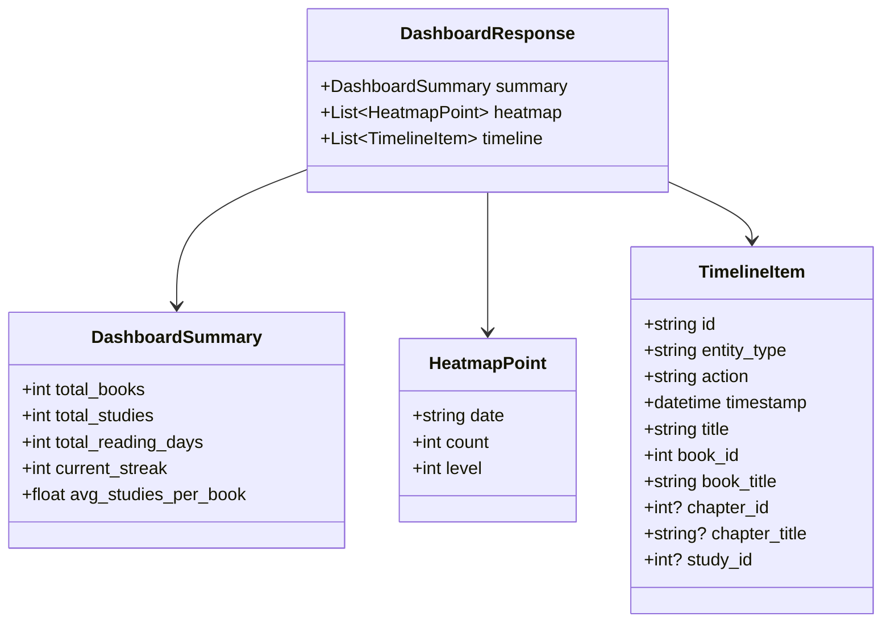

# Data Model & State Specifications: Dashboard de Leitura

**Feature**: `013-dashboard-calendario-timeline`  
**Date**: 2026-09-19  
**Status**: Completed  

---

## 1. Entidades e Modelos de Resposta da API

Como esta funcionalidade não requer novas tabelas nem migrações no banco SQLite, os modelos abaixo representam os schemas Pydantic (backend) e interfaces TypeScript (frontend) para consumo da tela de Dashboard.



### 1.1 `DashboardSummary` (Resumo Geral)

| Campo | Tipo | Descrição |
|---|---|---|
| `total_books` | `int` | Quantidade total de livros ativos (`deleted_at IS NULL`). |
| `total_studies` | `int` | Quantidade total de estudos ativos (`study.deleted_at IS NULL` e `book.deleted_at IS NULL`). |
| `total_reading_days` | `int` | Número total de dias distintos com pelo menos 1 evento de atividade no histórico. |
| `current_streak` | `int` | Sequência ininterrupta de dias com leitura/estudo até a data atual. |
| `avg_studies_per_book` | `float` | Média ponderada de estudos por livro cadastrado (`round(total_studies / total_books, 1)` ou `0.0`). |

### 1.2 `HeatmapPoint` (Célula de Atividade Diária)

| Campo | Tipo | Descrição |
|---|---|---|
| `date` | `string` | Data do dia civil no formato `YYYY-MM-DD` (ajustada pelo fuso horário do usuário). |
| `count` | `int` | Número total de eventos de atividade registrados nesta data. |
| `level` | `int` | Nível de intensidade visual da célula: `0` (sem atividade), `1` (1 evento), `2` (2 a 3 eventos), `3` (4 ou mais eventos). |

### 1.3 `TimelineItem` (Item da Linha do Tempo)

| Campo | Tipo | Descrição |
|---|---|---|
| `id` | `string` | Identificador único sintético do evento (ex.: `study-42-created`, `study-42-updated`, `book-10-created`). |
| `entity_type` | `'book' \| 'study'` | Tipo da entidade que originou o evento. |
| `action` | `'book_created' \| 'study_created' \| 'study_updated'` | Ação executada pelo usuário. |
| `timestamp` | `datetime` | Instante canônico do evento em UTC (ISO 8601). |
| `title` | `string` | Título da anotação/estudo ou título do livro cadastrado. |
| `book_id` | `int` | ID do livro associado (para navegação e rota). |
| `book_title` | `string` | Nome do livro para exibição contextual. |
| `chapter_id` | `int \| null` | ID do capítulo associado (quando o evento é de estudo). |
| `chapter_title` | `string \| null` | Nome do capítulo associado. |
| `study_id` | `int \| null` | ID do estudo (quando aplicável). |

---

## 2. Regras de Cálculo e Negócio

### 2.1 Eventos Computados como Atividade (Decisão Q1: B)
Um evento é considerado atividade válida se, e somente se:
1. **Criação de Livro**: `Book.created_at`, desde que `Book.deleted_at IS NULL`.
2. **Criação de Estudo**: `Study.created_at`, desde que `Study.deleted_at IS NULL` e `Book.deleted_at IS NULL`.
3. **Edição de Anotação**: `Study.updated_at`, quando `Study.updated_at > Study.created_at` (diferença maior que 60 segundos para descartar criação simultânea), desde que o estudo e o livro estejam ativos.

### 2.2 Tratamento da Lixeira (Decisão Q3: A)
- Itens com `deleted_at IS NOT NULL` (ou subordinados a um livro com `deleted_at IS NOT NULL`) são **estritamente excluídos** de todas as consultas (`summary`, `heatmap`, `timeline`).
- Ao restaurar um item da lixeira, seus carimbos históricos voltam imediatamente a pontuar nas datas originais.

### 2.3 Cálculo da Sequência Atual de Dias (Streak)
1. Converte a data de hoje para o fuso local do leitor (`today`).
2. Agrupa todos os dias distintos que possuem atividade (`count > 0`) em ordem decrescente.
3. Se o dia de hoje (`today`) tiver atividade, o contador inicia em `1` e percorre os dias anteriores consecutivamente (`today - 1`, `today - 2`, etc.).
4. Se o dia de hoje ainda não tiver atividade, mas o dia de ontem (`today - 1`) tiver, a sequência ainda é considerada ativa com base em ontem, encorajando o usuário a estudar hoje para não perder a sequência.
5. Ao encontrar o primeiro dia faltante no intervalo consecutivo, a contagem de streak é finalizada.

---

## 3. Estado no Frontend (Vue 3 / TypeScript)

A store ou composable `useDashboard` encapsula o estado reativo:

```typescript
export interface DashboardState {
  summary: DashboardSummary | null
  heatmap: HeatmapPoint[]
  timeline: TimelineItem[]
  loading: boolean
  error: string | null
  selectedDate: string | null // Filtro ativo de data vindo do clique no heatmap
  mobileViewMode: 'compact' | 'expanded' // 4 meses vs 12 meses no mobile
}
```
