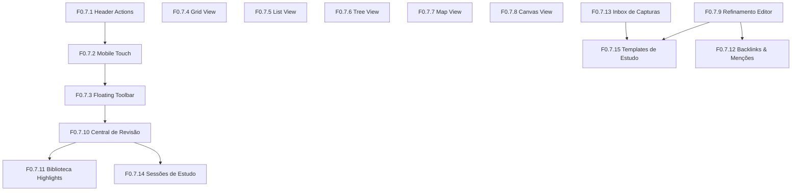

# Roadmap 0.7 — A Experiência de Estudos do Leitorum

**Data oficial de emissão:** 2026-10-03  
**Status do Roadmap:** Planejamento Arquitetural Concluído. Pronto para Ciclo Spec Kit (`speckit-specify` → `speckit-implement`).  
**Regra Geral de Governança:** Todas as quinze features (**F 0.7.1 a F 0.7.15**) estão estritamente **NÃO INICIADAS**. Nenhuma linha de código será escrita fora do fluxo formal do GitHub Spec Kit, respeitando a convenção **1 Feature = 1 Commit Atômico**.

---

## 1. Visão Geral e Filosofia do Ciclo 0.7

O Roadmap 0.7 estabelece o marco de maturidade da **Experiência de Estudos** do Leitorum. Enquanto os ciclos anteriores estruturaram a fundação técnica, a arquitetura multiusuário e a segurança para exposição pública, a versão 0.7 volta-se integralmente para a atividade central do usuário: **ler com profundidade, anotar com clareza, conectar ideias e reter o conhecimento adquirido**.

### Princípio do Ciclo do Conhecimento no Leitorum:
```
  [CAPTURAR] (F0.7.13 Inbox de Capturas)
      ↓
  [ORGANIZAR] (F0.7.4 Grid, F0.7.5 List, F0.7.6 Tree, F0.7.15 Templates)
      ↓
  [CONECTAR] (F0.7.7 Map, F0.7.8 Canvas, F0.7.12 Backlinks & Menções)
      ↓
  [ESTUDAR] (F0.7.1 Header Actions, F0.7.2 Mobile Touch, F0.7.3 Floating Toolbar, F0.7.9 Editor)
      ↓
  [REVISAR] (F0.7.10 Central de Revisão, F0.7.14 Sessões de Estudo)
      ↓
  [RETORNAR AO CONTEXTO] (F0.7.11 Biblioteca de Highlights & Anotações)
```

---

## 2. As Quinze Features do Roadmap 0.7

O roadmap divide-se estritamente em três grupos operacionais:
1. **Refinamento e Correção de UX (F 0.7.1 a F 0.7.3 e F 0.7.9)**
2. **Reestruturação e Diferenciação das 5 Views (F 0.7.4 a F 0.7.8)**
3. **Novas Capacidades Cognitivas de Estudo (F 0.7.10 a F 0.7.15)**

---

### F 0.7.1 — Hierarquia e Ergonomia de Header Actions no Leitor (`StudyView.vue`)

#### 1. Objetivo
Restruturar o cabeçalho e a barra de ações de `StudyView.vue` tanto no Desktop quanto no Mobile, estabelecendo uma clara hierarquia entre a ação primária e as utilidades secundárias, eliminando quebras desajeitadas e poluição visual.

#### 2. Problema atual
Atualmente, o topo do leitor acumula cinco a seis botões secundários lado a lado (`Compartilhar`, `Exportar`, `Histórico`, `Editar estudo`, `Mover para a lixeira`). No Desktop, isso gera competição visual com o título e dispersão de atenção. No Mobile, os botões quebram em duas ou três linhas desiguais, empurrando a área de leitura para baixo da dobra da tela.

#### 3. Experiência desejada do usuário
* **Desktop**: Título e metadados com respiro editorial. Ação primária destacada (`Editar Estudo`). Ações utilitárias colapsadas em um menu compacto de ações (`•••` ou "Mais Ações"), preservando acesso imediato sem ruído.
* **Mobile**: Cabeçalho condensado em linha única com botão de retorno, status compacto e menu dropdown acessível. Alvos de toque estritamente respeitando 44x44px.

#### 4. Componentes afetados
* `frontend/src/views/StudyView.vue`
* `frontend/src/components/StudyStatusBadge.vue`
* Novo componente `frontend/src/components/ui/DropdownMenu.vue`

#### 5. Backend afetado
Nenhum. A feature é 100% de interface e interação.

#### 6. Banco de dados afetado
Nenhum.

#### 7. API afetada
Nenhuma.

#### 8. Dependências com outras features
Base para F 0.7.2 e F 0.7.3.

#### 9. Regras de negócio
* Permissões de edição (`can_edit === false`) ocultam permanentemente ações mutáveis (`Editar`, `Lixeira`) e exibem apenas `Exportar` e indicador de proprietário.
* A troca de status de leitura deve continuar disponível com 1 clique direto no badge, sem exigir entrada no modo de edição.

#### 10. Estados e comportamentos
* Estado Aberto/Fechado do menu de ações secundárias.
* Fechamento automático ao clicar fora (`click-outside`) ou pressionar `Escape`.

#### 11. Desktop
Header com duas zonas claras: à esquerda, hierarquia textual (Breadcrumb, Badge, Título, Localização); à direita, grupo de botões (`Compartilhar`, botão primário `Editar`, menu `•••` contendo `Histórico`, `Exportar`, `Lixeira`).

#### 12. Mobile
Header fixo/compacto. Título truncate elegante. Ações agrupadas em barra de ferramentas enxuta que não consome mais de 56px de altura vertical.

#### 13. Acessibilidade
Menu `•••` com WAI-ARIA `aria-haspopup="menu"`, `aria-expanded` e navegação com setas cima/baixo. Rótulos explícitos em leitores de tela.

#### 14. Persistência necessária
Nenhuma.

#### 15. Migração necessária
Nenhuma.

#### 16. Riscos técnicos
Interferência com eventos de teclado globais existentes de Active Recall. (Mitigação: travar propagação de eventos quando o menu estiver aberto).

#### 17. Riscos de UX
Tornar ações frequentes excessivamente escondidas atrás de cliques adicionais. (Mitigação: manter `Editar` e `Compartilhar` sempre expostos).

#### 18. Critérios objetivos de aceitação
* [ ] Em telas `< 768px`, o cabeçalho não quebra em mais de 1 linha de ações.
* [ ] No Desktop, botões secundários estão organizados sem sobrecarregar a leitura.
* [ ] Todos os botões possuem área de clique/toque de no mínimo 44x44px no mobile.
* [ ] 100% dos testes de regressão de `StudyView.vue` aprovados.

#### 19. O que explicitamente NÃO faz parte da feature
* Modificar a lógica de compartilhamento ou exportação.
* Alterar o conteúdo do fichamento.

---

### F 0.7.2 — Responsividade Mobile, Toque Nativo e Notificação Flutuante de Ferramentas

#### 1. Objetivo
Aprimorar a ergonomia de toque em dispositivos móveis, permitindo seleção precisa por duplo toque/long press e substituindo textos extensos da barra de ferramentas por ícones autoexplicativos acompanhados de micro-toasts informativos temporários.

#### 2. Problema atual
No celular, a seleção de texto é frequentemente cancelada pelo scroll acidental da página. A barra de ferramentas flutuante ocupa quase metade da largura útil com textos longos ("Destacar", "Anotar", "Ocultar"), gerando sobreposição e toques erráticos.

#### 3. Experiência desejada do usuário
* Seleção por toque intuitiva: duplo toque seleciona a palavra imediatamente; arrastar alças expande o trecho sem quebrar o viewport.
* No mobile, a toolbar flutuante exibe apenas ícones táteis de 44x44px perfeitamente espaçados.
* Ao acionar uma ferramenta (ex.: Marca-texto, Cloze), surge uma pequena div flutuante elegante no topo da aba por 2 segundos indicando a ação executada ("Trecho ocultado para estudo", "Destaque aplicado").

#### 4. Componentes afetados
* `frontend/src/components/FloatingActionsToolbar.vue`
* `frontend/src/composables/useTextSelection.ts`
* `frontend/src/views/StudyView.vue`
* Novo composable `frontend/src/composables/useFloatingToast.ts`

#### 5. Backend afetado
Nenhum.

#### 6. Banco de dados afetado
Nenhum.

#### 7. API afetada
Nenhuma.

#### 8. Dependências com outras features
Relacionada a F 0.7.3.

#### 9. Regras de negócio
* A barra flutuante mobile não pode cobrir o texto que está sendo lido nem ultrapassar as bordas da tela.
* Toasts informativos duram 2.000ms e desaparecem com fade suave, sem bloquear novos toques do usuário.

#### 10. Estados e comportamentos
* Estado de toque: `touch-active`, `selection-active`.
* Toast flutuante com fila simples (se o usuário tocar em outra ferramenta, o toast anterior é substituído sem piscar).

#### 11. Desktop
Mantém rótulos discretos e atalhos de teclado. Micro-toasts ocorrem discretamente no canto superior direito do painel.

#### 12. Mobile
Barra de ferramentas ancorada inferiormente ou logo acima da seleção, com ícones táteis (min 44px) e toast compacto centralizado no topo.

#### 13. Acessibilidade
Micro-toast anunciado com `role="status"` e `aria-live="polite"` para leitores de tela sem interromper o fluxo sonoro.

#### 14. Persistência necessária
Nenhuma.

#### 15. Migração necessária
Nenhuma.

#### 16. Riscos técnicos
Inconsistências no comportamento de seleção por toque entre navegadores móveis (Safari iOS WebKit vs Chrome Android). (Mitigação: utilizar a API padrão `window.getSelection()` com listener defensivo de `selectionchange`).

#### 17. Riscos de UX
O toast cobrir elementos importantes da tela. (Mitigação: posicionar no topo absoluto da área da aba com z-index controlado e altura reduzida).

#### 18. Critérios objetivos de aceitação
* [ ] No mobile, a toolbar não exibe textos extensos, apenas ícones.
* [ ] Ao acionar cada ação, surge notificação flutuante temporária de 2s.
* [ ] Duplo toque no celular seleciona a palavra sem zoom espúrio.
* [ ] Nenhuma sobreposição de botões abaixo de 360px de largura de tela.

#### 19. O que explicitamente NÃO faz parte da feature
* Criação de novo tipo de destaque ou anotação.

---

### F 0.7.3 — Refatoração Dinâmica da Floating Actions Toolbar

#### 1. Objetivo
Transformar a barra flutuante de ações em uma experiência ágil, contextual e elegante, eliminando o comportamento engessado e intrusivo ao anotar ou criar perguntas.

#### 2. Problema atual
O componente `FloatingActionsToolbar.vue` contém mais de 600 linhas com modais e caixas de texto acopladas dentro da própria régua flutuante. Quando o usuário clica em "Anotar" ou "Pergunta", a régua se expande bruscamente, desalinhando o cálculo de posição na tela e frequentemente cobrindo o texto que o usuário acabou de ler.

#### 3. Experiência desejada do usuário
* A barra atua em **duas camadas limpas**:
  1. **Camada de Ação Imediata (1 clique)**: Marca-texto (com última cor usada memorizada), Oclusão (Cloze imediato), Copiar Citação (Markdown direto).
  2. **Camada de Detalhe Ancorada**: Clicar em "Anotar" ou "Pergunta" abre um mini-popover leve ancorado abaixo do texto selecionado, com autofocus no input, botão de confirmação e suporte nativo a `Enter` para salvar e `Esc` para cancelar.

#### 4. Componentes afetados
* `frontend/src/components/FloatingActionsToolbar.vue`
* `frontend/src/utils/toolbarPosition.ts`
* `frontend/src/views/StudyView.vue`

#### 5. Backend afetado
Nenhum.

#### 6. Banco de dados afetado
Nenhum.

#### 7. API afetada
Nenhuma (reutiliza endpoints existentes de `/api/studies/{id}/highlights`).

#### 8. Dependências com outras features
Complementa F 0.7.2.

#### 9. Regras de negócio
* A última cor de marca-texto utilizada pelo usuário é memorizada no `localStorage` como padrão para o próximo clique.
* O popover de anotação fecha automaticamente ao confirmar com `Enter` ou clicar fora.

#### 10. Estados e comportamentos
* Estados da toolbar: `idle`, `color_palette_open`, `note_popover_open`, `question_popover_open`.

#### 11. Desktop
Flutuação inteligente calculada via `computeToolbarPosition`, evitando extravasar bordas superior/inferior. Atalhos rápidos numéricos (1=amarelo, 2=verde, etc.) opcionais.

#### 12. Mobile
Docking suave na base da tela com gaveta ascendente (`bottom-sheet`) ao abrir anotação ou pergunta, garantindo que o teclado virtual do celular não cubra o campo de digitação.

#### 13. Acessibilidade
Foco preso (`focus trap`) temporário na caixa de anotação/pergunta enquanto aberta, retornando o foco ao texto ao fechar.

#### 14. Persistência necessária
`localStorage.getItem('caderno_last_highlight_color')`.

#### 15. Migração necessária
Nenhuma.

#### 16. Riscos técnicos
Conflito de posicionamento com o teclado virtual no mobile (`window.visualViewport`). (Mitigação: escutar eventos de `visualViewport.resize`).

#### 17. Riscos de UX
Sensação de cliques em excesso. (Mitigação: marca-texto e oclusão são de 1 clique direto).

#### 18. Critérios objetivos de aceitação
* [ ] Marca-texto é aplicado com 1 único clique sem abrir paleta obrigatoriamente.
* [ ] Caixa de anotação/pergunta não deforma a barra de ferramentas principal.
* [ ] `Enter` salva e `Esc` cancela anotação sem recarregar a tela.

#### 19. O que explicitamente NÃO faz parte da feature
* Criação de novo tipo de destaque no banco de dados.

---

### F 0.7.4 — Redesenho da Grid View: Reconhecimento Visual e Cartografia de Leitura

#### 1. Objetivo
Redesenhar a `StudyGridView.vue` para que assuma com excelência sua responsabilidade única no sistema: **reconhecimento visual imediato, densidade estética e percepção do estado dos estudos**.

#### 2. Problema atual
A Grid View atual é visualmente idêntica à List View, apenas dispondo cartões padronizados em colunas sem rica informação editorial. Não há diferenciação visual que permita ao usuário reconhecer de relance a densidade do estudo, quais possuem destaques, oclusões ou o peso de cada estudo no capítulo.

#### 3. Experiência desejada do usuário
* Cartões com rica identidade editorial:
  * Faixa cromática indicando o status de leitura (*Rascunho* cinza/neutro, *Em Andamento* âmbar, *Revisado* azul, *Concluído* esmeralda).
  * Mini-indicadores visuais de densidade: quantidade de destaques, perguntas de active recall e conexões com outros estudos.
  * Prévia tipográfica estilizada do Resumo (2 a 3 linhas com elipse balanceada).
  * Data da última atualização e indicação de localização na obra.

#### 4. Componentes afetados
* `frontend/src/components/views/StudyGridView.vue`
* `frontend/src/components/StudyStatusBadge.vue`
* `frontend/src/composables/useStudyGrouping.ts`

#### 5. Backend afetado
Inclusão de contagens agregadas leves (`highlights_count`, `relations_count`) no schema de retorno de lista de estudos (`StudySummaryRead`).

#### 6. Banco de dados afetado
Nenhum (consultas SQL já contam com relacionamentos indexados).

#### 7. API afetada
`GET /api/books/{book_id}/studies` e `GET /api/chapters/{chapter_id}/studies` (inclusão de campos opcionais de contagem).

#### 8. Dependências com outras features
Diferenciação coordenada com F 0.7.5 (List View).

#### 9. Regras de negócio
* A Grid View prioriza estética e reconhecimento visual rápido; não deve ter excesso de botões de edição inline.
* Clique no cartão transporta imediatamente para a leitura do estudo.

#### 10. Estados e comportamentos
* Estados de carregamento com *Skeleton Screens* correspondentes ao grid.
* Estado vazio contextual encorajando criação ou importação.

#### 11. Desktop
Grid responsivo adaptável: 3 colunas em telas amplas, 2 colunas em telas intermediárias. Efeito sutil de hover com elevação sensorial.

#### 12. Mobile
Grid de 1 coluna (cartões largos) ou 2 colunas compactas, otimizadas para leitura rápida no toque.

#### 13. Acessibilidade
Navegação sequencial por teclado (`Tab`), rótulos claros em leitores de tela com resumo dos metadados de cada cartão.

#### 14. Persistência necessária
Critério de agrupamento no `localStorage` (já suportado via `useStudyGrouping`).

#### 15. Migração necessária
Nenhuma.

#### 16. Riscos técnicos
Impacto de performance ao calcular contagens de destaques para muitos estudos. (Mitigação: subqueries agregadas eficientes no SQLAlchemy ou contagem em lote no SQLite).

#### 17. Riscos de UX
Poluição excessiva de mini-ícones no card. (Mitigação: micro-badges monocromáticos discretos no rodapé do cartão).

#### 18. Critérios objetivos de aceitação
* [ ] Cartões exibem claramente status cromático, contagem de highlights e resumo do estudo.
* [ ] Layout adapta-se perfeitamente de 1 a 3 colunas sem quebras visuais.
* [ ] Zero redundância funcional com a List View.

#### 19. O que explicitamente NÃO faz parte da feature
* Edição inline do texto analítico dentro do cartão do grid.

---

### F 0.7.5 — Redesenho da List View: Busca Rápida, Filtragem e Comparação Analítica

#### 1. Objetivo
Redesenhar a `StudyListView.vue` para que assuma com excelência sua responsabilidade única: **busca instantânea, alta densidade de informação, ordenação multicritério e comparação entre estudos**.

#### 2. Problema atual
Atualmente a List View é apenas uma repetição da Grid View em formato vertical espaçado. Não oferece ferramentas de busca em tempo real, ordenação por colunas nem comparação analítica de status e datas.

#### 3. Experiência desejada do usuário
* Tabela densa e sofisticada com cabeçalhos clicáveis para ordenação:
  * Título e Localização.
  * Status de Leitura (com filtro drop-down rápido no topo: Todos, Rascunho, Em Andamento, Revisado, Concluído).
  * Data de Atualização / Criação.
  * Presença de seções preenchidas (chips compactos: R, E, C, Ref).
  * Quantidade de conexões semânticas.
* Campo de busca rápida no topo filtrando instantaneamente por termo no título, localização ou notas.

#### 4. Componentes afetados
* `frontend/src/components/views/StudyListView.vue`
* Novo composable `frontend/src/composables/useStudyListFilters.ts`

#### 5. Backend afetado
Nenhum (filtragem e ordenação reativas no cliente para estudos carregados do capítulo).

#### 6. Banco de dados afetado
Nenhum.

#### 7. API afetada
Nenhuma.

#### 8. Dependências com outras features
Diferenciada de F 0.7.4 (Grid View).

#### 9. Regras de negócio
* A ordenação padrão é por posição/ordem de leitura no livro, permitindo alternar para data ou status.
* A busca filtra sem recarregar a página, destacando os termos coincidentes.

#### 10. Estados e comportamentos
* Estado de busca sem resultados com botão "Limpar filtros".
* Seleção de linha com feedback visual de hover e teclado.

#### 11. Desktop
Tabela completa de alta densidade analítica, ideal para revisões sistemáticas de capítulos volumosos.

#### 12. Mobile
Lista compacta de 2 linhas por estudo (Linha 1: Título e Status; Linha 2: Localização, Data e chips de seções), com busca e filtros no topo colapsáveis.

#### 13. Acessibilidade
Estrutura semântica de tabela acessível (`<table>` ou grid ARIA com `role="table"`, `role="row"`, `role="columnheader"`).

#### 14. Persistência necessária
Preferência de ordenação ativa no `localStorage`.

#### 15. Migração necessária
Nenhuma.

#### 16. Riscos técnicos
Lentidão em capítulos com mais de 200 estudos ao filtrar. (Mitigação: computeds otimizados no Vue 3 e paginação virtual se ultrapassar 100 itens).

#### 17. Riscos de UX
Interface excessivamente parecida com planilha genérica. (Mitigação: manter design tokens refinados do Leitorum e tipografia editorial).

#### 18. Critérios objetivos de aceitação
* [ ] Permite ordenar por título, status e data com 1 clique no cabeçalho.
* [ ] Busca textual filtra a lista em menos de 50ms.
* [ ] Densidade de informação substancialmente superior à Grid View.

#### 19. O que explicitamente NÃO faz parte da feature
* Edição em massa de campos analíticos de texto.

---

### F 0.7.6 — Redesenho da Tree View: Hierarquia Cognitiva e Estruturação de Tópicos

#### 1. Objetivo
Redesenhar a `StudyTreeView.vue` para consolidar sua responsabilidade exclusiva: **representação da subordinação hierárquica (estudos raiz, subestudos e desdobramentos de leitura)** com percepção de progresso agregado por ramo.

#### 2. Problema atual
A Tree View atual organiza nós mecanicamente, mas não transmite visualmente a profundidade conceitual, o progresso acumulado de cada ramo temático nem oferece controle intuitivo de recolhimento em lote.

#### 3. Experiência desejada do usuário
* Ramos hierárquicos com linhas guias finas e elegantes conectando pais a filhos.
* Indicador de progresso agregado em cada nó pai (ex.: badge sutil "3/4 concluídos" contabilizando os filhos daquele ramo).
* Ações rápidas no topo: "Expandir Todos" e "Recolher Todos".
* Drag-and-drop aprimorado com indicador magnético claro de reordenação (antes, depois ou aninhar como filho).

#### 4. Componentes afetados
* `frontend/src/components/views/StudyTreeView.vue`
* `frontend/src/components/views/StudyTreeNodeItem.vue`
* `frontend/src/composables/useStudyHierarchy.ts`

#### 5. Backend afetado
Nenhum (a hierarquia já se apoia no campo `parent_study_id` no banco).

#### 6. Banco de dados afetado
Nenhum.

#### 7. API afetada
Nenhuma (reutiliza endpoints existentes de reordenação e hierarquia).

#### 8. Dependências com outras features
Complementa a experiência das outras views.

#### 9. Regras de negócio
* Limite máximo de profundidade de 5 níveis preservado rigorosamente para evitar aninhamentos infinitos.
* Um nó pai não pode ser movido para dentro de um de seus próprios descendentes (prevenção de ciclos).

#### 10. Estados e comportamentos
* Estado expandido/recolhido individual memorizado por nó.
* Drag preview translúcido indicando exatamente onde o nó será solto.

#### 11. Desktop
Navegação completa por teclado com padrão WAI-ARIA Treeview (Setas Direita/Esquerda para abrir/fechar, Cima/Baixo para navegar entre nós).

#### 12. Mobile
Alvos de toque ampliados (44x44px) nos botões de chevron para expandir/recolher; opções rápidas de "Mover para cima" / "Mover para baixo" em menu touch para evitar arrasto impreciso no celular.

#### 13. Acessibilidade
Conformidade WAI-ARIA Treeview 1.2 completa com `role="tree"`, `role="treeitem"`, `aria-expanded` e `aria-level`.

#### 14. Persistência necessária
Conjunto de IDs de nós expandidos persistido no `localStorage`.

#### 15. Migração necessária
Nenhuma.

#### 16. Riscos técnicos
Cálculo recursivo de nós em árvores profundas. (Mitigação: computeds em memoização plana já arquitetados em `buildStudyTree`).

#### 17. Riscos de UX
Dificuldade do usuário em acertar se está soltando um item como irmão ou como filho no drag-and-drop. (Mitigação: linha guia com cor distinta para aninhamento vs reordenação linear).

#### 18. Critérios objetivos de aceitação
* [ ] Botões "Expandir Todos" e "Recolher Todos" funcionais.
* [ ] Nós pais exibem contador/progresso dos estudos filhos vinculados.
* [ ] Bloqueio determinístico de ciclos no drag-and-drop.

#### 19. O que explicitamente NÃO faz parte da feature
* Criação de relações em grafo nesta view (responsabilidade da Map View).

---

### F 0.7.7 — Redesenho da Map View: Criação e Edição de Grafo Semântico

#### 1. Objetivo
Transformar a `StudyMapView.vue` em uma ferramenta dinâmica e viva de pensamento relacional, permitindo criar estudos diretamente pelo mapa, traçar conexões semânticas nomeadas e destacar com clareza o estudo central/núcleo.

#### 2. Problema atual
A visualização em mapa atual é puramente passiva: renderiza círculos radiais ao redor de um centro sem permitir arrastar conexões, sem permitir criar um novo nó diretamente do grafo e sem permitir editar os nomes/tipos das relações sem sair do mapa.

#### 3. Experiência desejada do usuário
* O usuário visualiza o **Estudo Núcleo** com destaque tipográfico e dimensional superior.
* É possível puxar uma linha conectora entre dois estudos e definir a relação semântica através de um mini-popover no próprio mapa (*Fundamenta*, *Desdobra*, *Contradiz*, *Sintetiza*, *Cita*, *Complementa*).
* Botão "+" flutuante ou duplo clique no fundo do mapa para criar um novo estudo diretamente naquele ponto e conectá-lo.
* Arestas direcionadas exibindo rótulos legíveis que esclarecem a direção do argumento.

#### 4. Componentes afetados
* `frontend/src/components/views/StudyMapView.vue`
* `frontend/src/composables/useCanvasConnections.ts`
* `frontend/src/composables/useStudyRelations.ts`
* Novo componente `frontend/src/components/views/map/MapRelationPopover.vue`

#### 5. Backend afetado
Suporte à criação de estudo com vínculo relacional atômico no router de estudos.

#### 6. Banco de dados afetado
Nenhum (reutiliza `study_relations`).

#### 7. API afetada
`POST /api/studies` (aceitando opcionalmente `initial_relation: { target_id, relation_type }`).

#### 8. Dependências com outras features
Interage com o modelo de relações semânticas existente.

#### 9. Regras de negócio
* Relações criadas no mapa são estritamente bidirecionais/semânticas e integradas à tabela `study_relations`.
* Não são permitidas auto-relações (conectar um estudo a si mesmo).

#### 10. Estados e comportamentos
* Modo de conexão ativo (`isConnecting: true`) com linha elástica acompanhando o ponteiro do mouse até o nó de destino.
* Zoom e Pan com roda do mouse e gesto pinça.

#### 11. Desktop
Interação precisa por mouse com drag de arestas e nós magnéticos.

#### 12. Mobile
Modo de toque assistido: toque no primeiro nó, botão flutuante "Conectar a...", toque no nó de destino.

#### 13. Acessibilidade
Lista alternativa acessível de relações semânticas para leitores de tela em modo leitor de tabela.

#### 14. Persistência necessária
Posições personalizadas de layout do mapa salvas no `localStorage`.

#### 15. Migração necessária
Nenhuma.

#### 16. Riscos técnicos
Desempenho de renderização SVG ao animar muitas arestas conectadas. (Mitigação: reaproveitar o `CanvasAcceleratedLayer` existente acelerado por GPU).

#### 17. Riscos de UX
O grafo se transformar em uma "teia de aranha" ilegível. (Mitigação: algoritmos de força repulsiva suave e filtro por tipo de relação).

#### 18. Critérios objetivos de aceitação
* [ ] Permite traçar conexão entre dois estudos diretamente pela interface do mapa.
* [ ] Permite escolher o tipo da relação sem sair da tela.
* [ ] Estudo núcleo possui diferenciação visual inequívoca em relação aos nós periféricos.

#### 19. O que explicitamente NÃO faz parte da feature
* Criação de frames espaciais livres (responsabilidade do Canvas).

---

### F 0.7.8 — Redesenho do Canvas: Espaço Livre de Pensamento e Criação Espacial

#### 1. Objetivo
Evoluir a `StudyCanvasView.vue` para uma verdadeira mesa de trabalho espacial de pensamento livre, permitindo criação direta de cartões com duplo clique, conexões livres nomeadas e agrupamento visual em molduras temáticas.

#### 2. Problema atual
O Canvas atual funciona como uma grade de cartões rígidos posicionados automaticamente. Não permite duplo clique para criar estudos rapidamente, as conexões visuais são limitadas e a manipulação espacial não transmite a liberdade de um quadro branco de estudos.

#### 3. Experiência desejada do usuário
* Duplo clique em qualquer área livre do Canvas abre um mini-card de criação rápida ("Título do novo estudo" + Seção inicial).
* Conectores espaciais livres entre cartões com rótulo textual customizável pelo usuário (além das relações semânticas formais).
* Criação e redimensionamento fluido de **Molduras (Frames)** coloridas para organizar grupos de estudos ("Argumentos Pró", "Contrapontos", "Síntese Final").
* Alinhamento magnético inteligente ao arrastar múltiplos cartões.

#### 4. Componentes afetados
* `frontend/src/components/views/StudyCanvasView.vue`
* `frontend/src/components/views/canvas/CanvasNode.vue`
* `frontend/src/components/views/canvas/CanvasFrameNode.vue`
* `frontend/src/components/views/canvas/CanvasToolbar.vue`
* `frontend/src/composables/useCanvasNodes.ts`
* `frontend/src/composables/useCanvasFrames.ts`

#### 5. Backend afetado
Endpoints de nós do canvas em `backend/app/routers/canvas.py`.

#### 6. Banco de dados afetado
Nenhum (tabelas `study_canvas_nodes` e `canvas_frames` já implementadas em migrações anteriores).

#### 7. API afetada
`POST /api/canvas/nodes` e `POST /api/canvas/frames`.

#### 8. Dependências com outras features
Diferenciada da Map View (foco em organização espacial livre vs relações semânticas formais).

#### 9. Regras de negócio
* Posições (X, Y) e dimensões de frames são salvas no banco de dados vinculadas ao livro/capítulo.
* Um estudo pode ter uma única posição cartesiana persistida no canvas por livro.

#### 10. Estados e comportamentos
* Ferramentas ativas na Canvas Toolbar: `select` (ponteiro), `pan` (mãozinha), `frame` (desenhar moldura), `connect` (conectar nós).
* Mini-mapa funcional no canto inferior direito refletindo o viewport em tempo real.

#### 11. Desktop
Zoom suave com scroll wheel e pan com barra de espaço pressionada ou botão do meio. Marquee selection (seleção por retângulo arrastado).

#### 12. Mobile
Gesto de pinça (pinch-to-zoom) e arrasto com dois dedos para pan, com botões dedicados de zoom no rodapé.

#### 13. Acessibilidade
Atalhos de teclado completos para navegação entre nós espaciais (`Tab`, setas) e leitura linear dos cartões para leitores de tela.

#### 14. Persistência necessária
Persistência de nós no SQLite via endpoint existente com debounce de 500ms.

#### 15. Migração necessária
Nenhuma.

#### 16. Riscos técnicos
Degradação de FPS ao arrastar múltiplos nós simultaneamente. (Mitigação: transformações CSS via `translate3d` e submissão em lote ao backend).

#### 17. Riscos de UX
Perda de cartões fora dos limites visíveis do viewport. (Mitigação: botão "Resetar Visualização / Centralizar Tudo").

#### 18. Critérios objetivos de aceitação
* [ ] Duplo clique no canvas cria novo estudo imediatamente no ponto do clique.
* [ ] Permite criar e mover frames temáticos agrupando cartões.
* [ ] Posições são salvas no SQLite e recarregadas sem saltos visuais.

#### 19. O que explicitamente NÃO faz parte da feature
* Conversores complexos de canvas para apresentação de slides.

---

### F 0.7.9 — Refinamento do Editor de Estudos e Correção de Ícones de Categorias

#### 1. Objetivo
Melhorar a experiência de escrita em `StudyEditView.vue` no Desktop e Mobile e corrigir definitivamente os ícones quebrados/desalinhados no seletor de categorias (`CategoryInput.vue` / `CategoryBadge.vue`).

#### 2. Problema atual
No editor de estudos, as 4 seções empilham quatro campos de texto grandes verticalmente, tornando a página longa e cansativa no mobile. Na seleção de categorias, em determinados navegadores e resoluções, o ícone de remoção e sugestões apresenta falhas de renderização SVG e falta de alinhamento visual.

#### 3. Experiência desejada do usuário
* **Editor Flexível**: Alternância opcional entre visualização de 4 seções contínuas ou navegação focada em aba/seção ativa com prévia Markdown imediata.
* **Barra de Formatação Responsiva**: A `MarkdownToolbar.vue` adapta-se ao mobile com botões táteis (negrito, itálico, lista, citação, link).
* **Categorias Polidas**: Ícones SVG limpos e padronizados, sem elementos gráficos quebrados, com feedback nítido de adição e remoção.

#### 4. Componentes afetados
* `frontend/src/views/StudyEditView.vue`
* `frontend/src/components/StudyEditorFields.vue`
* `frontend/src/components/MarkdownToolbar.vue`
* `frontend/src/components/CategoryInput.vue`
* `frontend/src/components/CategoryBadge.vue`

#### 5. Backend afetado
Nenhum.

#### 6. Banco de dados afetado
Nenhum.

#### 7. API afetada
Nenhuma.

#### 8. Dependências com outras features
Impacta a usabilidade de criação de F 0.7.13 e F 0.7.15.

#### 9. Regras de negócio
* Proteção contra alterações não salvas (`useUnsavedChanges`) mantida 100% ativa.
* Ao menos uma das 4 seções de análise deve conter texto antes de permitir salvar o estudo.

#### 10. Estados e comportamentos
* Feedback de salvamento em andamento e indicador de dirty state discreto no botão.

#### 11. Desktop
Atalhos de teclado Markdown (Ctrl+B, Ctrl+I, Ctrl+K) funcionando diretamente nas textareas.

#### 12. Mobile
Toolbar de Markdown compacta fixada logo acima do teclado virtual para agilizar a formatação no toque.

#### 13. Acessibilidade
Rótulos `aria-label` descritivos em todos os botões de formatação e de remoção de categorias.

#### 14. Persistência necessária
Rascunho temporário de edição preservado no `sessionStorage` para proteção contra fechamentos acidentais da aba.

#### 15. Migração necessária
Nenhuma.

#### 16. Riscos técnicos
Incompatibilidade de cálculo de seleção de texto nas textareas do mobile ao inserir tags Markdown. (Mitigação: usar helper canônico `insertMarkdown` testado).

#### 17. Riscos de UX
Tornar o formulário excessivamente complexo. (Mitigação: manter campos simples e visíveis por padrão).

#### 18. Critérios objetivos de aceitação
* [ ] Ícones de remoção e sugestão de categorias exibidos perfeitamente sem falhas gráficas.
* [ ] No mobile, a edição das 4 seções não gera quebras horizontais no viewport.
* [ ] Teclas de atalho e botões da barra inserem formatação Markdown corretamente.

#### 19. O que explicitamente NÃO faz parte da feature
* Editor WYSIWYG pesado estilo Notion/TipTap que corrompa o Markdown puro do banco.

---

### F 0.7.10 — Central de Revisão de Perguntas e Clozes

#### 1. Objetivo
Criar uma área dedicada e centralizada no Leitorum para o leitor revisar todas as perguntas de fixação e termos ocultos (clozes) criados durante suas leituras, estabelecendo a infraestrutura base de repetição sem adotar algoritmos complexos de SRS prematuramente.

#### 2. Problema atual
Atualmente, as perguntas e oclusões de Active Recall só podem ser exercitadas se o usuário abrir o estudo individual correspondente e clicar em "Leitura Ativa". Não há uma visão consolidada que responda: *"O que eu preciso revisar hoje sobre o Livro X ou sobre todo o meu caderno?"*.

#### 3. Experiência desejada do usuário
* Nova rota e menu: **Revisão** (`/review`).
* Painel consolidado exibindo:
  * Contagem total de itens interativos cadastrados (Perguntas e Clozes).
  * Filtro por Livro e por Capítulo.
  * Botão de ação direta: **"Iniciar Revisão"**.
* Fluxo de revisão em tela limpa: o item é apresentado (pergunta ou texto com lacuna `[...]`); o leitor reflete; clica em "Revelar Resposta"; marca seu nível de assimilação simples (*Fácil*, *Médio*, *Difícil*); avança para o próximo item.

#### 4. Componentes afetados
* Nova View: `frontend/src/views/ReviewHubView.vue`
* Novo componente: `frontend/src/components/review/ReviewCard.vue`
* Novo componente: `frontend/src/components/review/ReviewStatsHeader.vue`
* Router do frontend: `frontend/src/router/index.ts`
* Menu de navegação principal: `frontend/src/App.vue`

#### 5. Backend afetado
* Novo router: `backend/app/routers/review.py`
* Serviço de agregação de revisão: `backend/app/services/review_service.py`

#### 6. Banco de dados afetado
* Extensão da tabela existente `study_highlights`:
  * Adicionar colunas leves: `last_reviewed_at` (DATETIME nullable), `review_count` (INTEGER default 0), `last_rating` (VARCHAR(20) nullable).
* Não cria tabela paralela de perguntas. Reutiliza 100% o modelo de `study_highlights` (`kind='hidden'` e `kind='question'`).

#### 7. API afetada
* `GET /api/review/items` (retorna itens elegíveis com filtros por livro/capítulo).
* `POST /api/review/items/{highlight_id}/record` (registra a avaliação do leitor e atualiza `last_reviewed_at`).

#### 8. Dependências com outras features
Utilizada por F 0.7.14 (Sessões de Estudo) e integrada a F 0.7.11 (Biblioteca de Highlights).

#### 9. Regras de negócio
* Apenas destaques com `kind IN ('hidden', 'question')` do usuário ativo são elegíveis para revisão.
* Estudos movidos para a lixeira (`deleted_at IS NOT NULL`) têm seus itens excluídos automaticamente da revisão.

#### 10. Estados e comportamentos
* Estado `question_hidden` → `answer_revealed` → `rated`.
* Estado vazio amigável quando todos os itens já tiverem sido revisados recentemente.

#### 11. Desktop
Modo imersivo com atalhos de teclado: `Barra de Espaço` revela a resposta; teclas `1`, `2`, `3` selecionam *Difícil*, *Médio*, *Fácil*.

#### 12. Mobile
Interface tátil de tela cheia com botão largo de revelação e botões de avaliação confortáveis para o polegar.

#### 13. Acessibilidade
Anúncio dinâmico via `aria-live` da revelação da resposta e foco automático no grupo de botões de classificação.

#### 14. Persistência necessária
Atualização das colunas de auditoria de revisão na base de dados SQLite.

#### 15. Migração necessária
Sim: `0024_add_review_metadata_to_highlights.py` adicionando `last_reviewed_at`, `review_count` e `last_rating` na tabela `study_highlights`.

#### 16. Riscos técnicos
Consultas lentas ao consolidar perguntas de todo o acervo. (Mitigação: criação de índice composto `ix_study_highlights_review` em `user_id`, `kind`, `last_reviewed_at`).

#### 17. Riscos de UX
O usuário se sentir sobrecarregado por uma fila infinita de perguntas. (Mitigação: limitar a revisão padrão a blocos de 10 a 20 itens por sessão).

#### 18. Critérios objetivos de aceitação
* [ ] Permite revisar perguntas e clozes de múltiplos estudos em uma tela única.
* [ ] Registra data da última revisão e contagem sem duplicar entidades no banco.
* [ ] Atalhos de teclado operam perfeitamente no desktop.

#### 19. O que explicitamente NÃO faz parte da feature
* Algoritmo de repetição espaçada complexo (SuperMemo SM-2, FSRS) nesta primeira versão.

---

### F 0.7.11 — Biblioteca Transversal de Highlights e Anotações

#### 1. Objetivo
Construir uma visão unificada e pesquisável de todas as marcações, anotações de margem, citações, clozes e perguntas do usuário, permitindo filtragem abrangente e retorno imediato ao ponto exato do estudo original.

#### 2. Problema atual
Atualmente, as marcações e notas do leitor ficam confinadas e isoladas dentro de cada estudo específico. Se o leitor se lembrar de uma anotação valiosa que fez sobre um conceito mas não lembrar exatamente em qual capítulo escreveu, ele é obrigado a abrir dezenas de estudos manualmente.

#### 3. Experiência desejada do usuário
* Nova rota e tela: **Anotações & Destaques** (`/highlights`).
* Barra de filtros completa no topo:
  * Filtro por **Livro** e **Capítulo**.
  * Filtro por **Tipo**: Destaques, Anotações, Citações, Oclusões, Perguntas.
  * Filtro por **Cor**: Amarelo, Verde, Azul, Rosa, Lilás.
  * Campo de busca textual pesquisando no texto selecionado e nas anotações pessoais.
* Cartões de destaque contextualizados: exibem o trecho, a nota, o livro/capítulo de origem e um botão direto **"Abrir no Estudo"** que navega e rola a tela até a posição exata com um pulso luminoso suave.

#### 4. Componentes afetados
* Nova View: `frontend/src/views/HighlightsLibraryView.vue`
* Novo componente: `frontend/src/components/highlights/HighlightCard.vue`
* Novo componente: `frontend/src/components/highlights/HighlightFilterToolbar.vue`
* Roteamento do frontend: `frontend/src/router/index.ts`
* Visualizador do estudo: `frontend/src/views/StudyView.vue` (suporte a hash de rolagem `#highlight-{id}`).

#### 5. Backend afetado
* Endpoint consolidado em `backend/app/routers/studies.py`: `GET /api/highlights/library`.

#### 6. Banco de dados afetado
Nenhum novo modelo. Utiliza índices existentes e novos em `study_highlights`.

#### 7. API afetada
* `GET /api/highlights/library` (suporte a paginação, busca por termo, filtro por `book_id`, `kind`, `color`).

#### 8. Dependências com outras features
Alimenta o retorno ao contexto a partir de F 0.7.10 e F 0.7.14.

#### 9. Regras de negócio
* A biblioteca exibe estritamente marcações do usuário autenticado (isolamento multiusuário).
* Destaques de estudos excluídos são ocultados.

#### 10. Estados e comportamentos
* Busca instantânea com debounce de 250ms.
* Estado de carregamento com cards skeleton.

#### 11. Desktop
Layout em duas colunas ou lista fluida com visualização da citação e notas ao lado.

#### 12. Mobile
Lista linear de cards com tipografia confortável e botão de salto direto para o estudo.

#### 13. Acessibilidade
Cada card possui link claro com contexto (`aria-label="Abrir citação sobre [título] no capítulo [nome]"`).

#### 14. Persistência necessária
Filtros ativos memorizados na URL (Query Params: `?book=1&kind=note&q=termo`).

#### 15. Migração necessária
Índice de apoio em `study_highlights(user_id, color, kind)`.

#### 16. Riscos técnicos
Grandes volumes de destaques (ex.: mais de 2.000 marcações) lentificarem a consulta. (Mitigação: paginação por cursor ou limit/offset indexado).

#### 17. Riscos de UX
Perder a sensação de contexto do livro. (Mitigação: cada card exibe claramente Livro, Capítulo e Título do Estudo).

#### 18. Critérios objetivos de aceitação
* [ ] Permite filtrar todas as marcações do usuário por livro, tipo e cor.
* [ ] Busca textual localiza trechos e notas instantaneamente.
* [ ] Clicar no card abre o estudo e posiciona o leitor no trecho exato.

#### 19. O que explicitamente NÃO faz parte da feature
* Exportação em lote de highlights para ferramentas externas (mantém foco no acervo interno).

---

### F 0.7.12 — Backlinks e Menções entre Estudos

#### 1. Objetivo
Permitir que o usuário mencione outros estudos no texto analítico através de sintaxe natural (como `[[Título do Estudo]]`), computando automaticamente backlinks reversos sem sobrecarregar nem duplicar o sistema existente de relações semânticas.

#### 2. Diferenciação Crucial de Relações
* **Relação Semântica (`study_relations`)**: Vínculo formal, tipado e conceitual de alto nível (*Fundamenta*, *Contradiz*, *Desdobra*), exibido no grafo e no mapa mental.
* **Backlink / Menção (`study_mentions`)**: Referência contextual e textual dentro da escrita ("conforme vimos no estudo sobre Dialética"), gerando um link clicável de ida e uma seção de rodapé "Mencionado em" (Backlinks) de volta.

#### 3. Experiência desejada do usuário
* Durante a escrita em qualquer seção, o leitor digita `[[` ou `@` e surge um autocomplete rápido com títulos de estudos do acervo.
* Ao selecionar, o Leitorum insere `[[Título do Estudo]]` (ou link correspondente).
* Na visualização do estudo citado, aparece um painel sutil no rodapé: **"Mencionado nos estudos:"** listando os estudos que fazem referência a este, com trecho e link de retorno.

#### 4. Componentes afetados
* `frontend/src/views/StudyView.vue`
* `frontend/src/components/MarkdownContent.vue`
* `frontend/src/components/StudyEditorFields.vue`
* Novo componente `frontend/src/components/studies/StudyBacklinksList.vue`

#### 5. Backend afetado
* Parser de Markdown e serviço de menções em `backend/app/services/mention_service.py`.
* Atualização de menções vinculada ao salvamento do estudo em `backend/app/routers/studies.py`.

#### 6. Banco de dados afetado
* Nova tabela relacional: `study_mentions`:
  * `id` (INTEGER PRIMARY KEY), `user_id` (VARCHAR(36)), `source_study_id` (INTEGER FK), `target_study_id` (INTEGER FK), `mention_text` (TEXT), `created_at` (DATETIME).

#### 7. API afetada
* `GET /api/studies/{study_id}/backlinks` (retorna estudos que mencionam o estudo atual).

#### 8. Dependências com outras features
Complementa F 0.7.7 (Map View) e F 0.7.9 (Editor).

#### 9. Regras de negócio
* Se um estudo tem o título alterado, menções existentes preservam a integridade pelo identificador ou texto normalizado.
* Se o estudo alvo for movido para a lixeira, os backlinks deixam de ser listados.

#### 10. Estados e comportamentos
* Parser renderiza `[[Nome]]` como link interno com estilo visual diferenciado de links externos da web.

#### 11. Desktop
Autocomplete com navegação por setas ao digitar `[[` no editor.

#### 12. Mobile
Menu de sugestões adaptado acima do teclado virtual ao digitar o gatilho de menção.

#### 13. Acessibilidade
Backlinks marcados com navegação semântica `<nav aria-label="Estudos que mencionam este fichamento">`.

#### 14. Persistência necessária
Tabela de relacionamento persistida no SQLite.

#### 15. Migração necessária
Sim: `0025_add_study_mentions_table.py`.

#### 16. Riscos técnicos
Sobrecarga de regex no processamento de Markdown longo. (Mitigação: extração rápida de tokens apenas no evento de salvamento do estudo).

#### 17. Riscos de UX
Confusão entre Backlinks e Relações Semânticas. (Mitigação: posicionamento e nomenclatura visualmente distintos — Relações no topo com ícones conceituais; Backlinks no rodapé como referências bibliográficas internas).

#### 18. Critérios objetivos de aceitação
* [ ] Digitar `[[Título]]` gera link interno navegável.
* [ ] O estudo referenciado exibe automaticamente o backlink reverso no rodapé.
* [ ] Não há conflito ou duplicação com a tabela de relações semânticas.

#### 19. O que explicitamente NÃO faz parte da feature
* Criação de Wiki pública aberta para edição colaborativa.

---

### F 0.7.13 — Caixa de Entrada de Capturas (Inbox de Conhecimento)

#### 1. Objetivo
Criar um espaço rápido e descompromissado para o leitor guardar trechos, ideias soltas, citações e referências antes de estruturá-las em um estudo completo, com rotina de promoção com 1 clique para o acervo formal.

#### 2. Problema atual
Atualmente, para registrar qualquer ideia no Leitorum, o usuário é obrigado a criar um Estudo formal completo (com título, escolha de capítulo, 4 seções, etc.). Isso inibe a captura rápida de pensamentos provisórios durante leituras dinâmicas.

#### 3. Experiência desejada do usuário
* Acesso imediato no menu ou atalho rápido: **Captura Rápida** (`/inbox`).
* Formulário simples: campo de texto livre + fonte/obra (opcional).
* Lista de capturas pendentes não processadas.
* Ações diretas em cada item capturado:
  * **"Promover para Estudo"**: abre o editor pré-preenchido com o texto na seção Resumo.
  * **"Vincular a Estudo Existente"**: anexa a captura como nota em um estudo já existente.
  * **"Descartar"**.

#### 4. Componentes afetados
* Nova View: `frontend/src/views/InboxView.vue`
* Novo componente: `frontend/src/components/inbox/QuickCaptureModal.vue`
* Novo componente: `frontend/src/components/inbox/CaptureItemCard.vue`
* Menu global de navegação: `frontend/src/App.vue`

#### 5. Backend afetado
* Novo router: `backend/app/routers/inbox.py`
* Modelo e schemas de Captura.

#### 6. Banco de dados afetado
* Nova tabela: `inbox_captures`:
  * `id` (INTEGER PRIMARY KEY), `user_id` (VARCHAR(36)), `book_id` (INTEGER FK nullable), `content` (TEXT), `source_hint` (TEXT), `status` (VARCHAR(20) default 'inbox'), `created_at`, `updated_at`.

#### 7. API afetada
* `GET /api/inbox`
* `POST /api/inbox`
* `DELETE /api/inbox/{id}`
* `POST /api/inbox/{id}/promote` (transforma captura em estudo).

#### 8. Dependências com outras features
Alimenta a entrada de novos estudos para F 0.7.4 (Views) e F 0.7.15 (Templates).

#### 9. Regras de negócio
* Capturas promovidas recebem status `promoted` e guardam o ID do estudo gerado para rastreabilidade.
* Capturas não precisam obrigatoriamente estar associadas a um livro no momento da criação.

#### 10. Estados e comportamentos
* Contador de itens não processados no menu lateral (ex.: badge discreto "3").

#### 11. Desktop
Atalho global de teclado (ex.: `Ctrl+Shift+C` ou botão rápido de topo) para abrir modal de captura sem sair da página atual.

#### 12. Mobile
Botão de ação rápida flutuante (FAB) na tela inicial para despejo mental rápido.

#### 13. Acessibilidade
Modal de captura com foco automático e suporte a `Esc` para fechar.

#### 14. Persistência necessária
Armazenamento relacional isolado por usuário no SQLite.

#### 15. Migração necessária
Sim: `0026_add_inbox_captures_table.py`.

#### 16. Riscos técnicos
Acúmulo de centenas de capturas órfãs sem triagem. (Mitigação: ordenação cronológica e botão facilitado de limpeza em lote).

#### 17. Riscos de UX
Desviar o foco do Leitorum de ser um caderno de leitura para ser um app genérico de anotações soltas. (Mitigação: fluxo estritamente orientado à promoção para livros e estudos).

#### 18. Critérios objetivos de aceitação
* [ ] Permite salvar uma anotação em menos de 5 segundos.
* [ ] Botão de promoção abre o editor de estudo com os dados pré-preenchidos.
* [ ] Contador do Inbox atualiza reativamente.

#### 19. O que explicitamente NÃO faz parte da feature
* Captura de fotos ou gravação de áudio do microfone.

---

### F 0.7.14 — Sessões Estruturadas de Estudo e Auditoria de Aprendizado

#### 1. Objetivo
Transformar o ato de revisar em uma experiência de estudo focada e delimitada (ex.: "Sessão de Revisão do Capítulo 2 — 15 itens"), registrando métricas de conclusão e alimentando o histórico de retenção.

#### 2. Problema atual
O modo de Active Recall atual é apenas um botão de alternância dentro de um único estudo, sem começo, meio e fim definidos. O leitor não tem a sensação de ter "completado uma sessão de estudo" nem histórico de quando estudou aquele conteúdo.

#### 3. Experiência desejada do usuário
* O usuário clica em **"Iniciar Sessão de Estudo"** na Central de Revisão ou na página do Livro/Capítulo.
* Escolhe o escopo: *Rápida (10 itens)*, *Completa (todos os pendentes)* ou *Capítulo Atual*.
* Entra em modo de tela limpa imersivo com barra de progresso horizontal no topo (`Item 4 de 12`).
* Conclusão triunfante da sessão com resumo: *12 itens estudados*, *9 fáceis*, *3 revisões marcadas*, *Tempo dedicado: 8 minutos*.

#### 4. Componentes afetados
* Nova View: `frontend/src/views/StudySessionView.vue`
* Novo componente: `frontend/src/components/session/SessionProgressHeader.vue`
* Novo componente: `frontend/src/components/session/SessionSummaryModal.vue`
* Composable `frontend/src/composables/useActiveReadingSession.ts`

#### 5. Backend afetado
* Novo router: `backend/app/routers/study_sessions.py`
* Serviço de sessões em `backend/app/services/study_session_service.py`

#### 6. Banco de dados afetado
* Novas tabelas relacionais:
  * `study_sessions`: `id` (INTEGER PK), `user_id` (VARCHAR(36)), `book_id` (INTEGER nullable), `started_at` (DATETIME), `completed_at` (DATETIME), `items_count` (INTEGER), `correct_count` (INTEGER).
  * `study_session_items`: `id` (INTEGER PK), `session_id` (FK), `highlight_id` (FK), `rating` (VARCHAR(20)).

#### 7. API afetada
* `POST /api/study-sessions/start`
* `POST /api/study-sessions/{id}/complete`
* `GET /api/study-sessions/history`

#### 8. Dependências com outras features
Depende da infraestrutura de F 0.7.10 (Central de Revisão).

#### 9. Regras de negócio
* Uma sessão cancelada antes da metade não gera registro definitivo de conclusão no histórico.
* Itens revisados na sessão atualizam seus carimbos individuais em `study_highlights`.

#### 10. Estados e comportamentos
* Estados: `configuring`, `active_session`, `completed_summary`.
* Prevenção de abandono de tela com confirmação se o usuário tentar sair no meio da sessão.

#### 11. Desktop
Tela cheia sem barras de navegação globais, maximizando foco sensorial no conteúdo.

#### 12. Mobile
Interface limpa adaptada para uso com uma mão (alvos de toque inferiores).

#### 13. Acessibilidade
Anúncio via voz do progresso (`aria-valuenow`, `aria-valuemax`) a cada transição de cartão.

#### 14. Persistência necessária
Histórico de sessões gravado no banco de dados SQLite.

#### 15. Migração necessária
Sim: `0027_add_study_sessions_tables.py`.

#### 16. Riscos técnicos
Sessão abandonada ficar "órfã" no banco. (Mitigação: limpeza automática de sessões sem conclusão após 24 horas).

#### 17. Riscos de UX
Gamificação exagerada e barulhenta com confetes ou sons infantis. (Mitigação: manter o tom solene, acadêmico e refinado característico do Leitorum).

#### 18. Critérios objetivos de aceitação
* [ ] Permite iniciar e concluir uma sessão delimitada de estudo.
* [ ] Tela final de resumo exibe itens completados e tempo dedicado.
* [ ] Integração fluida com os atalhos de teclado do desktop.

#### 19. O que explicitamente NÃO faz parte da feature
* Ranking público competitivo ou comparação de pontuação com outros usuários.

---

### F 0.7.15 — Templates Estruturados de Estudo

#### 1. Objetivo
Oferecer modelos mentais e roteiros de análise pré-configurados para guiar o leitor em diferentes tipos de fichamento, mantendo total compatibilidade com os quatro pilares fundamentais do banco de dados do Leitorum (`summary`, `explanation`, `concepts`, `references`).

#### 2. Problema atual
Atualmente, todo novo estudo criado apresenta quatro campos de texto vazios idênticos com dicas genéricas. Quando o leitor deseja fazer uma análise conceitual de um termo filosófico, uma análise crítica ou uma comparação entre dois autores, ele precisa estruturar o roteiro do zero toda vez.

#### 3. Experiência desejada do usuário
* Ao criar um novo estudo (ou na tela de edição), o leitor encontra um seletor sutil: **Template de Análise**:
  1. **Fichamento Clássico** (Estrutura padrão de 4 seções do Leitorum).
  2. **Estudo de Conceito** (Definição essencial, Etimologia, Aplicação, Contrapontos).
  3. **Reconstrução de Argumento** (Tese central, Premissas fundamentais, Objeções possíveis, Conclusão).
  4. **Análise Comparativa** (Obra A vs Obra B, Convergências, Divergências, Síntese).
  5. **Resenha Crítica** (Contexto histórico, Julgamento do argumento, Limitações da tese, Posicionamento).
* A escolha do template preenche as textareas com placeholders ou esqueletos Markdown estruturados, sem alterar o schema do banco.

#### 4. Componentes afetados
* `frontend/src/views/StudyEditView.vue`
* `frontend/src/components/StudyEditorFields.vue`
* Novo arquivo de catálogo: `frontend/src/constants/studyTemplates.ts`
* Novo componente: `frontend/src/components/studies/TemplateSelectorModal.vue`

#### 5. Backend afetado
Inclusão opcional do campo `template_id` (VARCHAR(30) default 'classico') no modelo `Study`.

#### 6. Banco de dados afetado
Adição de coluna opcional `template_id` na tabela `studies`.

#### 7. API afetada
`POST /api/studies` e `PUT /api/studies/{id}` (aceitando `template_id`).

#### 8. Dependências com outras features
Complementa F 0.7.9 (Editor) e F 0.7.13 (Promoção do Inbox).

#### 9. Regras de negócio
* A troca de template não apaga textos já digitados pelo usuário sem confirmação explícita.
* Templates nunca quebram os 4 campos do banco: o texto de cada template é mapeado proporcionalmente em `summary`, `explanation`, `concepts` e `references`.

#### 10. Estados e comportamentos
* Prévia do roteiro do template antes de aplicar ao formulário.

#### 11. Desktop
Menu suspenso com descrição elegante do propósito de cada template no topo do editor.

#### 12. Mobile
Seleção em modal touch amigável com cartões ilustrativos.

#### 13. Acessibilidade
Diálogo modal acessível com navegação por teclado e foco retido.

#### 14. Persistência necessária
`template_id` persistido como metadado no SQLite.

#### 15. Migração necessária
Sim: `0028_add_template_id_to_studies.py`.

#### 16. Riscos técnicos
Tentativa de transformar o Leitorum em um construtor genérico de formulários customizados. (Mitigação: templates são estritamente 5 modelos canônicos fixos com mapeamento fechado nas 4 seções existentes).

#### 17. Riscos de UX
O usuário se sentir engessado por roteiros obrigatórios. (Mitigação: todos os templates são 100% opcionais e editáveis livremente em Markdown).

#### 18. Critérios objetivos de aceitação
* [ ] Disponibiliza os 5 templates canônicos no momento da criação/edição.
* [ ] Aplicação do template preenche roteiros em Markdown nas seções correspondentes.
* [ ] Compatibilidade total preservada com estudos antigos sem template.

#### 19. O que explicitamente NÃO faz parte da feature
* Construtor visual de formulários personalizados arrastáveis (drag-and-drop form builder).

---

## 3. Arquitetura Atual Relevante para o 0.7

1. **Camada de Dados do Backend (SQLAlchemy 2.0 / SQLite WAL)**:
   - `Study`: entidade central estruturada nas 4 seções canônicas analíticas (`summary`, `explanation`, `concepts`, `references`), `location`, `title`, `user_id`, `chapter_id`, `reading_status`.
   - `StudyHighlight`: motor unificado de marcações, clozes (`hidden`), perguntas (`question`), anotações marginais (`note`) e citações (`quote`).
   - `StudyRelation`: grafo semântico relacional explícito entre estudos (*Fundamenta, Desdobra, Contradiz, Sintetiza, Cita, Complementa*).
   - `StudyCanvasNode` e `CanvasFrame`: posições bidimensionais (X, Y) e molduras espaciais independentes.
2. **Camada Reativa do Frontend (Vue 3 / TypeScript / Vite / Tailwind)**:
   - `StudyView.vue`: leitor principal com abas de seções e active recall acoplado.
   - `BookView.vue`: orquestrador de alternância das 5 views de estudos via `ViewSwitcher.vue`.
   - `FloatingActionsToolbar.vue`: barra flutuante de seleção de texto.
   - Design System e Tokens: 10 temas canônicos oficiais e 5 superclasses cinemáticas.

---

## 4. Matriz de Dependências entre as Features (F 0.7.1 – F 0.7.15)



---

## 5. Ordem Recomendada de Implementação

A ordem de execução foi desenhada para garantir entregas autônomas, estáveis e de valor imediato a cada commit atômico:

1. **Fase 1 — Ergonomia e Experiência do Leitor (Fundação Visual)**:
   - `F 0.7.1`: Hierarquia e Ergonomia de Header Actions.
   - `F 0.7.2`: Responsividade Mobile, Toque Nativo e Notificação Flutuante.
   - `F 0.7.3`: Refatoração Dinâmica da Floating Actions Toolbar.
   - `F 0.7.9`: Refinamento do Editor de Estudos e Correção de Ícones de Categorias.

2. **Fase 2 — Diferenciação das Cinco Views (Cartografia Cognitiva)**:
   - `F 0.7.4`: Redesenho da Grid View (Reconhecimento visual e densidade).
   - `F 0.7.5`: Redesenho da List View (Busca rápida e filtragem densa).
   - `F 0.7.6`: Redesenho da Tree View (Hierarquia e progresso por ramo).
   - `F 0.7.7`: Redesenho da Map View (Conexões semânticas no grafo).
   - `F 0.7.8`: Redesenho do Canvas (Pensamento espacial e criação livre).

3. **Fase 3 — Novas Capacidades de Estudo e Revisão**:
   - `F 0.7.10`: Central de Revisão de Perguntas e Clozes.
   - `F 0.7.11`: Biblioteca Transversal de Highlights e Anotações.
   - `F 0.7.14`: Sessões Estruturadas de Estudo e Auditoria de Aprendizado.

4. **Fase 4 — Conexões Avançadas, Captura e Estruturação**:
   - `F 0.7.12`: Backlinks e Menções entre Estudos (`[[...]]`).
   - `F 0.7.13`: Caixa de Entrada de Capturas (Inbox de Conhecimento).
   - `F 0.7.15`: Templates Estruturados de Estudo.

---

## 6. Alterações de Banco de Dados Necessárias

Todas as migrações serão aplicadas incrementalmente e de forma isolada através do Alembic:

| Migração | Feature | Tabelas Afetadas | Descrição da Alteração |
|---|---|---|---|
| `0024_add_review_metadata_to_highlights.py` | F 0.7.10 | `study_highlights` | Adiciona `last_reviewed_at`, `review_count`, `last_rating`. |
| `0025_add_study_mentions_table.py` | F 0.7.12 | `study_mentions` (Nova) | Criação de tabela de menções com FK para `source_study_id` e `target_study_id`. |
| `0026_add_inbox_captures_table.py` | F 0.7.13 | `inbox_captures` (Nova) | Criação de tabela para despejo rápido de ideias e citações não processadas. |
| `0027_add_study_sessions_tables.py` | F 0.7.14 | `study_sessions`, `study_session_items` (Novas) | Criação de tabelas de histórico e auditoria de sessões de estudo. |
| `0028_add_template_id_to_studies.py` | F 0.7.15 | `studies` | Adiciona coluna opcional `template_id` (VARCHAR(30)). |

---

## 7. Novas APIs Necessárias

* **Revisão & Highlights**:
  * `GET /api/review/items`: lista de itens interativos para revisão com filtros.
  * `POST /api/review/items/{highlight_id}/record`: registro de avaliação de memorização.
  * `GET /api/highlights/library`: consulta paginada transversal de marcações e anotações.
* **Menções & Backlinks**:
  * `GET /api/studies/{study_id}/backlinks`: lista de estudos que citam o estudo atual.
* **Inbox**:
  * `GET /api/inbox`: listagem de capturas pendentes.
  * `POST /api/inbox`: registro de nova captura rápida.
  * `POST /api/inbox/{id}/promote`: conversão de captura em estudo formal.
  * `DELETE /api/inbox/{id}`: descarte de captura.
* **Sessões de Estudo**:
  * `POST /api/study-sessions/start`: inicia sessão estruturada.
  * `POST /api/study-sessions/{id}/complete`: finaliza sessão e consolida métricas.
  * `GET /api/study-sessions/history`: histórico cronológico de sessões.

---

## 8. Componentes Vue Novos e Modificados

* **Novas Views**:
  * `ReviewHubView.vue` (F 0.7.10)
  * `HighlightsLibraryView.vue` (F 0.7.11)
  * `InboxView.vue` (F 0.7.13)
  * `StudySessionView.vue` (F 0.7.14)
* **Novos Componentes Modulares**:
  * `DropdownMenu.vue` (F 0.7.1)
  * `MapRelationPopover.vue` (F 0.7.7)
  * `ReviewCard.vue`, `ReviewStatsHeader.vue` (F 0.7.10)
  * `HighlightCard.vue`, `HighlightFilterToolbar.vue` (F 0.7.11)
  * `StudyBacklinksList.vue` (F 0.7.12)
  * `QuickCaptureModal.vue`, `CaptureItemCard.vue` (F 0.7.13)
  * `SessionProgressHeader.vue`, `SessionSummaryModal.vue` (F 0.7.14)
  * `TemplateSelectorModal.vue` (F 0.7.15)
* **Componentes Profundamente Refatorados**:
  * `StudyView.vue` (F 0.7.1, F 0.7.2)
  * `FloatingActionsToolbar.vue` (F 0.7.2, F 0.7.3)
  * `StudyGridView.vue` (F 0.7.4)
  * `StudyListView.vue` (F 0.7.5)
  * `StudyTreeView.vue` (F 0.7.6)
  * `StudyMapView.vue` (F 0.7.7)
  * `StudyCanvasView.vue` (F 0.7.8)
  * `StudyEditView.vue`, `CategoryInput.vue` (F 0.7.9)

---

## 9. Riscos e Pontos de Atenção

1. **Preservação de Dados e Isolamento em Testes (Princípios I e II)**:
   - Todo novo modelo ou migração DEVE ser validado exclusivamente com bancos efêmeros em `tmp_path`. O banco de produção `backend/data/caderno.db` não deve sofrer alterações fora de migrações explicitamente autorizadas.
2. **Performance em Grandes Acervos**:
   - A biblioteca de highlights e os cálculos de backlinks devem utilizar índices SQLite compostos para evitar scans lineares de tabela.
3. **Respeito às Superclasses Cinemáticas e Temas**:
   - Todos os novos modais, cards e transições devem herdar rigorosamente os tokens de design CSS e as propriedades cinemáticas das superclasses ativas (*Zero-G, Mecânica, Invisível, Dimensional, Monolítica*).

---

## 10. Critérios Globais de Aceite do Roadmap 0.7

* [ ] Todas as 15 features (F 0.7.1 a F 0.7.15) especificadas, implementadas e testadas individualmente sob o ciclo Spec Kit.
* [ ] 100% dos testes de backend passando (`pytest backend/tests` > 430 testes).
* [ ] 100% dos testes de frontend passando (`npm test` > 370 testes).
* [ ] Build de produção do frontend (`npm run build`) concluído sem nenhum erro de tipagem (`vue-tsc`).
* [ ] **1 Feature = 1 Commit Atômico** mantido rigorosamente no Git com mensagens descritivas em português.

---

## 11. O que explicitamente NÃO será feito no Roadmap 0.7

Para manter o foco, a estabilidade e a integridade da aplicação, fica deliberadamente fora do escopo da versão 0.7:
* Algoritmos matemáticos complexos de repetição espaçada (ex.: implementações completas de Anki SM-2 ou FSRS) — a versão 0.7 estabelece a base e o hábito de revisão, sem complexidade estatística precoce.
* Editores WYSIWYG de blocos pesados (tipo Notion ou TipTap) que descaracterizem o armazenamento em Markdown puro.
* Reconhecimento óptico de caracteres (OCR) em imagens ou transcrição de áudio no Inbox.
* Funcionalidades de gamificação barulhenta (sons infantis, rankings competitivos com outros leitores).
* Construtores dinâmicos de formulários arrastáveis (drag-and-drop form builders).
