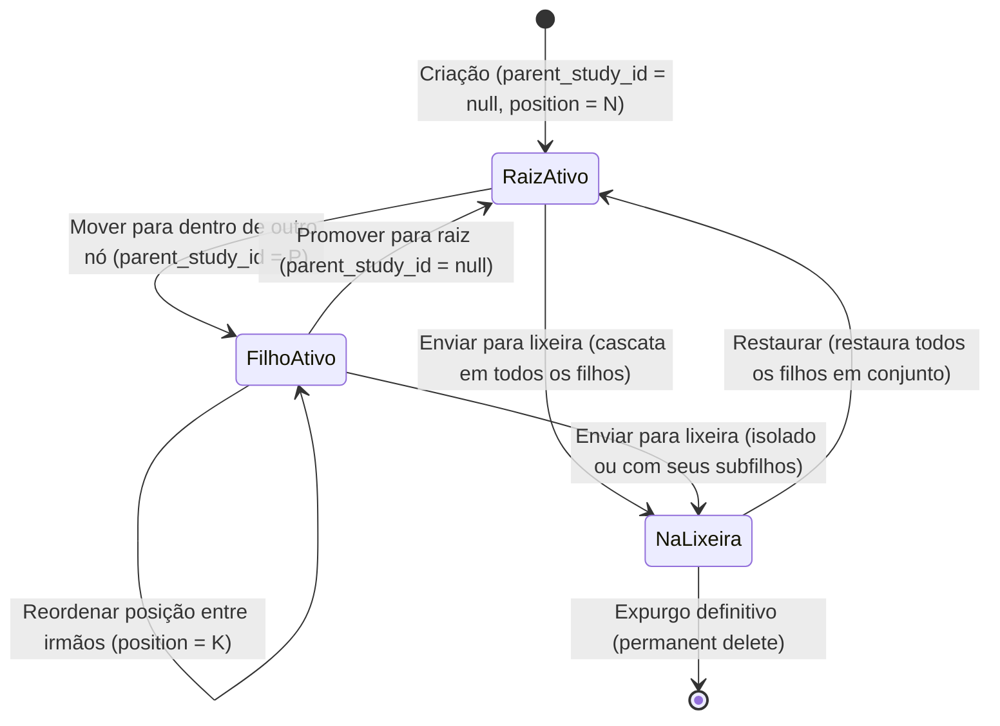

# Data Model: F02 — Hierarquia Interativa

**Feature Branch**: `020-hierarquia-interativa`  
**Date**: 2026-09-19  
**Status**: Completed  

---

## 1. Schema Relacional (SQLite)

### Tabela `studies` (Alteração Estrutural)

A tabela existente `studies` recebe duas novas colunas via migração Alembic `0006_add_study_hierarchy_and_position.py`:

```sql
ALTER TABLE studies ADD COLUMN parent_study_id INTEGER NULL REFERENCES studies(id) ON DELETE SET NULL;
ALTER TABLE studies ADD COLUMN position INTEGER NOT NULL DEFAULT 0;

CREATE INDEX ix_studies_parent_study_id ON studies (parent_study_id);
CREATE INDEX ix_studies_chapter_parent_position ON studies (chapter_id, parent_study_id, position);
```

### Detalhamento dos Campos Adicionados

| Campo | Tipo | Nulidade | Valor Padrão | Descrição |
| :--- | :--- | :--- | :--- | :--- |
| `parent_study_id` | `INTEGER` | Sim (`NULL`) | `NULL` | ID do estudo pai ancestral imediato. Se `NULL`, o estudo é um nó raiz no capítulo. |
| `position` | `INTEGER` | Não (`NOT NULL`) | `0` | Posição ordinal entre estudos que compartilham o mesmo pai no mesmo capítulo. |

### Relacionamentos SQLAlchemy no Modelo `Study`

```python
# Em app/models/study.py

parent_study_id: Mapped[int | None] = mapped_column(
    ForeignKey("studies.id", ondelete="SET NULL"),
    nullable=True,
    index=True,
)
position: Mapped[int] = mapped_column(
    Integer,
    default=0,
    server_default=text("0"),
    nullable=False,
)

# Relacionamento de autorreferência hierárquica
parent: Mapped[Study | None] = relationship(
    "Study",
    remote_side="Study.id",
    back_populates="children",
)
children: Mapped[list[Study]] = relationship(
    "Study",
    back_populates="parent",
    order_by="Study.position",
    cascade="all, delete-orphan",
)
```

---

## 2. Validações e Regras de Integridade

### Regra V-01: Pertencimento ao Mesmo Capítulo
- Um estudo filho **DEVE** pertencer estritamente ao mesmo `chapter_id` que o estudo pai.
- Rejeição: `HTTP 422 Unprocessable Entity` com mensagem: `"Estudo pai pertence a outro capítulo."`.

### Regra V-02: Grafo Acíclico Dirigido (Prevenção de Ciclos)
- Um estudo **NÃO PODE** ser atribuído como pai de si próprio (`parent_study_id == id`).
- Um estudo **NÃO PODE** ser atribuído como filho de qualquer um de seus próprios descendentes diretos ou indiretos.
- Rejeição: `HTTP 422 Unprocessable Entity` com mensagem: `"Ciclo hierárquico detectado: um estudo não pode ser filho de seus descendentes."`.

### Regra V-03: Limite Máximo de Profundidade (5 Níveis)
- A profundidade de um nó na árvore é calculada como a distância até a raiz (nível raiz = 0).
- O nível máximo permitido para qualquer estudo é 4 (total de 5 níveis: 0, 1, 2, 3, 4).
- Ao mover um nó que possui subárvore de filhos, a profundidade máxima resultante calculada é:
  $$\text{Profundidade Nova} = \text{Profundidade}(Pai) + 1 + \text{Altura}(\text{Subárvore})$$
  Se $\text{Profundidade Nova} > 4$ (total $> 5$), a movimentação é rejeitada.
- Rejeição: `HTTP 422 Unprocessable Entity` com mensagem: `"Limite de profundidade excedido: a árvore permite no máximo 5 níveis de aninhamento."`.

### Regra V-04: Concorrência Otimista
- Operações de reordenação e movimentação hierárquica exigem o envio de `expected_updated_at`.
- Caso o `updated_at` no banco seja superior, a operação é rejeitada com `HTTP 409 Conflict`.

---

## 3. Entidades no Frontend (TypeScript)

### Extensão de `StudySummary` e `Study`

```typescript
// Em frontend/src/types.ts

export interface StudySummary {
  id: number
  chapter_id: number
  title: string
  location: string
  parent_study_id: number | null  // NOVO
  position: number               // NOVO
  created_at: string
  updated_at: string
  deleted_at?: string | null
}
```

### Projeção Hierárquica em Árvore (`StudyTreeNode`)

```typescript
export interface StudyTreeNode extends StudySummary {
  depth: number
  isExpanded: boolean
  children: StudyTreeNode[]
}
```

### Payload de Movimentação Hierárquica (`StudyMovePayload`)

```typescript
export interface StudyMovePayload {
  parent_study_id: number | null
  target_position: number
  expected_updated_at?: string | null
}
```

---

## 4. Transições de Estado e Ciclo de Vida


