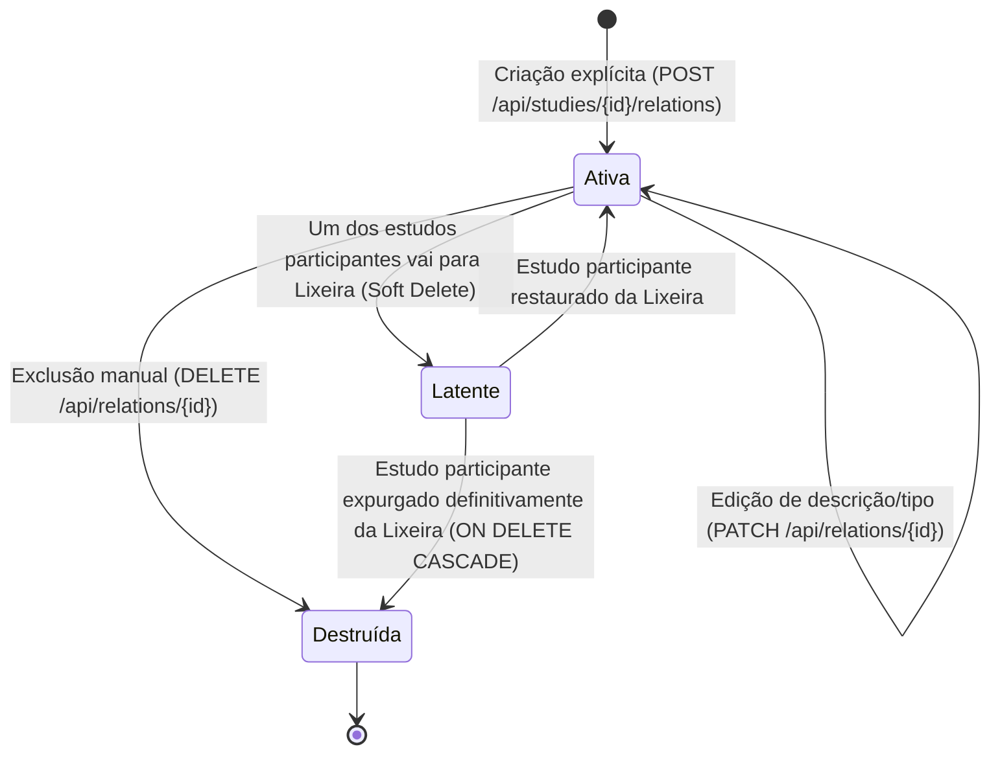

# Data Model & Schema Specification: F04 — Relações entre Estudos

**Feature**: `022-relacoes-estudos`  
**Date**: 2026-09-19  
**Status**: Completed  

---

## 1. Esquema Relacional (SQLite)

### Tabela `study_relations`

| Coluna | Tipo | Restrições | Descrição |
| :--- | :--- | :--- | :--- |
| `id` | `INTEGER` | `PRIMARY KEY AUTOINCREMENT` | Identificador único da relação. |
| `source_study_id` | `INTEGER` | `NOT NULL REFERENCES studies(id) ON DELETE CASCADE` | Estudo de origem do vínculo semântico. |
| `target_study_id` | `INTEGER` | `NOT NULL REFERENCES studies(id) ON DELETE CASCADE` | Estudo de destino do vínculo semântico. |
| `relation_type` | `TEXT` | `NOT NULL` | Tipo semântico canônico do vínculo. |
| `description` | `TEXT` | `NOT NULL DEFAULT ''` | Anotação textual opcional (máximo 500 caracteres). |
| `created_at` | `DATETIME` | `NOT NULL DEFAULT CURRENT_TIMESTAMP` | Carimbo de data/hora de criação do vínculo. |

### Restrições de Integridade (Constraints)

1. **Proibição de Auto-Relacionamento**:
   ```sql
   CONSTRAINT ck_study_relations_no_self CHECK (source_study_id != target_study_id)
   ```
2. **Tipos de Relação Válidos**:
   ```sql
   CONSTRAINT ck_study_relations_type CHECK (
       relation_type IN (
           'relacionado_com',
           'complementa',
           'contradiz',
           'depende_de',
           'mesmo_tema',
           'desdobramento_de'
       )
   )
   ```
3. **Unicidade Composta**:
   ```sql
   CONSTRAINT uq_study_relations_src_tgt_type UNIQUE (source_study_id, target_study_id, relation_type)
   ```

### Índices de Performance

```sql
CREATE INDEX ix_study_relations_source ON study_relations (source_study_id);
CREATE INDEX ix_study_relations_target ON study_relations (target_study_id);
```

---

## 2. Modelo Declarativo SQLAlchemy 2.0 (Python 3.13)

```python
# backend/app/models/study_relation.py
from datetime import datetime
from sqlalchemy import (
    CheckConstraint,
    Column,
    DateTime,
    ForeignKey,
    Integer,
    String,
    Text,
    UniqueConstraint,
)
from sqlalchemy.orm import relationship

from app.core.database import Base


class StudyRelation(Base):
    __tablename__ = "study_relations"
    __table_args__ = (
        CheckConstraint("source_study_id != target_study_id", name="ck_study_relations_no_self"),
        CheckConstraint(
            "relation_type IN ('relacionado_com', 'complementa', 'contradiz', 'depende_de', 'mesmo_tema', 'desdobramento_de')",
            name="ck_study_relations_type",
        ),
        UniqueConstraint("source_study_id", "target_study_id", "relation_type", name="uq_study_relations_src_tgt_type"),
    )

    id = Column(Integer, primary_key=True, autoincrement=True)
    source_study_id = Column(Integer, ForeignKey("studies.id", ondelete="CASCADE"), nullable=False, index=True)
    target_study_id = Column(Integer, ForeignKey("studies.id", ondelete="CASCADE"), nullable=False, index=True)
    relation_type = Column(String(50), nullable=False)
    description = Column(Text, nullable=False, default="")
    created_at = Column(DateTime, nullable=False, default=datetime.utcnow)

    # Relacionamentos com os estudos participantes
    source_study = relationship("Study", foreign_keys=[source_study_id], backref="outbound_relations")
    target_study = relationship("Study", foreign_keys=[target_study_id], backref="inbound_relations")
```

---

## 3. Schemas Pydantic v2

```python
# backend/app/schemas/study_relation.py
from datetime import datetime
from typing import Literal, Optional
from pydantic import BaseModel, Field, field_validator

RelationTypeEnum = Literal[
    "relacionado_com",
    "complementa",
    "contradiz",
    "depende_de",
    "mesmo_tema",
    "desdobramento_de",
]

class StudyRelationBase(BaseModel):
    relation_type: RelationTypeEnum
    description: str = Field(default="", max_length=500)

class StudyRelationCreate(StudyRelationBase):
    target_study_id: int

    @field_validator("target_study_id")
    @classmethod
    def validate_positive(cls, v: int) -> int:
        if v <= 0:
            raise ValueError("O ID do estudo de destino deve ser um número inteiro positivo.")
        return v

class StudyRelationUpdate(BaseModel):
    relation_type: Optional[RelationTypeEnum] = None
    description: Optional[str] = Field(default=None, max_length=500)

class ConnectedStudySummary(BaseModel):
    id: int
    title: str
    book_id: int
    book_title: str
    chapter_id: int
    chapter_title: str

class StudyRelationItem(BaseModel):
    id: int
    source_study_id: int
    target_study_id: int
    relation_type: RelationTypeEnum
    description: str
    created_at: datetime
    connected_study: ConnectedStudySummary

    class Config:
        from_attributes = True

class StudyRelationsResponse(BaseModel):
    study_id: int
    outbound: list[StudyRelationItem]
    inbound: list[StudyRelationItem]

class CandidateStudyItem(BaseModel):
    id: int
    title: str
    book_id: int
    book_title: str
    chapter_id: int
    chapter_title: str

class BookCanvasRelationItem(BaseModel):
    id: int
    source_study_id: int
    target_study_id: int
    relation_type: RelationTypeEnum
    description: str
```

---

## 4. Tipagem TypeScript (Frontend)

```typescript
// frontend/src/types.ts

export type StudyRelationType =
  | 'relacionado_com'
  | 'complementa'
  | 'contradiz'
  | 'depende_de'
  | 'mesmo_tema'
  | 'desdobramento_de'

export interface ConnectedStudySummary {
  id: number
  title: str
  book_id: number
  book_title: string
  chapter_id: number
  chapter_title: string
}

export interface StudyRelationItem {
  id: number
  source_study_id: number
  target_study_id: number
  relation_type: StudyRelationType
  description: string
  created_at: string
  connected_study: ConnectedStudySummary
}

export interface StudyRelationsResponse {
  study_id: number
  outbound: StudyRelationItem[]
  inbound: StudyRelationItem[]
}

export interface CreateStudyRelationPayload {
  target_study_id: number
  relation_type: StudyRelationType
  description?: string
}

export interface CandidateStudyItem {
  id: number
  title: string
  book_id: number
  book_title: string
  chapter_id: number
  chapter_title: string
}

export interface BookCanvasRelationItem {
  id: number
  source_study_id: number
  target_study_id: number
  relation_type: StudyRelationType
  description: string
}
```

---

## 5. Ciclo de Vida e Transições de Estado


