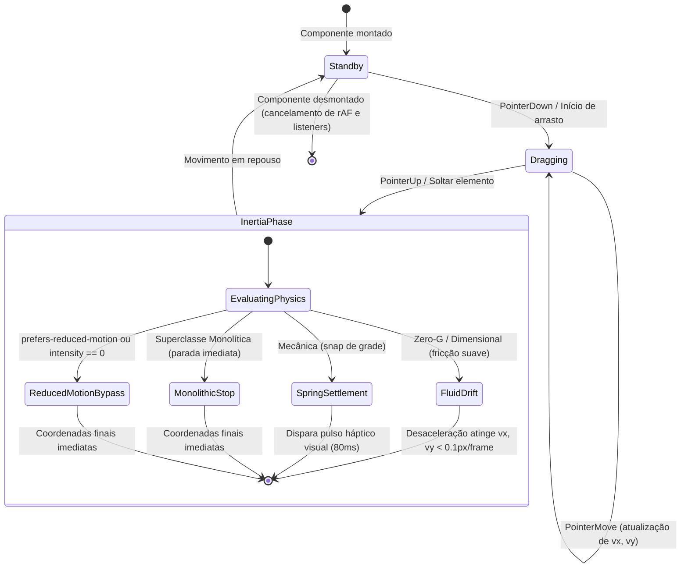

# Data Model & State Architecture: F10 — Interação Avançada, Movimento e Experiências Visuais

**Feature Branch**: `026-interacao-avancada-movimento`  
**Date**: 2026-09-19  
**Status**: Ready  

---

## 1. Visão Geral do Modelo de Dados

A Feature F10 opera integralmente no lado do cliente (Frontend Vue 3), com persistência de preferências de apresentação no `localStorage` do navegador e zero alterações na camada de banco de dados (`caderno.db`) ou API REST.

---

## 2. Entidades de Estado Reativo e Cinemática (TypeScript)

### 2.1 Perfil Cinemático da Superclasse (`KinematicProfile`)
Define as constantes matemáticas que governam a simulação física, a inércia e as microinterações de cada superclasse:

```typescript
export interface KinematicProfile {
  name: 'zero-g' | 'mecanica' | 'invisivel' | 'dimensional' | 'monolitica'
  friction: number          // Coeficiente de desaceleração por quadro [0.0, 1.0] (1 = sem atrito)
  springStiffness: number   // Rigidez da força de retorno elástico [0.0, 1.0]
  snapGridSize: number      // Tamanho do passo da grade (0 = contínuo, 20 = grade rígida)
  parallaxFactor: number    // Fator de escala de deslocamento em profundidade 2.5D
  revealDistance: number    // Raio de proximidade em pixels para revelação de arestas
  hapticStyle: 'smooth' | 'snap' | 'none' | 'subtle' // Padrão de micro-resposta visual
}
```

### 2.2 Tabela de Constantes Canônicas por Superclasse

```typescript
export const SUPERCLASS_KINEMATIC_PROFILES: Record<string, KinematicProfile> = {
  'zero-g': {
    name: 'zero-g',
    friction: 0.96,
    springStiffness: 0.05,
    snapGridSize: 0,
    parallaxFactor: 1.0,
    revealDistance: 0,
    hapticStyle: 'smooth',
  },
  'mecanica': {
    name: 'mecanica',
    friction: 0.82,
    springStiffness: 0.28,
    snapGridSize: 20,
    parallaxFactor: 0.0,
    revealDistance: 0,
    hapticStyle: 'snap',
  },
  'invisivel': {
    name: 'invisivel',
    friction: 0.90,
    springStiffness: 0.10,
    snapGridSize: 0,
    parallaxFactor: 0.2,
    revealDistance: 140,
    hapticStyle: 'subtle',
  },
  'dimensional': {
    name: 'dimensional',
    friction: 0.92,
    springStiffness: 0.12,
    snapGridSize: 0,
    parallaxFactor: 1.6,
    revealDistance: 0,
    hapticStyle: 'subtle',
  },
  'monolitica': {
    name: 'monolitica',
    friction: 0.0,
    springStiffness: 1.0,
    snapGridSize: 0,
    parallaxFactor: 0.0,
    revealDistance: 0,
    hapticStyle: 'none',
  },
}
```

### 2.3 Estado do Motor Gráfico Acelerado (`AccelerationEngineState`)
Controla o monitoramento da densidade de nós e a comutação transparente entre a camada SVG e a camada acelerada Canvas 2D:

```typescript
export interface AccelerationEngineState {
  nodeCount: number
  threshold: number          // Limiar padrão: 60 nós visíveis simultaneamente
  isAccelerated: boolean     // true se nodeCount >= threshold e hardware suportado
  fpsTarget: number          // 60 fps
  reducedMotionActive: boolean
}
```

### 2.4 Estado Transitório de Movimento (`MotionState`)
Mantém o rastreamento em tempo real da velocidade e posição de nós ou do viewport durante o arraste e após o soltar:

```typescript
export interface MotionState {
  x: number
  y: number
  vx: number
  vy: number
  isDragging: boolean
  isSettling: boolean
}
```

---

## 3. Persistência de Preferências do Usuário (`localStorage`)

| Chave | Tipo | Descrição | Fallback Padrão |
|---|---|---|---|
| `caderno_superclass` | string | Identificador da superclasse ativa (`zero-g`, `mecanica`, etc.) | `'zero-g'` |
| `caderno_superclass_intensity` | string / float | Multiplicador de intensidade cinemática entre `0.0` e `1.0` | `1.0` |
| `caderno_graph_acceleration` | string / bool | Preferência de aceleração gráfica (`'auto'`, `'always'`, `'disabled'`) | `'auto'` |

---

## 4. Ciclo de Vida e Estados de Transição


