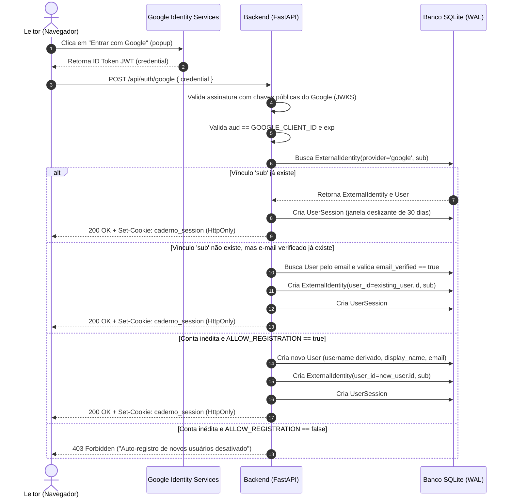
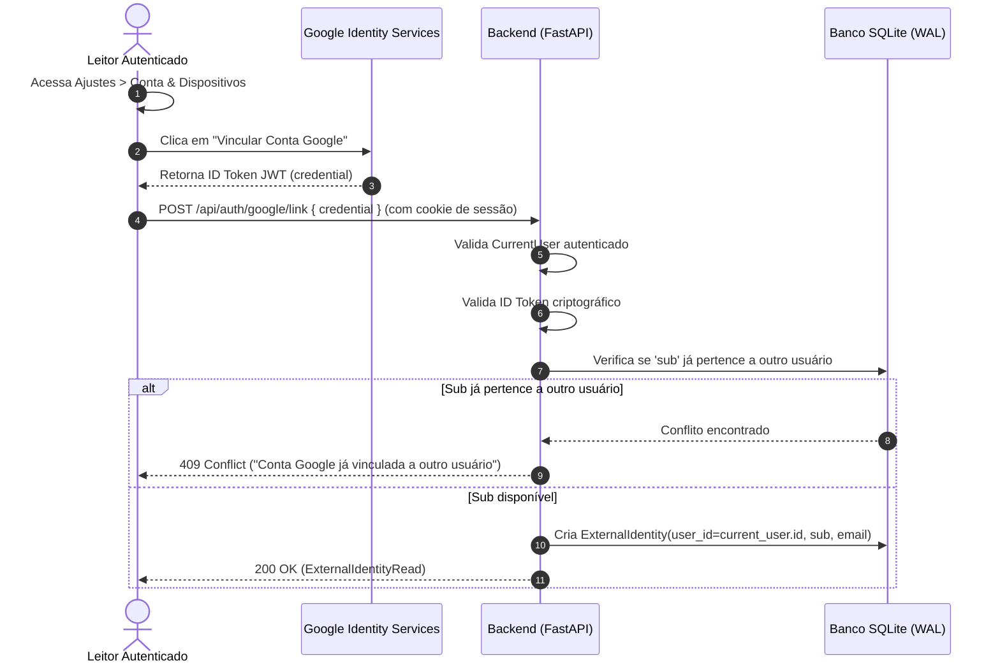
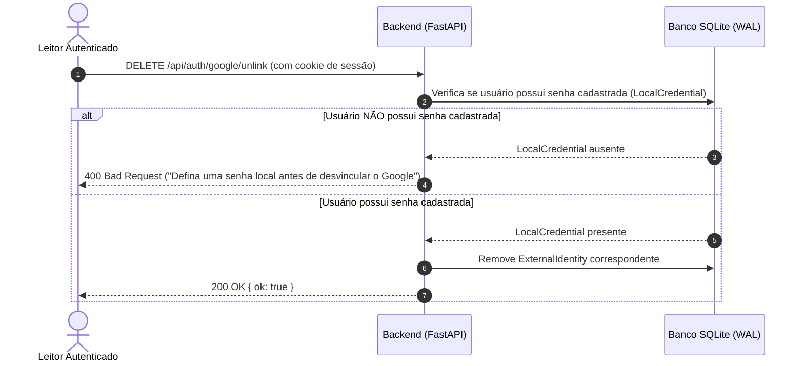

# Sequence Diagrams & State Transitions: Google Auth

**Feature**: `030-conta-google-identidade`  
**Date**: 2026-09-22  
**Status**: Completed  

---

## 1. Fluxo de Autenticação e Primeiro Acesso (Sign In with Google)

---

## 2. Fluxo de Vinculação nos Ajustes de Conta

---

## 3. Fluxo de Desvinculação nos Ajustes e Prevenção de Lockout

