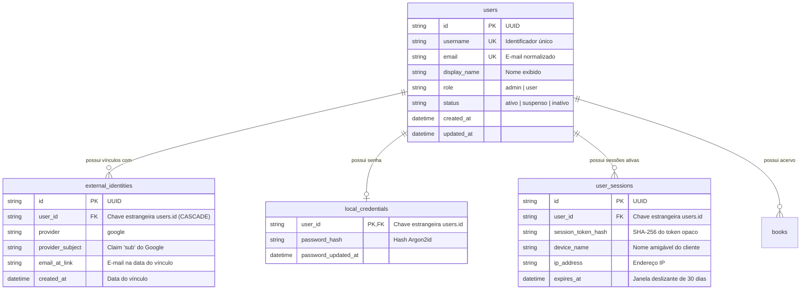

# Data Model: Conta Google e Vinculação de Identidade

**Feature**: `030-conta-google-identidade`  
**Date**: 2026-09-22  
**Status**: Completed  

---

## 1. Diagrama Entidade-Relacionamento



---

## 2. Entidades e Definições de Tabela

### 2.1 Tabela `external_identities` (Nova)

Armazena as identidades externas de terceiros vinculadas a uma conta de usuário do Caderno de Leitura.

| Coluna | Tipo | Nulo | Padrão | Descrição |
| :--- | :--- | :---: | :--- | :--- |
| `id` | `VARCHAR(36)` | Não | UUID v4 | Identificador primário da identidade externa |
| `user_id` | `VARCHAR(36)` | Não | — | Chave estrangeira referenciando `users(id)` com `ON DELETE CASCADE` |
| `provider` | `VARCHAR(30)` | Não | `'google'` | Nome do provedor de identidade |
| `provider_subject` | `VARCHAR(255)` | Não | — | Identificador imutável fornecido pelo provedor (claim `sub` do Google) |
| `email_at_link` | `VARCHAR(255)` | Sim | `NULL` | E-mail registrado no momento da vinculação |
| `created_at` | `TIMESTAMP` | Não | `CURRENT_TIMESTAMP` | Carimbo de data/hora da criação do vínculo |

#### Restrições e Índices
- **PK**: `PRIMARY KEY (id)`
- **FK**: `FOREIGN KEY (user_id) REFERENCES users(id) ON DELETE CASCADE`
- **UQ**: `UNIQUE (provider, provider_subject)` (Garante que a mesma conta Google não pertença a mais de um usuário simultaneamente)
- **IDX**: `INDEX ix_external_identities_user_id (user_id)`
- **IDX**: `INDEX ix_external_identities_provider_sub (provider, provider_subject)`

---

## 3. Schemas de Entrada e Saída (Pydantic v2)

### 3.1 `GoogleAuthRequest`
```python
class GoogleAuthRequest(InputModel):
    credential: str = Field(
        min_length=1,
        description="ID Token JWT emitido pelo Google Identity Services (GIS)",
    )
```

### 3.2 `ExternalIdentityRead`
```python
class ExternalIdentityRead(OutputModel):
    id: str
    provider: str
    email_at_link: str | None = None
    created_at: datetime
```

### 3.3 Atualizações em `AuthConfigResponse`
```python
class AuthConfigResponse(OutputModel):
    allow_registration: bool
    owner_setup_required: bool
    google_auth_enabled: bool = False
    google_client_id: str | None = None
```

### 3.4 Atualizações em `UserRead`
```python
class UserRead(OutputModel):
    id: str
    username: str
    display_name: str
    email: str | None = None
    role: str
    status: str
    created_at: datetime
    has_password: bool = False
    has_google: bool = False
```

---

## 4. Ciclo de Migração de Banco de Dados (Alembic)

- **Identificador de Revisão**: `0013_add_external_identities`
- **Revisão Anterior**: `0012_add_credentials_and_sessions`
- **Operação**:
  1. Cria tabela `external_identities` com constraints e índices.
  2. Executa `downgrade` dropando a tabela `external_identities` de forma segura.
