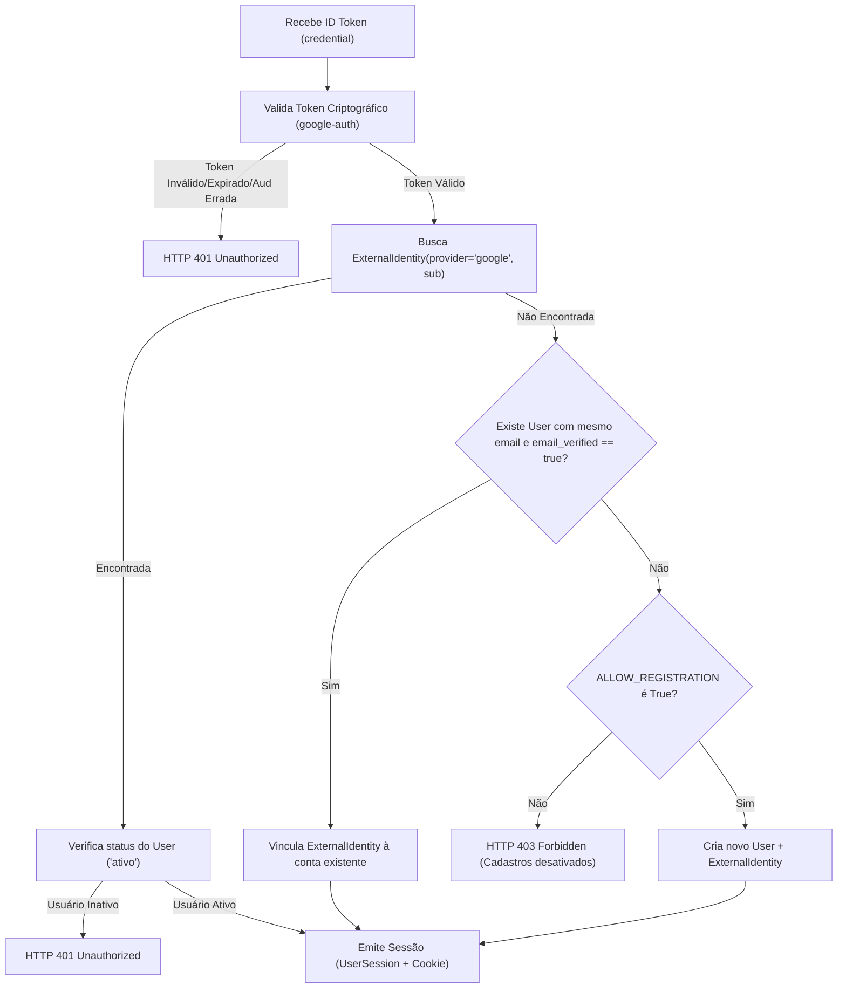

# Research & Technical Decisions: Conta Google e Vinculação de Identidade

**Feature**: `030-conta-google-identidade`  
**Date**: 2026-09-22  
**Status**: Completed  

---

## 1. Validação Criptográfica de ID Token Google no Backend

### Decisão
Utilizar a biblioteca oficial `google-auth` (`google.oauth2.id_token.verify_oauth2_token`) combinada com `google.auth.transport.requests.Request` para validação criptográfica estrita dos ID Tokens JWT emitidos pelo Google.

### Justificativa
- A biblioteca `google-auth` é a implementação canônica mantida pelo Google para verificação de ID Tokens em Python.
- Ela realiza o download e o cache inteligente das chaves públicas dos certificados JWKS do Google (`https://www.googleapis.com/oauth2/v3/certs`).
- Valida automaticamente a assinatura RSA, a expiração do token (`exp`), a janela de tempo válida (`nbf`, `iat`), o emissor (`iss` pertencente a `accounts.google.com` ou `https://accounts.google.com`) e o destinatário pretendido (`aud == GOOGLE_CLIENT_ID`).
- Evita reimplementar manualmente a lógica de validação de chaves rotativas do Google em `pyjwt` ou `cryptography`.

### Alternativas Consideradas
- **PyJWT puro com busca manual de JWKS**: Requereria gerenciar manualmente o cache HTTP das chaves públicas do Google e tratar a rotação de certificados. Menos robusto e com maior superfície de erro.
- **Validação via endpoint de introspecção do Google (`tokeninfo`)**: Realiza uma chamada HTTP de rede externa para o Google a cada requisição de login. Ineficiente e adiciona latência desnecessária em comparação com a validação local por chave pública com cache.

---

## 2. Modelo de Dados de Identidades Externas (`ExternalIdentity`)

### Decisão
Criar a entidade SQLAlchemy `ExternalIdentity` mapeada para a tabela `external_identities`, vinculada a `User` por chave estrangeira `user_id` com integridade referencial `CASCADE`.

```python
class ExternalIdentity(Base):
    __tablename__ = "external_identities"
    __table_args__ = (
        UniqueConstraint("provider", "provider_subject", name="uq_external_provider_sub"),
    )

    id: Mapped[str] = mapped_column(String(36), primary_key=True, default=lambda: str(uuid.uuid4()))
    user_id: Mapped[str] = mapped_column(String(36), ForeignKey("users.id", ondelete="CASCADE"), nullable=False, index=True)
    provider: Mapped[str] = mapped_column(String(30), nullable=False, default="google")
    provider_subject: Mapped[str] = mapped_column(String(255), nullable=False, index=True)
    email_at_link: Mapped[str | None] = mapped_column(String(255), nullable=True)
    created_at: Mapped[datetime] = mapped_column(UTCDateTime(), default=utc_now, nullable=False)
```

### Justificativa
- Adere ao Princípio 4 do Roadmap 0.5: **Identidade Própria Desacoplada de Provedores Externos**. A conta do usuário (`User`) é soberana e central; o Google é apenas um dos provedores de identidade vinculáveis.
- O campo `provider_subject` armazena o claim `sub` do Google (uma sequência estável de dígitos imutável para toda a vida da conta Google).
- O e-mail nunca é a chave primária de relacionamento: se o leitor mudar o e-mail principal na conta Google, o vínculo permanece íntegro e inalterado.
- Índice único composto em `(provider, provider_subject)` assegura que a mesma conta Google não possa ser associada a dois usuários diferentes simultaneamente.

---

## 3. Integração Frontend com o SDK Google Identity Services (GIS)

### Decisão
Carregar dinamicamente o script oficial do GIS (`https://accounts.google.com/gsi/client`) de forma sob demanda e assíncrona, apenas quando `google_auth_enabled == true` e `google_client_id` estiver presente na configuração pública fornecida por `GET /api/auth/config`.

### Justificativa
- Se o servidor estiver operando sem chaves do Google (`GOOGLE_CLIENT_ID` não configurado), o frontend **não** carrega o script externo, mantendo zero conexões externas e total discrição.
- O script do GIS renderiza o botão oficial do Google através de `google.accounts.id.renderButton` ou gerencia o fluxo de One Tap / popup modal.
- O callback JavaScript recebe o objeto `{ credential }` contendo o JWT bruto e o envia imediatamente ao backend via requisição JSON `POST /api/auth/google`.
- O backend responde com o cookie seguro de sessão `caderno_session` (`HttpOnly`), aproveitando exatamente a mesma arquitetura de transporte e janela deslizante da Feature 02.

---

## 4. Algoritmo de Resolução de Identidade e Vinculação Automática

### Decisão
O endpoint `POST /api/auth/google` implementa o seguinte fluxo determinístico:



### Regras Específicas de Provisionamento
1. **Geração de `@username`**: O nome de usuário para novos leitores Google é derivado da parte local do e-mail ou do nome (ex.: `joao.silva`), normalizado para caracteres alfanuméricos e pontos/hífens (`^[a-zA-Z0-9_.-]+$`). Caso o username já esteja em uso, um sufixo numérico pseudo-aleatório é anexado (ex.: `joao.silva2`).
2. **Nome de Exibição**: Preenchido com o claim `name` do Google (ou parte local do e-mail se ausente).
3. **E-mail**: Preenchido com o claim `email` do Google.
4. **Sem Senha Local Inicial**: A conta nasce sem `LocalCredential`. O usuário pode definir uma senha mestra local posteriormente nos Ajustes de Conta, permitindo login por ambos os métodos.

---

## 5. Vinculação e Desvinculação nos Ajustes de Conta

### Decisão
Endpoints dedicados para a gestão do vínculo na aba *Conta & Dispositivos*:
- `POST /api/auth/google/link`: Associa uma conta Google ao usuário autenticado (`CurrentUser`), validando o token recebido. Rejeita com `HTTP 409 Conflict` se o `sub` já estiver associado a outra conta.
- `DELETE /api/auth/google/unlink`: Remove o registro `ExternalIdentity`. **Prevenção de Lockout**: Rejeita com `HTTP 400 Bad Request` se o usuário não possuir senha local cadastrada (`LocalCredential`), impedindo que o leitor fique sem qualquer meio de acesso.

---

## 6. Estratégia de Testes Automatizados Herméticos

### Decisão
Para os testes com `pytest`:
- Os testes automatizados nunca realizam requisições HTTP reais aos servidores do Google (para manter hermeticidade e independência de conexão com a internet).
- Será criado um helper de teste / fixture que gera ID Tokens mockados e intercepta `google.oauth2.id_token.verify_oauth2_token` retornando os claims esperados (`sub`, `email`, `email_verified`, `name`, `aud`, `iss`).
- Cenários testados:
  1. Login bem-sucedido com conta Google já vinculada.
  2. Auto-registro com nova conta Google (geração de username e estante isolada).
  3. Vinculação automática de e-mail existente com `email_verified=true`.
  4. Bloqueio quando `ALLOW_REGISTRATION=false`.
  5. Vinculação manual via Ajustes e proteção anti-conflito (409).
  6. Desvinculação com sucesso para usuário com senha.
  7. Bloqueio de desvinculação (*lockout prevention*) para usuário sem senha (400).
  8. Rejeição de tokens inválidos, expirados ou com audiência errada (401).
