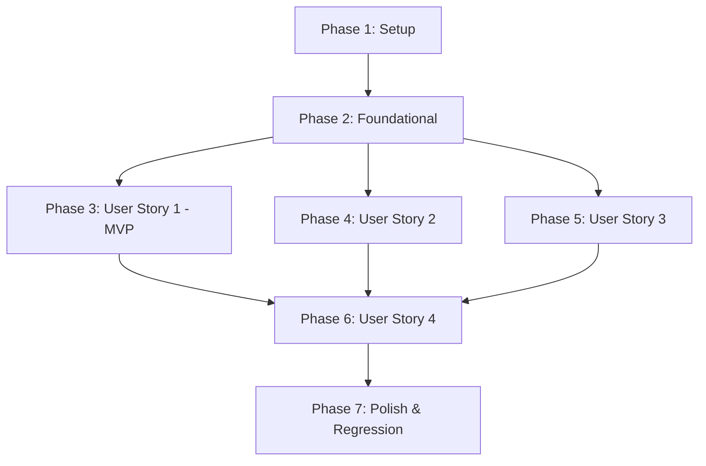

# Tasks: Conta Google e Vinculação de Identidade (F03)

**Feature**: `030-conta-google-identidade`  
**Spec**: [specs/030-conta-google-identidade/spec.md](spec.md)  
**Plan**: [specs/030-conta-google-identidade/plan.md](plan.md)  
**Quickstart**: [specs/030-conta-google-identidade/quickstart.md](quickstart.md)  

---

## Phase 1: Setup (Shared Infrastructure)

**Purpose**: Instalação de dependências e configuração de ambiente base para a integração com Google Identity Services.

- [X] T001 [P] Adicionar dependência `google-auth>=2.27.0` em `caderno-leitura-0.1/backend/requirements.in` e compilar em `caderno-leitura-0.1/backend/requirements.txt`
- [X] T002 [P] Adicionar `@types/google.accounts` como devDependency em `caderno-leitura-0.1/frontend/package.json`
- [X] T003 [P] Configurar leitura de `GOOGLE_CLIENT_ID` e flag `google_auth_enabled` em `caderno-leitura-0.1/backend/app/core/config.py`

---

## Phase 2: Foundational (Blocking Prerequisites)

**Purpose**: Infraestrutura de banco de dados, modelos ORM, schemas de validação e fixtures de teste essenciais que bloqueiam as histórias de usuário.

⚠️ **CRÍTICO**: O desenvolvimento das histórias de usuário (Phases 3 a 6) depende da conclusão desta fase.

- [X] T004 [P] Criar o modelo ORM `ExternalIdentity` com restrições e integridade referencial em `caderno-leitura-0.1/backend/app/models/external_identity.py`
- [X] T005 Adicionar o relacionamento `external_identities` com `cascade="all, delete-orphan"` no modelo `User` em `caderno-leitura-0.1/backend/app/models/user.py`
- [X] T006 Registrar e exportar `ExternalIdentity` em `caderno-leitura-0.1/backend/app/models/__init__.py`
- [X] T007 Criar migração reversível Alembic `0013_add_external_identities.py` em `caderno-leitura-0.1/backend/alembic/versions/0013_add_external_identities.py`
- [X] T008 [P] Criar schemas Pydantic v2 `GoogleAuthRequest`, `ExternalIdentityRead` e atualizar `AuthConfigResponse` e `UserRead` em `caderno-leitura-0.1/backend/app/schemas/auth.py`
- [X] T009 [P] Criar fixtures herméticas e mocks para validação do token Google ID em `caderno-leitura-0.1/backend/tests/conftest.py`
- [X] T010 Implementar serviço de verificação criptográfica do token ID Token usando `google.oauth2.id_token` em `caderno-leitura-0.1/backend/app/services/google_auth_service.py`
- [X] T011 [P] Atualizar interfaces TypeScript para autenticação e identidades externas em `caderno-leitura-0.1/frontend/src/types/auth.ts`

**Checkpoint**: Camada base concluída — modelos, migração, schemas e mocks prontos para a implementação das histórias de usuário.

---

## Phase 3: User Story 1 - Autenticação Direta com Conta Google (Priority: P1) 🎯 MVP

**Goal**: Permitir que usuários com conta Google previamente vinculada façam login na aplicação com um único clique no botão oficial do Google Identity Services (GIS).

**Independent Test**: Submeter credencial JWT simulada com `sub` de usuário existente para o backend; verificar emissão do cookie seguro de sessão `caderno_session` e redirecionamento para a estante. Tokens inválidos ou expirados retornam `HTTP 401 Unauthorized`. Usuários suspensos são recusados.

### Tests for User Story 1
- [X] T012 [P] [US1] Criar suíte de testes de autenticação Google cobrindo token válido, token expirado, token de outra aplicação e usuário suspenso em `caderno-leitura-0.1/backend/tests/test_google_auth.py`

### Implementation for User Story 1
- [X] T013 [US1] Implementar lógica de autenticação com identificador `sub` e emissão de sessão em `caderno-leitura-0.1/backend/app/services/auth_service.py`
- [X] T014 [US1] Implementar endpoint `POST /api/auth/google` em `caderno-leitura-0.1/backend/app/routers/auth.py`
- [X] T015 [P] [US1] Implementar método de API para login com Google em `caderno-leitura-0.1/frontend/src/api/auth.ts`
- [X] T016 [P] [US1] Implementar composable `useGoogleIdentity.ts` para carregar o SDK GIS e gerenciar callbacks em `caderno-leitura-0.1/frontend/src/composables/useGoogleIdentity.ts`
- [X] T017 [US1] Criar componente `GoogleSignInButton.vue` usando ícones do Lucide em `caderno-leitura-0.1/frontend/src/components/auth/GoogleSignInButton.vue`
- [X] T018 [US1] Integrar o botão `GoogleSignInButton` e divisor visual na tela de login em `caderno-leitura-0.1/frontend/src/views/LoginView.vue`

**Checkpoint**: User Story 1 concluída e testável de forma autônoma como MVP.

---

## Phase 4: User Story 2 - Cadastro e Primeiro Acesso Automático via Google (Priority: P1)

**Goal**: Provisionar automaticamente novas contas de leitor a partir do login Google quando o auto-registro estiver ativado, bloqueando com `HTTP 403` quando desativado, e vinculando automaticamente e-mails verificados idênticos a contas locais pré-existentes.

**Independent Test**: Submeter token Google de novo usuário com auto-registro ativo comprovando a criação do registro em `users` e `external_identities`. Em seguida, testar com `ALLOW_REGISTRATION=false` confirmando rejeição `HTTP 403`. Por fim, testar token com e-mail verificado correspondente a usuário local com senha, confirmando auto-vinculação sem conta duplicada.

### Tests for User Story 2
- [X] T019 [P] [US2] Adicionar testes em `caderno-leitura-0.1/backend/tests/test_google_auth.py` para auto-provisionamento de novo leitor, rejeição 403 com registro desabilitado, auto-vinculação por e-mail verificado e rejeição de e-mail não verificado

### Implementation for User Story 2
- [X] T020 [US2] Implementar provisionamento de novos usuários com `@username` único e auto-vinculação por `email_verified` em `caderno-leitura-0.1/backend/app/services/auth_service.py`
- [X] T021 [US2] Integrar botão de cadastro via Google na tela de registro em `caderno-leitura-0.1/frontend/src/views/RegisterView.vue`
- [X] T022 [US2] Atualizar gerenciamento de estado da sessão de usuário no composable `useAuth.ts` em `caderno-leitura-0.1/frontend/src/composables/useAuth.ts`

**Checkpoint**: Histórias 1 e 2 plenamente funcionais de forma independente e integradas.

---

## Phase 5: User Story 3 - Vinculação e Desvinculação nos Ajustes de Conta (Priority: P2)

**Goal**: Permitir que usuários autenticados conectem sua conta Google à sua conta existente ou a desvinculem, garantindo que o usuário nunca fique sem nenhum método de acesso (*lockout prevention*).

**Independent Test**: Usuário logado vincula conta Google com sucesso; tentativa de vincular conta Google já pertencente a outro usuário resulta em `HTTP 409 Conflict`; tentativa de desvincular Google por usuário sem senha cadastrada resulta em `HTTP 400 Bad Request`; desvinculação por usuário com senha local cadastrada conclui-se com sucesso (`HTTP 200 OK`).

### Tests for User Story 3
- [X] T023 [P] [US3] Adicionar testes para vinculação manual, conflito 409 de conta duplicada e prevenção de lockout na desvinculação em `caderno-leitura-0.1/backend/tests/test_google_auth.py`

### Implementation for User Story 3
- [X] T024 [US3] Implementar métodos `link_google_identity` e `unlink_google_identity` com verificação estrita de senha ativa em `caderno-leitura-0.1/backend/app/services/auth_service.py`
- [X] T025 [US3] Implementar rotas `POST /api/auth/google/link` e `DELETE /api/auth/google/unlink` em `caderno-leitura-0.1/backend/app/routers/auth.py`
- [X] T026 [P] [US3] Adicionar métodos `linkGoogle` e `unlinkGoogle` no cliente HTTP em `caderno-leitura-0.1/frontend/src/api/auth.ts`
- [X] T027 [US3] Adicionar card de vinculação/desvinculação de conta Google com avisos de segurança em `caderno-leitura-0.1/frontend/src/components/auth/SessionsManager.vue`

**Checkpoint**: Histórias 1, 2 e 3 integradas e testadas com prevenção total de bloqueio acidental de contas.

---

## Phase 6: User Story 4 - Operação Graciosa e Degradação Elegante sem Chaves Google (Priority: P3)

**Goal**: Garantir que a ausência de `GOOGLE_CLIENT_ID` desative silenciosamente os componentes externos do Google, mantendo o login local 100% operacional sem erros no console ou requisições de rede com falha.

**Independent Test**: Executar a API com `GOOGLE_CLIENT_ID` indefinido; constatar que `GET /api/auth/config` retorna `google_auth_enabled: false`; verificar que `LoginView.vue` oculta o botão Google sem espaço vazio ou erro; verificar que chamadas diretas a `/api/auth/google` retornam `HTTP 400 Bad Request`.

### Tests for User Story 4
- [X] T028 [P] [US4] Adicionar testes de degradação graciosa com Google desabilitado em `caderno-leitura-0.1/backend/tests/test_google_auth.py`

### Implementation for User Story 4
- [X] T029 [US4] Garantir que `GET /api/auth/config` e rotas do Google tratem adequadamente a ausência de chaves em `caderno-leitura-0.1/backend/app/routers/auth.py`
- [X] T030 [US4] Garantir que o composable `useGoogleIdentity.ts` não injete scripts externos quando desabilitado em `caderno-leitura-0.1/frontend/src/composables/useGoogleIdentity.ts`
- [X] T031 [US4] Assegurar renderização limpa e responsiva do formulário local sem quebras visuais em `caderno-leitura-0.1/frontend/src/views/LoginView.vue`

**Checkpoint**: Histórias 1 a 4 totalmente funcionais e verificadas em modo online e offline/degradado.

---

## Phase 7: Polish & Cross-Cutting Concerns

**Purpose**: Validação de ponta a ponta, qualidade de código, conformidade de acessibilidade e regressão geral.

- [X] T032 [P] Documentar guia de configuração de credenciais no Google Cloud Console e Tailscale HTTPS em `caderno-leitura-0.1/docs/contexto/GOOGLE-AUTH-SETUP.md`
- [X] T033 Executar todos os cenários de validação descritos em `specs/030-conta-google-identidade/quickstart.md`
- [X] T034 Executar auditoria de sistema visual e ícones garantindo ausência de emojis informais com `frontend/tests/visual_system.test.mjs`
- [X] T035 Executar suíte completa de testes de regressão do backend via `python -m pytest backend/tests`
- [X] T036 Executar suíte completa de testes e build de produção do frontend via `npm test` e `npm run build` em `caderno-leitura-0.1/frontend`

---

## Dependencies & Execution Order

### Phase Dependencies

- **Setup (Phase 1)**: Sem dependências — execução imediata.
- **Foundational (Phase 2)**: Depende da conclusão da Phase 1 — **BLOQUEIA** todas as histórias de usuário.
- **User Story 1 (Phase 3 - P1 MVP)**: Depende da conclusão da Phase 2.
- **User Story 2 (Phase 4 - P1)**: Depende da conclusão da Phase 2 e integra-se à Phase 3.
- **User Story 3 (Phase 5 - P2)**: Depende da conclusão da Phase 2 e da estrutura de sessão estabelecida na Phase 3.
- **User Story 4 (Phase 6 - P3)**: Depende da conclusão das rotas e componentes base das histórias anteriores.
- **Polish (Phase 7)**: Depende da conclusão das histórias de usuário desejadas.

### Parallel Execution Opportunities

- **Phase 1**: `T001`, `T002` e `T003` podem ser executadas em paralelo (arquivos distintos).
- **Phase 2**: `T004`, `T008`, `T009` e `T011` podem ser iniciadas em paralelo.
- **Phase 3**: `T012` (testes backend), `T015` (API frontend) e `T016` (composable GIS) podem rodar em paralelo.
- **Phase 4**: `T019` (testes US2) pode ser criado paralelamente à integração de tela `T021`.
- **Phase 5**: `T023` (testes US3) e `T026` (API frontend) podem ser executados em paralelo.
- **Phase 6**: `T028` (testes de degradação) pode ser escrito em paralelo a `T030`.
- **Phase 7**: `T032`, `T034` e `T035` podem ser auditados independentemente.

---

## Implementation Strategy

### MVP First (Phase 1 + Phase 2 + Phase 3)
1. Concluir a instalação de dependências e configuração básica (Phase 1).
2. Concluir a tabela `external_identities`, migração Alembic, schemas e mock fixtures (Phase 2).
3. Concluir a User Story 1: validação de token Google e emissão de sessão via botão GIS (Phase 3).
4. **Validar MVP**: Executar os testes herméticos de login Google comprovando o funcionamento autônomo.

### Entrega Incremental
1. **MVP**: Login direto com conta Google já vinculada (US1).
2. **Incremento 1**: Auto-provisionamento de novas contas e vinculação inteligente por e-mail verificado (US2).
3. **Incremento 2**: Gerenciamento de vínculo nos Ajustes com proteção estrita contra *lockout* (US3).
4. **Incremento 3**: Validação de degradação graciosa em ambiente offline/sem chaves Google (US4).
5. **Finalização**: Validação completa da suíte de regressão (`pytest`, `npm test`, `npm run build`).
