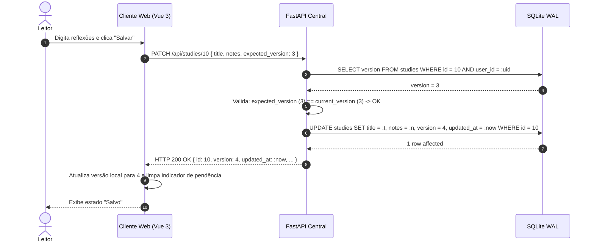
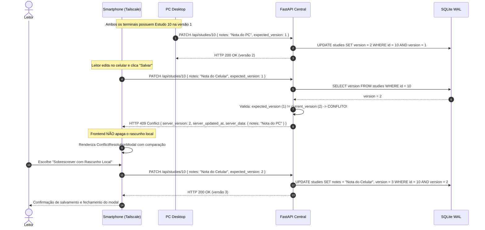
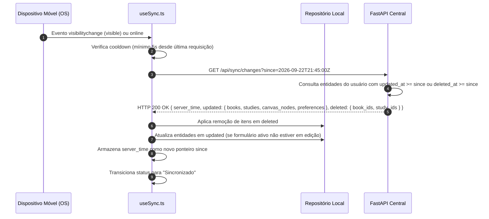

# Sync Flow & Concurrency Lifecycle

**Feature**: `031-sincronizacao-multidispositivo`  
**Date**: 2026-09-22  
**Status**: Completed  

Este documento descreve os fluxos de mensagens, transições de estado e protocolos de interação entre clientes desktop/móveis e o servidor central FastAPI.

---

## 1. Fluxo de Atualização com Controle Otimista de Concorrência (OCC)

### Cenário A: Atualização Sequencial Bem-Sucedida
Quando não há edições concorrentes, a gravação procede sem atrito e avança a versão.

---

### Cenário B: Detecção de Conflito Concorrente e Diálogo de Resolução
Quando outro terminal salvou uma alteração prévia e o cliente tenta enviar versão defasada.

---

## 2. Fluxo de Reconciliação Pós-Reconexão / Standby

Quando um celular volta de suspensão ou recupera sinal Wi-Fi/Tailscale:

---

## 3. Matriz de Estados do Indicador de Sincronização

| Estado | Significado | Ação do Usuário | Ícone / Feedback Visual |
| :--- | :--- | :--- | :--- |
| `IDLE_SYNCED` | Todos os dados locais estão persistidos e idênticos ao servidor. | Nenhuma ação necessária. | Nuvem neutra estática ou discreto "Sincronizado". |
| `SYNCING` | Requisição de envio ou reconciliação ativa em andamento. | Aguardar brevemente. | Ícone de atualização em rotação suave. |
| `OFFLINE` | Dispositivo sem rede ou servidor local do PC inacessível. | Leitura liberada; edições são retidas localmente. | Nuvem cortada "Offline — dados retidos". |
| `CONFLICT` | Resposta `HTTP 409` recebida; divergência detectada. | Decidir no modal de resolução. | Alerta visual chamando atenção ao formulário. |
