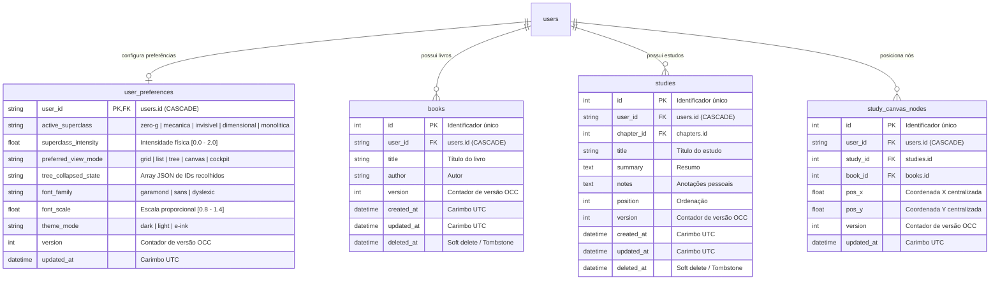

# Data Model: Sincronização Multidispositivo

**Feature**: `031-sincronizacao-multidispositivo`  
**Date**: 2026-09-22  
**Status**: Completed  

---

## 1. Diagrama Entidade-Relacionamento



---

## 2. Entidades e Definições de Tabela

### 2.1 Tabela `user_preferences` (Nova)

Armazena as configurações visuais, de tipografia, modo de leitura e estado da árvore de estudos de cada usuário no servidor.

| Coluna | Tipo | Nulo | Padrão | Descrição |
| :--- | :--- | :---: | :--- | :--- |
| `user_id` | `VARCHAR(36)` | Não | — | Chave primária e estrangeira referenciando `users(id)` com `ON DELETE CASCADE` |
| `active_superclass` | `VARCHAR(30)` | Não | `'mecanica'` | Superclasse cinemática ativa |
| `superclass_intensity` | `FLOAT` | Não | `1.0` | Multiplicador de intensidade das microinterações |
| `preferred_view_mode` | `VARCHAR(20)` | Não | `'grid'` | Modo de visualização preferido na abertura da estante |
| `tree_collapsed_state` | `TEXT` | Não | `'[]'` | Serialização JSON de IDs numéricos recolhidos na árvore |
| `font_family` | `VARCHAR(30)` | Não | `'garamond'` | Fonte tipográfica de leitura |
| `font_scale` | `FLOAT` | Não | `1.0` | Escala proporcional do corpo de texto |
| `theme_mode` | `VARCHAR(20)` | Não | `'dark'` | Tema de cores da aplicação |
| `version` | `INTEGER` | Não | `1` | Versão incremental para controle de concorrência |
| `updated_at` | `TIMESTAMP` | Não | `CURRENT_TIMESTAMP` | Data/hora da última alteração no fuso UTC |

---

### 2.2 Alterações em Tabelas Existentes (Migração 0014)

#### Tabela `studies`
- Adição da coluna `version INTEGER NOT NULL DEFAULT 1` com `server_default=text("1")`.
- Índice composto `ix_studies_sync (user_id, updated_at)` para otimizar a consulta do change feed.

#### Tabela `books`
- Adição da coluna `version INTEGER NOT NULL DEFAULT 1` com `server_default=text("1")`.
- Índice composto `ix_books_sync (user_id, updated_at)` para otimizar a consulta do change feed.

#### Tabela `study_canvas_nodes`
- Adição da coluna `version INTEGER NOT NULL DEFAULT 1` com `server_default=text("1")`.
- Índice composto `ix_canvas_nodes_sync (user_id, updated_at)` para otimizar o feed de alterações espaciais.

---

## 3. Schemas de Entrada e Saída (Pydantic v2)

### 3.1 `SyncChangesResponse`
```python
class SyncChangesResponse(OutputModel):
    server_time: datetime
    updated: SyncUpdatedItems
    deleted: SyncDeletedItems

class SyncUpdatedItems(OutputModel):
    books: list[BookRead]
    studies: list[StudyRead]
    canvas_nodes: list[CanvasNodeRead]
    preferences: UserPreferenceRead | None = None

class SyncDeletedItems(OutputModel):
    book_ids: list[int]
    study_ids: list[int]
```

### 3.2 `ConflictErrorResponse` (HTTP 409)
```python
class ConflictErrorResponse(OutputModel):
    detail: str = "Conflito de concorrência: o registro foi modificado em outro dispositivo."
    entity_id: int
    entity_type: str  # "study" | "book" | "preference"
    server_version: int
    server_updated_at: datetime
    server_data: dict[str, Any]
```

### 3.3 `UserPreferenceRead` e `UserPreferenceUpdate`
```python
class UserPreferenceRead(OutputModel):
    user_id: str
    active_superclass: str
    superclass_intensity: float
    preferred_view_mode: str
    tree_collapsed_state: list[int]
    font_family: str
    font_scale: float
    theme_mode: str
    version: int
    updated_at: datetime

class UserPreferenceUpdate(InputModel):
    active_superclass: str | None = None
    superclass_intensity: float | None = None
    preferred_view_mode: str | None = None
    tree_collapsed_state: list[int] | None = None
    font_family: str | None = None
    font_scale: float | None = None
    theme_mode: str | None = None
    expected_version: int | None = None
```

---

## 4. Lógica de Controle Otimista de Concorrência (OCC)

```
[Cliente A]                   [Servidor (FastAPI)]                 [Cliente B]
    │                                  │                                │
    ├────────── GET /study/1 ─────────▶│                                │
    │    (recebe Study v1)             │                                │
    │                                  │◀────────── GET /study/1 ───────┤
    │                                  │     (recebe Study v1)          │
    │                                  │                                │
    │                                  │◀── PATCH /study/1 (v1->v2) ────┤
    │                                  │    expected_version = 1        │
    │                                  │    [Valida: v1 == v1]          │
    │                                  │    [Salva e incrementa para v2]│
    │                                  │────── HTTP 200 OK (v2) ───────▶│
    │                                  │                                │
    ├── PATCH /study/1 ───────────────▶│                                │
    │   expected_version = 1           │                                │
    │   [Valida: 1 != 2]               │                                │
    │   [Abortar transação]            │                                │
    │◀── HTTP 409 Conflict (v2 data) ──┤                                │
    │                                  │                                │
    │ [Exibe Modal de Resolução 409]   │                                │
    │ (Opção: Sobrescrever Local)      │                                │
    ├── PATCH /study/1 (forçado) ─────▶│                                │
    │   expected_version = 2           │                                │
    │   [Valida: 2 == 2]               │                                │
    │   [Salva e incrementa para v3]   │                                │
    │◀── HTTP 200 OK (v3) ─────────────┤                                │
```
