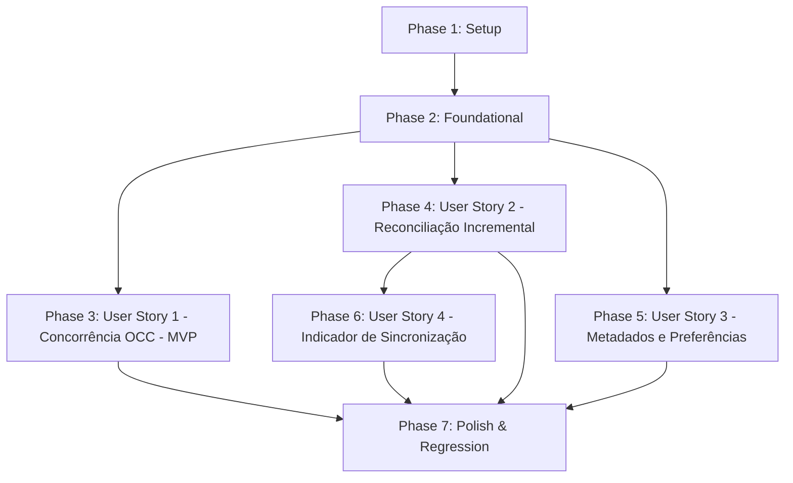

# Tasks: Sincronização Multidispositivo

**Feature**: `031-sincronizacao-multidispositivo`  
**Input**: Feature specification from `specs/031-sincronizacao-multidispositivo/spec.md` e design de `plan.md`

---

## Phase 1: Setup (Shared Infrastructure)

**Purpose**: Definição de schemas Pydantic de sincronização, interfaces TypeScript e contratos compartilhados.

- [X] T001 Criar schemas Pydantic para o feed de alterações e resposta de conflito em `caderno-leitura-0.1/backend/app/schemas/sync.py`
- [X] T002 [P] Criar schemas Pydantic de preferências do usuário em `caderno-leitura-0.1/backend/app/schemas/preferences.py`
- [X] T003 [P] Criar definições de tipos TypeScript para sincronização e conflitos em `caderno-leitura-0.1/frontend/src/types/sync.ts`
- [X] T004 [P] Criar definições de tipos TypeScript para preferências do usuário em `caderno-leitura-0.1/frontend/src/types/preferences.ts`
- [X] T005 Exportar novos tipos e schemas nos módulos centrais de tipagem `caderno-leitura-0.1/frontend/src/types.ts`

---

## Phase 2: Foundational (Blocking Prerequisites)

**Purpose**: Estrutura de banco de dados, migração Alembic, colunas de versionamento e fixtures de concorrência que **BLOQUEIAM** todas as histórias de usuário.

- [X] T006 Adicionar coluna `version: int` e índices de sync nos modelos `Study`, `Book` e `StudyCanvasNode` em `caderno-leitura-0.1/backend/app/models/study.py`, `book.py` e `study_canvas_node.py`
- [X] T007 Criar modelo ORM `UserPreference` com relacionamento `users(id)` e valores padrão canônicos em `caderno-leitura-0.1/backend/app/models/user_preference.py` e exportar em `backend/app/models/__init__.py`
- [X] T008 Criar e testar migração Alembic `0014_add_sync_versioning_and_preferences.py` em `caderno-leitura-0.1/backend/migrations/versions/`
- [X] T009 Atualizar schemas `StudyRead`, `StudyUpdate`, `BookRead`, `BookUpdate` adicionando `version` e `expected_version` em `caderno-leitura-0.1/backend/app/schemas/study.py` e `book.py`
- [X] T010 Criar fixture hermética para testes de concorrência com banco SQLite temporário em `caderno-leitura-0.1/backend/tests/test_sync_and_concurrency.py`

**Checkpoint**: Fundação de dados e modelos pronta — implementação de controle de concorrência liberada.

---

## Phase 3: User Story 1 - Detecção Otimista e Resolução de Conflitos (Priority: P1) — MVP

**Goal**: Assegurar que qualquer tentativa de salvamento com versão desatualizada seja interceptada pelo servidor com `HTTP 409 Conflict`, devolvendo a versão atual e permitindo ao usuário resolver o conflito na interface sem perder seu rascunho de digitação.

**Independent Test**: Modificar o mesmo estudo em duas sessões simuladas com versão inicial 1; a primeira sessão salva avançando para versão 2; a segunda tenta salvar informando `expected_version = 1`, recebendo `HTTP 409 Conflict` com os dados atuais do servidor; o cliente reenvia com `expected_version = 2` sob comando de sobrescrita e grava com sucesso na versão 3.

### Tests for User Story 1
- [X] T011 [P] [US1] Adicionar testes de concorrência otimista (OCC) para `studies` e `books` (gravação sequencial com avanço de versão, detecção de 409 em versão defasada, sobrescrita forçada) em `caderno-leitura-0.1/backend/tests/test_sync_and_concurrency.py`

### Implementation for User Story 1
- [X] T012 [US1] Implementar validação de `expected_version`, emissão de `ConflictErrorResponse` (409) e incremento atômico de `version` na rota `PATCH /api/studies/{id}` em `caderno-leitura-0.1/backend/app/routers/studies.py`
- [X] T013 [US1] Implementar validação de `expected_version`, emissão de `ConflictErrorResponse` (409) e incremento atômico de `version` na rota `PATCH /api/books/{id}` em `caderno-leitura-0.1/backend/app/routers/books.py`
- [X] T014 [P] [US1] Atualizar cliente HTTP para capturar respostas `HTTP 409` e propagar dados estruturados de conflito em `caderno-leitura-0.1/frontend/src/services/api.ts`
- [X] T015 [US1] Criar componente `ConflictResolutionModal.vue` com opções de manter servidor, sobrescrever com rascunho local e comparação lado a lado em `caderno-leitura-0.1/frontend/src/components/sync/ConflictResolutionModal.vue`
- [X] T016 [US1] Integrar interceptação de erro 409 e diálogo de concorrência sem perda de campos digitados em `caderno-leitura-0.1/frontend/src/views/StudyEditView.vue`

**Checkpoint**: User Story 1 (MVP) plenamente funcional: concorrência protegida no servidor e diálogo de resolução testado.

---

## Phase 4: User Story 2 - Reconciliação Incremental Pós-Reconexão e Standby (Priority: P1)

**Goal**: Permitir que dispositivos móveis ou secundários consultem o feed de alterações (`GET /api/sync/changes?since=<timestamp>`) ao retornar de suspensão de tela ou restabelecer conexão, atualizando o acervo local de forma suave e rápida.

**Independent Test**: Modificar e deletar estudos e livros no backend; consultar `GET /api/sync/changes?since=<T0>` comprovando que o payload retorna as entidades modificadas em `updated` e os IDs em `deleted`, isolando estritamente por `user_id`.

### Tests for User Story 2
- [X] T017 [P] [US2] Adicionar testes para o endpoint `GET /api/sync/changes` (filtro por timestamp `since`, inclusão de tombstones `deleted_at`, isolamento estrito por `user_id`) em `caderno-leitura-0.1/backend/tests/test_sync_and_concurrency.py`

### Implementation for User Story 2
- [X] T018 [US2] Implementar serviço `sync_service.py` para consulta eficiente de entidades atualizadas e excluídas em `caderno-leitura-0.1/backend/app/services/sync_service.py`
- [X] T019 [US2] Criar rota `GET /api/sync/changes` em `caderno-leitura-0.1/backend/app/routers/sync.py` e registrar em `backend/app/main.py`
- [X] T020 [P] [US2] Implementar métodos `fetchChanges` no cliente HTTP em `caderno-leitura-0.1/frontend/src/api/sync.ts`
- [X] T021 [US2] Criar composable `useSync.ts` com gerenciamento de estado, debounce e ouvintes dos eventos `online`, `visibilitychange` e `focus` em `caderno-leitura-0.1/frontend/src/composables/useSync.ts`

**Checkpoint**: Histórias 1 e 2 funcionais: escrita protegida e reconciliação incremental em segundo plano operacionais.

---

## Phase 5: User Story 3 - Sincronização de Metadados Visuais e Espaciais (Priority: P2)

**Goal**: Sincronizar centralmente as posições dos nós do Canvas 2D (`study_canvas_nodes` x, y), a escolha de Superclasse e preferências de leitura entre os dispositivos do leitor, preservando zoom e pan do Canvas como estado local.

**Independent Test**: Modificar preferências de aparência no backend via `PUT /api/preferences`; consultar em outro cliente verificando a aplicação dos valores; alterar posições do Canvas e verificar reflexão nos nós de outros dispositivos.

### Tests for User Story 3
- [X] T022 [P] [US3] Adicionar testes para `GET` e `PUT /api/preferences` (persistência, defaults, isolamento por usuário, validação) em `caderno-leitura-0.1/backend/tests/test_sync_and_concurrency.py`

### Implementation for User Story 3
- [X] T023 [US3] Implementar serviço `preferences_service.py` com carregamento de preferências padrão e atualização com versionamento em `caderno-leitura-0.1/backend/app/services/preferences_service.py`
- [X] T024 [US3] Criar rotas `GET /api/preferences` e `PUT /api/preferences` em `caderno-leitura-0.1/backend/app/routers/preferences.py` e registrar em `backend/app/main.py`
- [X] T025 [P] [US3] Implementar métodos `getPreferences` e `updatePreferences` no cliente HTTP em `caderno-leitura-0.1/frontend/src/api/preferences.ts`
- [X] T026 [US3] Atualizar composable `usePreferences.ts` para carregar do servidor na inicialização, sincronizar alterações e manter zoom/pan de câmera do Canvas como estado exclusivo do dispositivo em `caderno-leitura-0.1/frontend/src/composables/usePreferences.ts`

**Checkpoint**: Histórias 1, 2 e 3 integradas: conteúdo, concorrência e layout visual sincronizados entre dispositivos.

---

## Phase 6: User Story 4 - Indicador de Conexão e Transparência do Estado de Sincronização (Priority: P3)

**Goal**: Exibir ao usuário um indicador sutil e não intrusivo na interface informando o estado da sincronização ("Sincronizado", "Sincronizando...", "Offline — dados retidos no dispositivo"), em total conformidade visual e acessibilidade sem emojis.

**Independent Test**: Alternar o status no composable `useSync` e verificar a renderização responsiva do componente `SyncStatusBadge.vue`, comprovando uso exclusivo de ícones SVG Lucide e semântica WAI-ARIA.

### Implementation for User Story 4
- [X] T027 [P] [US4] Criar componente `SyncStatusBadge.vue` com suporte aos estados `synced`, `syncing`, `offline`, `conflict` utilizando ícones Lucide em `caderno-leitura-0.1/frontend/src/components/sync/SyncStatusBadge.vue`
- [X] T028 [US4] Integrar `SyncStatusBadge.vue` no cabeçalho ou rodapé principal da aplicação em `caderno-leitura-0.1/frontend/src/App.vue`

**Checkpoint**: Todas as 4 histórias de usuário concluídas e integradas com interface responsiva e clara.

---

## Phase 7: Polish & Cross-Cutting Concerns

**Purpose**: Documentação técnica, auditoria visual, testes de regressão de ponta a ponta e build de produção.

- [X] T029 [P] Documentar guia de arquitetura de sincronização e concorrência em `caderno-leitura-0.1/docs/contexto/SINCRONIZACAO-E-CONCORRENCIA.md`
- [X] T030 Executar todos os cenários de validação descritos em `specs/031-sincronizacao-multidispositivo/quickstart.md`
- [X] T031 Executar auditoria de sistema visual e ícones garantindo ausência de emojis informais com `frontend/tests/visual_system.test.mjs`
- [X] T032 Executar suíte completa de testes de regressão do backend via `python -m pytest backend/tests`
- [X] T033 Executar suíte completa de testes e build de produção do frontend via `npm test` e `npm run build` em `caderno-leitura-0.1/frontend`

---

## Dependencies & Execution Order

### Phase Dependencies

- **Setup (Phase 1)**: Sem dependências — execução imediata.
- **Foundational (Phase 2)**: Depende da Phase 1 — **BLOQUEIA** todas as histórias de usuário.
- **User Story 1 (Phase 3 - P1 MVP)**: Depende da conclusão da Phase 2.
- **User Story 2 (Phase 4 - P1)**: Depende da conclusão da Phase 2 e integra-se à Phase 3.
- **User Story 3 (Phase 5 - P2)**: Depende da conclusão da Phase 2.
- **User Story 4 (Phase 6 - P3)**: Depende do composable `useSync.ts` (Phase 4).
- **Polish (Phase 7)**: Depende da conclusão de todas as histórias.

### Parallel Execution Opportunities

- **Phase 1**: `T002`, `T003`, `T004` e `T005` podem ser executadas em paralelo.
- **Phase 2**: `T006` e `T007` podem ser desenvolvidas em paralelo antes da migração `T008`.
- **Phase 3**: `T011` (testes backend) e `T014`/`T015` (frontend modal) podem rodar em paralelo.
- **Phase 4**: `T017` (testes sync) e `T020` (API frontend) podem ser desenvolvidos em paralelo.
- **Phase 5**: `T022` (testes preferences) e `T025` (API frontend) podem ser executados em paralelo.
- **Phase 7**: `T029`, `T031` e `T032` podem ser auditados independentemente.

---

## Implementation Strategy

### MVP First (Phase 1 + Phase 2 + Phase 3)
1. Concluir Setup de schemas e tipos (Phase 1).
2. Concluir migração de versionamento e `UserPreference` (Phase 2).
3. Concluir a User Story 1: validação OCC e emissão de `HTTP 409 Conflict` com modal no frontend (Phase 3).
4. **Validar MVP**: Executar testes de concorrência comprovando proteção de dados e integridade de escrita.

### Entrega Incremental
1. **MVP**: Controle de concorrência com detecção de conflitos 409 e preservação de rascunhos (US1).
2. **Incremento 1**: Feed incremental `GET /api/sync/changes` e reconciliação automática pós-standby (US2).
3. **Incremento 2**: Sincronização centralizada de preferências e layout do Canvas com desacoplamento de zoom/pan (US3).
4. **Incremento 3**: Indicador visual acessível de estado da sincronização sem emojis (US4).
5. **Finalização**: Validação geral da suíte de regressão (`pytest`, `npm test`, `npm run build`).
