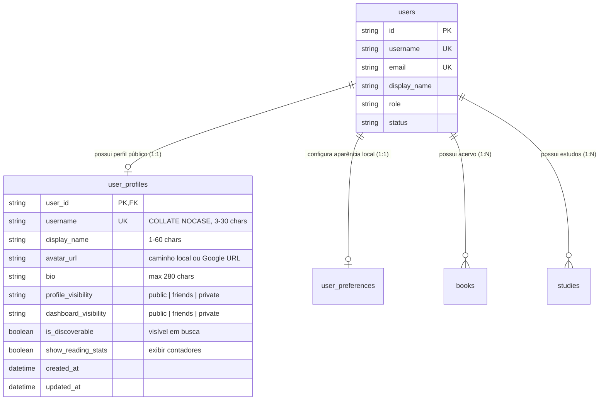

# Data Model: Perfil e Privacidade

**Feature**: `032-perfil-e-privacidade`  
**Date**: 2026-09-24  
**Status**: Ready for Implementation

Este documento detalha o modelo de dados relacional, schemas Pydantic e regras de validação para a Feature 05 — Perfil e Privacidade.

---

## 1. Entidades de Banco de Dados (SQLAlchemy 2.0 / SQLite)

### Tabela: `user_profiles`

Armazena a identidade pública, preferências de exposição e metadados de apresentação de cada leitor.

```sql
CREATE TABLE user_profiles (
    user_id VARCHAR(36) NOT NULL PRIMARY KEY,
    username VARCHAR(50) NOT NULL COLLATE NOCASE,
    display_name VARCHAR(60) NOT NULL,
    avatar_url VARCHAR(500),
    bio VARCHAR(280),
    profile_visibility VARCHAR(20) NOT NULL DEFAULT 'public',
    dashboard_visibility VARCHAR(20) NOT NULL DEFAULT 'private',
    is_discoverable BOOLEAN NOT NULL DEFAULT 1,
    show_reading_stats BOOLEAN NOT NULL DEFAULT 1,
    created_at DATETIME NOT NULL DEFAULT CURRENT_TIMESTAMP,
    updated_at DATETIME NOT NULL DEFAULT CURRENT_TIMESTAMP,
    CONSTRAINT fk_user_profiles_user_id FOREIGN KEY (user_id) REFERENCES users (id) ON DELETE CASCADE,
    CONSTRAINT uq_user_profiles_username UNIQUE (username),
    CONSTRAINT chk_profile_visibility CHECK (profile_visibility IN ('public', 'friends', 'private')),
    CONSTRAINT chk_dashboard_visibility CHECK (dashboard_visibility IN ('public', 'friends', 'private')),
    CONSTRAINT chk_username_length CHECK (length(trim(username)) >= 3 AND length(trim(username)) <= 30),
    CONSTRAINT chk_display_name_length CHECK (length(trim(display_name)) >= 1 AND length(trim(display_name)) <= 60),
    CONSTRAINT chk_bio_length CHECK (bio IS NULL OR length(bio) <= 280)
);

CREATE INDEX ix_user_profiles_discoverable ON user_profiles (is_discoverable, profile_visibility);
CREATE INDEX ix_user_profiles_username ON user_profiles (username COLLATE NOCASE);
```

### Modelo ORM: `UserProfile` (`backend/app/models/user_profile.py`)

```python
class UserProfile(Base):
    __tablename__ = "user_profiles"

    user_id: Mapped[str] = mapped_column(
        String(36),
        ForeignKey("users.id", ondelete="CASCADE"),
        primary_key=True,
        nullable=False,
    )
    username: Mapped[str] = mapped_column(
        String(50),
        unique=True,
        index=True,
        nullable=False,
    )
    display_name: Mapped[str] = mapped_column(String(60), nullable=False)
    avatar_url: Mapped[str | None] = mapped_column(String(500), nullable=True)
    bio: Mapped[str | None] = mapped_column(String(280), nullable=True)
    profile_visibility: Mapped[str] = mapped_column(
        String(20),
        default="public",
        server_default=text("'public'"),
        nullable=False,
    )
    dashboard_visibility: Mapped[str] = mapped_column(
        String(20),
        default="private",
        server_default=text("'private'"),
        nullable=False,
    )
    is_discoverable: Mapped[bool] = mapped_column(
        Boolean,
        default=True,
        server_default=text("1"),
        nullable=False,
    )
    show_reading_stats: Mapped[bool] = mapped_column(
        Boolean,
        default=True,
        server_default=text("1"),
        nullable=False,
    )
    created_at: Mapped[datetime] = mapped_column(
        UTCDateTime(),
        default=utc_now,
        server_default=text("CURRENT_TIMESTAMP"),
        nullable=False,
    )
    updated_at: Mapped[datetime] = mapped_column(
        UTCDateTime(),
        default=utc_now,
        onupdate=utc_now,
        server_default=text("CURRENT_TIMESTAMP"),
        nullable=False,
    )

    user: Mapped[User] = relationship("User", back_populates="profile")
```

---

## 2. Diagrama de Relacionamento (ER)



---

## 3. Schemas de Dados (Pydantic v2)

### Contratos de Entrada e Saída (`backend/app/schemas/profile.py`)

```python
from enum import Enum
from datetime import datetime
from pydantic import BaseModel, Field, field_validator
import re

USERNAME_REGEX = re.compile(r"^[a-zA-Z0-9_.-]{3,30}$")

class VisibilityLevel(str, Enum):
    PUBLIC = "public"
    FRIENDS = "friends"
    PRIVATE = "private"

class ProfileReadingStats(BaseModel):
    total_books: int = 0
    total_studies: int = 0
    current_streak_days: int = 0

class UserProfilePublicRead(BaseModel):
    """Payload retornado a qualquer visitante autenticado."""
    username: str
    display_name: str
    avatar_url: str | None = None
    bio: str | None = None
    profile_visibility: VisibilityLevel
    is_private: bool = False
    reading_stats: ProfileReadingStats | None = None
    created_at: datetime

class UserProfilePrivateRead(BaseModel):
    """Payload retornado exclusivamente ao próprio usuário autenticado em /api/profile/me."""
    user_id: str
    username: str
    display_name: str
    email: str | None
    avatar_url: str | None
    bio: str | None
    profile_visibility: VisibilityLevel
    dashboard_visibility: VisibilityLevel
    is_discoverable: bool
    show_reading_stats: bool
    has_google_avatar: bool = False
    google_avatar_url: str | None = None
    reading_stats: ProfileReadingStats
    created_at: datetime
    updated_at: datetime

class UserProfileUpdate(BaseModel):
    """Campos editáveis pelo usuário nos Ajustes."""
    username: str | None = Field(default=None, min_length=3, max_length=30)
    display_name: str | None = Field(default=None, min_length=1, max_length=60)
    bio: str | None = Field(default=None, max_length=280)
    profile_visibility: VisibilityLevel | None = None
    dashboard_visibility: VisibilityLevel | None = None
    is_discoverable: bool | None = None
    show_reading_stats: bool | None = None

    @field_validator("username")
    @classmethod
    def validate_username(cls, v: str | None) -> str | None:
        if v is not None:
            v = v.strip()
            if not USERNAME_REGEX.match(v):
                raise ValueError("O nome de usuário deve conter de 3 a 30 caracteres alfanuméricos, hífens ou pontos.")
        return v

class UserSearchItem(BaseModel):
    username: str
    display_name: str
    avatar_url: str | None
    bio: str | None
```

---

## 4. Matriz de Visualização e Filtro de Privacidade

```
┌─────────────────────────────────┬───────────────────┬───────────────────┬───────────────────┐
│ Campo                           │ Dono da Conta     │ Amigo (F06)       │ Público / Outros  │
├─────────────────────────────────┼───────────────────┼───────────────────┼───────────────────┤
│ username                        │ Sim               │ Sim               │ Sim               │
│ display_name                    │ Sim               │ Sim               │ Sim               │
│ avatar_url                      │ Sim               │ Sim               │ Sim               │
│ bio                             │ Sim               │ Se profile != priv│ Se profile == pub │
│ reading_stats                   │ Sim               │ Se stats ativado  │ Se stats e pub    │
│ email                           │ Sim (só /me)      │ NUNCA (None)      │ NUNCA (None)      │
│ dashboard_visibility / config   │ Sim (só /me)      │ Oculto            │ Oculto            │
│ is_private (flag visual)        │ False             │ Conforme amizade  │ True se != public │
└─────────────────────────────────┴───────────────────┴───────────────────┴───────────────────┘
```
