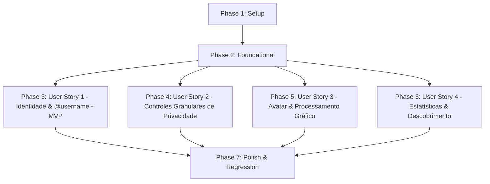

# Tasks: Perfil e Privacidade

**Feature**: `032-perfil-e-privacidade`  
**Input**: Feature specification from `specs/032-perfil-e-privacidade/spec.md` e design técnico de `plan.md`

---

## Phase 1: Setup (Shared Infrastructure)

**Purpose**: Definição de schemas Pydantic, tipagens TypeScript e configurações de diretório de mídia para avatares.

- [X] T001 Criar schemas Pydantic de perfil público, privado, atualização e busca em `caderno-leitura-0.1/backend/app/schemas/profile.py`
- [X] T002 [P] Criar definições de tipos TypeScript para perfil, privacidade e busca em `caderno-leitura-0.1/frontend/src/types/profile.ts`
- [X] T003 [P] Exportar tipos de perfil no módulo central de tipagem `caderno-leitura-0.1/frontend/src/types.ts`
- [X] T004 [P] Configurar resolução do diretório local de avatares `backend/data/avatars/` em `caderno-leitura-0.1/backend/app/core/config.py`

---

## Phase 2: Foundational (Blocking Prerequisites)

**Purpose**: Estrutura de banco de dados, migração Alembic, relacionamento 1:1 com `User` e fixtures de teste que **BLOQUEIAM** todas as histórias de usuário.

- [X] T005 Criar modelo ORM `UserProfile` com chave estrangeira `CASCADE` referenciando `users.id` em `caderno-leitura-0.1/backend/app/models/user_profile.py` e adicionar relacionamento `profile` em `caderno-leitura-0.1/backend/app/models/user.py`
- [X] T006 Exportar modelo `UserProfile` no módulo `caderno-leitura-0.1/backend/app/models/__init__.py`
- [X] T007 Criar migração Alembic `0015_add_user_profile.py` com criação da tabela `user_profiles` e auto-provisionamento para contas existentes em `caderno-leitura-0.1/backend/migrations/versions/`
- [X] T008 Criar fixture de testes hermética com banco SQLite efêmero e pasta temporária de avatares em `caderno-leitura-0.1/backend/tests/test_profile_and_privacy.py`
- [X] T009 Implementar serviço base `profile_service.py` com helper `get_or_create_profile` e hooks de provisionamento em `caderno-leitura-0.1/backend/app/services/profile_service.py` e `caderno-leitura-0.1/backend/app/services/auth_service.py`

**Checkpoint**: Fundação de dados e modelos pronta — implementação das histórias de usuário liberada.

---

## Phase 3: User Story 1 - Gestão da Identidade Pública e Handle Exclusivo (Priority: P1) — MVP

**Goal**: Permitir que o leitor defina e gerencie seu handle `@username` único (3 a 30 caracteres alfanuméricos/hífens/pontos), nome de exibição e biografia (até 280 caracteres), com garantia absoluta de que o e-mail permaneça estritamente sigiloso.

**Independent Test**: Leitor autenticado consulta `GET /api/profile/me`, altera seu `@username` e biografia via `PUT /api/profile/me`; outro usuário tenta registrar o mesmo `@username` com variação de maiúsculas/minúsculas recebendo `HTTP 409 Conflict`; ao consultar o perfil público desse leitor, o e-mail não aparece na resposta.

### Tests for User Story 1
- [X] T010 [P] [US1] Adicionar testes automatizados para obtenção e atualização do perfil próprio, validação de regex do handle, unicidade case-insensitive e blindagem de e-mail em `caderno-leitura-0.1/backend/tests/test_profile_and_privacy.py`

### Implementation for User Story 1
- [X] T011 [US1] Implementar endpoints `GET /api/profile/me` e `PUT /api/profile/me` com validação de handle e sincronização atômica com `User.username` em `caderno-leitura-0.1/backend/app/routers/profile.py` e registrar router em `backend/app/main.py`
- [X] T012 [P] [US1] Implementar cliente HTTP para rotas de perfil em `caderno-leitura-0.1/frontend/src/api/profile.ts`
- [X] T013 [US1] Criar composable `useProfile.ts` com gerenciamento de estado de identidade pública, carregamento e salvamento em `caderno-leitura-0.1/frontend/src/composables/useProfile.ts`
- [X] T014 [US1] Integrar seção de identidade pública e formulário de `@username`, nome de exibição e bio nos Ajustes em `caderno-leitura-0.1/frontend/src/views/SettingsView.vue`

**Checkpoint**: User Story 1 (MVP) plenamente funcional: identidade pública configurada com unicidade de handle e zero vazamento de e-mails.

---

## Phase 4: User Story 2 - Controles Granulares de Privacidade Desacoplados (Priority: P1)

**Goal**: Permitir ao leitor controlar de forma independente a visibilidade do seu perfil e do seu dashboard (`public`, `friends`, `private`), exibindo um cartão institucional discreto para visitantes não autorizados sem expor seus hábitos de estudo.

**Independent Test**: Configurar perfil como "Público" e dashboard como "Privado"; outro usuário visualiza com sucesso `GET /api/users/{username}`, mas recebe `HTTP 403 Forbidden` ao tentar acessar o dashboard desse leitor; para perfis privados, a bio é mascarada e `is_private = true`.

### Tests for User Story 2
- [X] T015 [P] [US2] Adicionar testes automatizados da matriz de privacidade (perfil público vs privado, desacoplamento do dashboard e mascaramento de campos sensíveis para não autorizados) em `caderno-leitura-0.1/backend/tests/test_profile_and_privacy.py`

### Implementation for User Story 2
- [X] T016 [US2] Implementar endpoint público `GET /api/users/{username}` aplicando regras de visibilidade e autorização em `caderno-leitura-0.1/backend/app/routers/users.py` e registrar router em `backend/app/main.py`
- [X] T017 [US2] Integrar seletores de visibilidade independente para Perfil e Dashboard na área de privacidade em `caderno-leitura-0.1/frontend/src/views/SettingsView.vue`
- [X] T018 [US2] Criar componente `UserProfileCard.vue` com exibição de perfil público e cartão discreto com selo institucional para perfis restritos em `caderno-leitura-0.1/frontend/src/components/profile/UserProfileCard.vue`
- [X] T019 [US2] Criar página pública de perfil `UserProfileView.vue` e registrar rota `/@:username` em `caderno-leitura-0.1/frontend/src/router/index.ts` e `caderno-leitura-0.1/frontend/src/views/UserProfileView.vue`

**Checkpoint**: Histórias 1 e 2 integradas: identidade pública e controle de privacidade desacoplado plenamente operacionais.

---

## Phase 5: User Story 3 - Personalização Visual do Perfil e Imagem de Avatar (Priority: P2)

**Goal**: Permitir que o leitor envie imagens personalizadas para o avatar (PNG/JPEG/WebP até 2MB), com recorte quadrado centralizado `256x256` WebP via Pillow, opção de reaproveitamento da foto de conta Google e fallback em iniciais estilizadas no sistema visual.

**Independent Test**: Enviar arquivo PNG de 500x300 pixels para `POST /api/profile/avatar`, verificando que o arquivo salvo em disco é `256x256 WebP`; remover avatar via `DELETE /api/profile/avatar` e constatar reversão para foto Google ou iniciais estilizadas sem emojis.

### Tests for User Story 3
- [X] T020 [P] [US3] Adicionar testes automatizados de upload de avatar (formatos válidos, corte 256x256, rejeição de arquivos > 2MB ou corrompidos, deleção física e serviço estático) em `caderno-leitura-0.1/backend/tests/test_profile_and_privacy.py`

### Implementation for User Story 3
- [X] T021 [US3] Implementar serviço `avatar_service.py` com validação de magic bytes, normalização EXIF, recorte centralizado quadrado (Pillow `ImageOps.fit`) e exclusão de arquivo anterior em `caderno-leitura-0.1/backend/app/services/avatar_service.py`
- [X] T022 [US3] Implementar endpoints `POST /api/profile/avatar`, `DELETE /api/profile/avatar` e `GET /api/avatars/{filename}` em `caderno-leitura-0.1/backend/app/routers/profile.py`
- [X] T023 [US3] Criar componente acessível `AvatarUploadModal.vue` com seleção de arquivo, preview, opção de foto Google e corte em `caderno-leitura-0.1/frontend/src/components/profile/AvatarUploadModal.vue`
- [X] T024 [US3] Integrar avatar dinâmico e fallback vetorial de iniciais estilizadas no cabeçalho em `caderno-leitura-0.1/frontend/src/App.vue` e nos cards de perfil

**Checkpoint**: Histórias 1, 2 e 3 integradas: identidade pública, privacidade e personalização visual completas.

---

## Phase 6: User Story 4 - Blindagem de Estatísticas de Leitura e Descobrimento (Priority: P3)

**Goal**: Conceder ao leitor a opção de ocultar suas estatísticas de leitura (livros e estudos concluídos) no perfil público e controlar se seu perfil pode ser encontrado em buscas gerais de leitores.

**Independent Test**: Definir `is_discoverable = false` e constatar que o leitor é omitido em `GET /api/users?q=...`; definir `show_reading_stats = false` e constatar que o perfil público renderizado oculta contadores numéricos.

### Tests for User Story 4
- [X] T025 [P] [US4] Adicionar testes automatizados para busca de usuários (`GET /api/users?q=...`), respeito à flag `is_discoverable` e ocultação de estatísticas em `caderno-leitura-0.1/backend/tests/test_profile_and_privacy.py`

### Implementation for User Story 4
- [X] T026 [US4] Implementar endpoint `GET /api/users?q=...` com filtro de usuários ativos, descobríveis e perfis não privados em `caderno-leitura-0.1/backend/app/routers/users.py`
- [X] T027 [US4] Integrar flags `is_discoverable` e `show_reading_stats` nos controles dos Ajustes em `caderno-leitura-0.1/frontend/src/views/SettingsView.vue` e renderização condicional de métricas em `UserProfileCard.vue`

**Checkpoint**: Todas as 4 histórias de usuário concluídas e integradas com interface responsiva e segura.

---

## Phase 7: Polish & Cross-Cutting Concerns

**Purpose**: Documentação técnica, auditoria visual, testes de regressão de ponta a ponta e build de produção.

- [X] T028 [P] Documentar guia de arquitetura de perfil e governança de privacidade em `caderno-leitura-0.1/docs/contexto/PERFIL-E-PRIVACIDADE.md`
- [X] T029 Executar todos os cenários de validação descritos em `specs/032-perfil-e-privacidade/quickstart.md`
- [X] T030 Executar auditoria de sistema visual e ícones garantindo ausência de emojis informais com `frontend/tests/visual_system.test.mjs`
- [X] T031 Executar suíte completa de testes de regressão do backend via `python -m pytest backend/tests`
- [X] T032 Executar suíte completa de testes e build de produção do frontend via `npm test` e `npm run build` em `caderno-leitura-0.1/frontend`

---

## Dependencies & Execution Order

### Phase Dependencies

- **Setup (Phase 1)**: Sem dependências — execução imediata.
- **Foundational (Phase 2)**: Depende da Phase 1 — **BLOQUEIA** todas as histórias de usuário.
- **User Story 1 (Phase 3 - P1 MVP)**: Depende da conclusão da Phase 2.
- **User Story 2 (Phase 4 - P1)**: Depende da conclusão da Phase 2 e integra-se à Phase 3.
- **User Story 3 (Phase 5 - P2)**: Depende da conclusão da Phase 2 e enriquece a Phase 3.
- **User Story 4 (Phase 6 - P3)**: Depende da conclusão da Phase 2 e integra-se às Phases 3 e 4.
- **Polish (Phase 7)**: Depende da conclusão de todas as histórias.

### Parallel Execution Opportunities

- **Phase 1**: `T002`, `T003` e `T004` podem ser desenvolvidos em paralelo após `T001`.
- **Phase 2**: `T008` (fixture de teste) pode ser preparado em paralelo com `T005`/`T006`.
- **Phase 3**: `T010` (testes backend) e `T012`/`T013` (frontend API e composable) podem rodar em paralelo.
- **Phase 4**: `T015` (testes de privacidade) e `T018`/`T019` (componente e view pública) podem ser desenvolvidos em paralelo.
- **Phase 5**: `T020` (testes avatar) e `T023` (modal frontend) podem ser executados em paralelo.
- **Phase 6**: `T025` (testes de busca) e `T027` (UI Ajustes) podem ser desenvolvidos em paralelo.
- **Phase 7**: `T028`, `T030` e `T031` podem ser auditados independentemente.

---

## Implementation Strategy

### MVP First (Phase 1 + Phase 2 + Phase 3)
1. Concluir Setup de schemas e tipos (Phase 1).
2. Concluir migração de `UserProfile` com auto-provisionamento (Phase 2).
3. Concluir User Story 1: definição de `@username` único e nome de exibição nos Ajustes com zero vazamento de e-mails (Phase 3).
4. **Validar MVP**: Executar testes de concorrência e unicidade de handle comprovando a fundação de identidade pública.

### Entrega Incremental
1. **MVP**: Identidade pública com handle `@username` único e proteção de e-mail (US1).
2. **Incremento 1**: Níveis desacoplados de privacidade (Perfil e Dashboard) e cartão institucional discreto para perfis restritos (US2).
3. **Incremento 2**: Upload e corte de imagem quadrada (256x256 WebP) com Pillow, opção Google e iniciais estilizadas (US3).
4. **Incremento 3**: Controle de perfil descobrível em buscas e ocultação de métricas quantitativas de leitura (US4).
5. **Finalização**: Validação geral da suíte de regressão (`pytest`, `npm test`, `npm run build`, `visual_system.test.mjs`).
