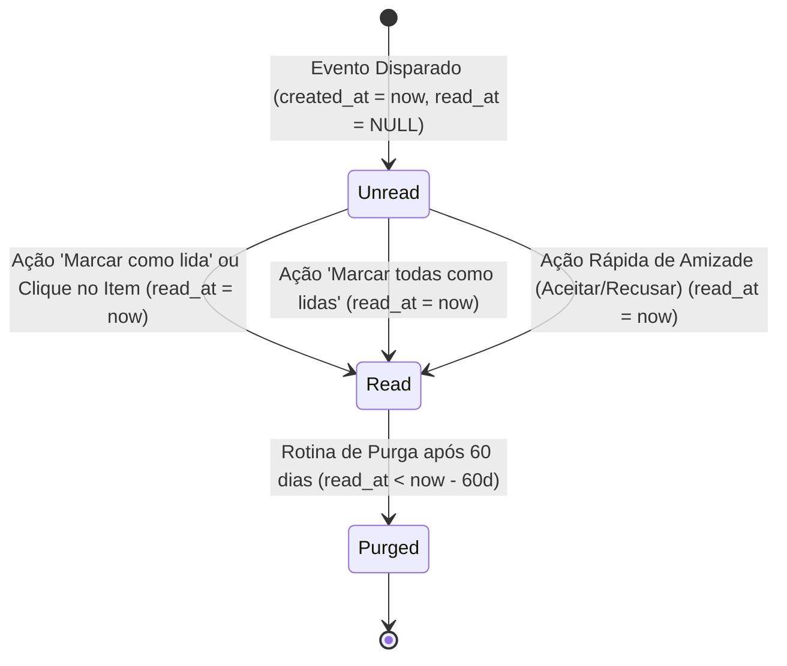

# Data Model: F09 — Notificações e Atividade Social

**Feature Branch**: `036-notificacoes-atividade-social`  
**Created**: 2026-09-26  
**Status**: Completed  

---

## 1. Entidade Relacional: `notifications`

### Descrição
Armazena registros individuais de eventos de notificação destinados aos leitores do Leitorum. Cada registro mapeia um evento único emitido para um destinatário específico, contendo metadados estruturados e estado de visualização.

### Tabela: `notifications`

| Coluna | Tipo SQL | Nulo? | Padrão | Descrição |
| :--- | :--- | :--- | :--- | :--- |
| `id` | `VARCHAR(36)` | Não | UUID v4 | Chave primária única da notificação. |
| `user_id` | `VARCHAR(36)` | Não | - | Chave estrangeira para `users.id` (destinatário da notificação). `ON DELETE CASCADE`. |
| `actor_id` | `VARCHAR(36)` | Sim | `NULL` | Chave estrangeira para `users.id` (usuário originador do evento). `ON DELETE SET NULL`. Nulo para alertas emitidos pelo sistema. |
| `event_type` | `VARCHAR(32)` | Não | - | Categoria do evento: `friend_request`, `friend_accepted`, `study_shared`, `system_alert`. |
| `payload` | `JSON` | Não | `{}` | Dicionário JSON flexível contendo identificadores e metadados contextuais da notificação. |
| `read_at` | `DATETIME` | Sim | `NULL` | Data e hora (UTC) em que a notificação foi visualizada ou marcada como lida pelo leitor. Nulo se pendente de leitura. |
| `created_at` | `DATETIME` | Não | `utc_now()` | Data e hora (UTC) em que a notificação foi emitida. |

### Índices de Banco de Dados

1. **`ix_notifications_id`**: Chave primária única.
2. **`ix_notifications_user_id`**: Chave estrangeira individual para buscas gerais de histórico de um usuário.
3. **`ix_notifications_user_unread`**: Índice composto `(user_id, read_at)` para otimizar o cálculo do contador de notificações não lidas (`WHERE user_id = :uid AND read_at IS NULL`).
4. **`ix_notifications_user_created`**: Índice composto `(user_id, created_at DESC)` para aceleração de paginação e listagem cronológica decrescente dos eventos recentes.
5. **`ix_notifications_read_at`**: Índice simples em `read_at` para otimizar a rotina de purga periódica de registros lidos há mais de 60 dias.

---

## 2. Tipos de Eventos e Estrutura do `payload`

### 2.1. `friend_request` (Solicitação de Amizade)
Disparado quando um usuário envia solicitação de amizade para o destinatário.
```json
{
  "friendship_id": 14,
  "requester_id": "usr_9988aabb",
  "requester_username": "maria_leitora",
  "requester_display_name": "Maria Silva",
  "requester_avatar_url": "/api/users/profiles/avatar/maria_leitora.webp",
  "message": "Maria Silva enviou uma solicitação de amizade para você."
}
```

### 2.2. `friend_accepted` (Amizade Confirmada)
Disparado para o remetente original quando sua solicitação de amizade é aceita pelo destinatário.
```json
{
  "friendship_id": 14,
  "friend_id": "usr_7766ccdd",
  "friend_username": "joao_livros",
  "friend_display_name": "João Santos",
  "friend_avatar_url": null,
  "message": "João Santos aceitou sua solicitação de amizade."
}
```

### 2.3. `study_shared` (Estudo ou Livro Compartilhado)
Disparado quando um leitor concede permissão de leitura nominal (`ResourcePermission`) sobre um estudo ou livro para outro usuário.
```json
{
  "resource_type": "study",
  "resource_id": 42,
  "resource_title": "Ensaio sobre a Cegueira — Análise de Personagens",
  "book_id": 10,
  "book_title": "Ensaio sobre a Cegueira",
  "shared_by_id": "usr_9988aabb",
  "shared_by_username": "maria_leitora",
  "shared_by_display_name": "Maria Silva",
  "link": "/estudos/42",
  "message": "Maria Silva compartilhou o estudo 'Ensaio sobre a Cegueira — Análise de Personagens' com você."
}
```

### 2.4. `system_alert` (Aviso Administrativo / Comunicado Institucional)
Disparado em massa para todos os leitores pelo administrador da plataforma.
```json
{
  "title": "Manutenção Programada de Servidor",
  "message": "O Leitorum passará por uma atualização preventiva no próximo domingo às 03:00.",
  "severity": "info",
  "link": null
}
```

---

## 3. Schemas Pydantic v2 (`backend/app/schemas/notification.py`)

```python
from __future__ import annotations
from datetime import datetime
from typing import Any, Literal
from pydantic import BaseModel, Field

NotificationEventType = Literal[
    "friend_request",
    "friend_accepted",
    "study_shared",
    "system_alert",
]

class NotificationActorRead(BaseModel):
    id: str
    username: str
    display_name: str
    avatar_url: str | None = None

class NotificationItem(BaseModel):
    id: str
    user_id: str
    actor: NotificationActorRead | None = None
    event_type: NotificationEventType
    payload: dict[str, Any] = Field(default_factory=dict)
    read_at: datetime | None = None
    created_at: datetime

    class Config:
        from_attributes = True

class NotificationListResponse(BaseModel):
    items: list[NotificationItem]
    total: int
    unread_count: int

class UnreadCountResponse(BaseModel):
    unread_count: int

class NotificationBroadcastRequest(BaseModel):
    title: str = Field(..., min_length=2, max_length=150)
    message: str = Field(..., min_length=2, max_length=2000)
    severity: Literal["info", "warning", "critical"] = "info"
    link: str | None = Field(default=None, max_length=500)

class NotificationBroadcastResponse(BaseModel):
    dispatched_count: int
    message: str

class NotificationPurgeResponse(BaseModel):
    purged_count: int
    retention_days: int
    message: str
```

---

## 4. Ciclo de Vida e Transições de Estado



---

## 5. Regras de Integridade e Validação

1. **Destinatário Válido:** O `user_id` deve referenciar um registro existente em `users.id` com `status == 'ativo'`.
2. **Actor Opcional:** Se `actor_id` for informado, deve referenciar um usuário válido. Se o usuário for excluído posteriormente, o relacionamento transita para `NULL` (`ondelete="SET NULL"`), preservando a notificação com actor genérico.
3. **Payload Sanitizado:** O payload não deve exceder 64 KB de dados serializados em JSON. Textos de título e mensagem passam por aparagem de espaços em branco (`strip`).
4. **Idempotência de Leitura:** Tentar marcar como lida uma notificação que já possui `read_at != NULL` é uma operação segura e idempotente (retorna HTTP 200 sem alterar o timestamp original).
5. **Privacidade e Isolamento:** Um leitor comum só tem autorização para consultar, listar ou marcar como lidas notificações onde `notification.user_id == current_user.id`. Tentativas de acessar notificações de outro leitor resultam em HTTP 404 (anti-enumeração).
