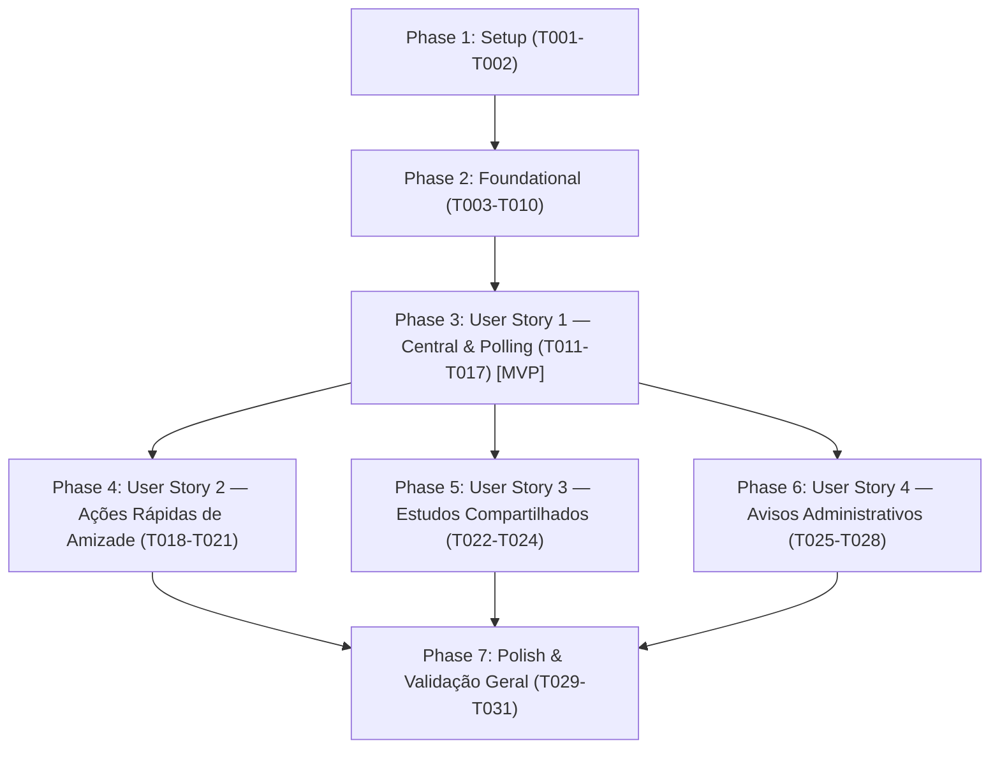

# Tasks: F09 — Notificações e Atividade Social

**Branch**: `036-notificacoes-atividade-social`  
**Input**: Design artifacts from `specs/036-notificacoes-atividade-social/` (`spec.md`, `plan.md`, `data-model.md`, `contracts/`, `research.md`, `quickstart.md`)  

---

## Phase 1: Setup (Shared Infrastructure)

**Purpose**: Inicialização de tipos compartilhados no frontend e registro de ícones no design system.

- [x] T001 [P] Criar tipos TypeScript para notificações e respostas da API em caderno-leitura-0.1/frontend/src/types/notifications.ts
- [x] T002 [P] Registrar ícone bell e bell-ring no mapeamento de componentes em caderno-leitura-0.1/frontend/src/components/ui/Icon.vue e caderno-leitura-0.1/frontend/src/types.ts

---

## Phase 2: Foundational (Blocking Prerequisites)

**Purpose**: Infraestrutura básica no backend (modelo SQLAlchemy, schemas Pydantic, migração Alembic, serviço base e router) necessária para todas as user stories.

**⚠️ CRITICAL**: Nenhuma implementação de User Story pode ser iniciada antes da conclusão desta fase.

- [x] T003 [P] Criar modelo SQLAlchemy Notification com índices de contagem e data em caderno-leitura-0.1/backend/app/models/notification.py
- [x] T004 [P] Registrar modelo Notification em caderno-leitura-0.1/backend/app/models/__init__.py
- [x] T005 [P] Criar schemas Pydantic v2 de entrada e saída em caderno-leitura-0.1/backend/app/schemas/notification.py
- [x] T006 [P] Exportar schemas de notificação em caderno-leitura-0.1/backend/app/schemas/__init__.py
- [x] T007 Criar migração Alembic para criação da tabela notifications e índices em caderno-leitura-0.1/backend/alembic/versions/
- [x] T008 Implementar métodos base do serviço de notificações (create, count_unread, list, mark_read, mark_all_read) em caderno-leitura-0.1/backend/app/services/notification_service.py
- [x] T009 Criar router FastAPI com endpoints de listagem, contagem e marcação de leitura em caderno-leitura-0.1/backend/app/routers/notifications.py
- [x] T010 Registrar router de notificações no aplicativo FastAPI em caderno-leitura-0.1/backend/app/main.py

**Checkpoint**: Fundação de dados e endpoints base pronta — implementação das User Stories pode iniciar.

---

## Phase 3: User Story 1 - Central de Notificações e Contador de Não Lidos (Priority: P1) 🎯 MVP

**Goal**: Exibir indicador numérico no cabeçalho com polling de 45s e revalidação no foco, permitindo ao leitor abrir o painel, visualizar eventos e marcar como lidos.

**Independent Test**: Disparar notificação de teste para o leitor e verificar atualização do badge no cabeçalho, abertura instantânea do painel dropdown e ação "Marcar todas como lidas" zerando o contador.

### Tests for User Story 1

- [x] T011 [P] [US1] Escrever testes automatizados de integração de backend para listagem, contagem e marcação de leitura em caderno-leitura-0.1/backend/tests/test_notifications.py

### Implementation for User Story 1

- [x] T012 [P] [US1] Criar cliente de API frontend com métodos de contagem, listagem e leitura em caderno-leitura-0.1/frontend/src/api/notifications.ts
- [x] T013 [US1] Implementar composable useNotifications com polling de 45s e revalidação ao focar a aba em caderno-leitura-0.1/frontend/src/composables/useNotifications.ts
- [x] T014 [P] [US1] Criar componente de card individual NotificationItem para exibição de eventos e data relativa em caderno-leitura-0.1/frontend/src/components/notifications/NotificationItem.vue
- [x] T015 [US1] Criar componente NotificationsDropdown com cabeçalho, lista de itens, estado vazio e fechamento com Escape em caderno-leitura-0.1/frontend/src/components/notifications/NotificationsDropdown.vue
- [x] T016 [US1] Integrar botão com sino, badge numérico e NotificationsDropdown no cabeçalho em caderno-leitura-0.1/frontend/src/App.vue
- [x] T017 [P] [US1] Criar testes unitários e de componente para dropdown e composable em caderno-leitura-0.1/frontend/src/__tests__/NotificationsDropdown.spec.ts

**Checkpoint**: User Story 1 totalmente funcional e testável de forma independente (MVP consolidado).

---

## Phase 4: User Story 2 - Ações Rápidas de Amizade no Painel de Notificações (Priority: P2)

**Goal**: Permitir que o leitor aceite ou recuse solicitações de amizade diretamente no card de notificação com feedback inline imediato, gerando notificação reversa de aceite.

**Independent Test**: Enviar solicitação de amizade entre dois usuários; o destinatário clica em "Aceitar" diretamente no card da notificação, a amizade torna-se confirmada e o solicitante recebe a notificação friend_accepted.

### Tests for User Story 2

- [x] T018 [P] [US2] Escrever testes de backend para disparo e ações rápidas de amizade em caderno-leitura-0.1/backend/tests/test_notifications.py

### Implementation for User Story 2

- [x] T019 [US2] Integrar disparo de friend_request e friend_accepted em caderno-leitura-0.1/backend/app/services/friendship_service.py
- [x] T020 [US2] Adicionar botões de ação rápida (Aceitar/Recusar) e feedback inline no card em caderno-leitura-0.1/frontend/src/components/notifications/NotificationItem.vue
- [x] T021 [US2] Adicionar handlers de aceite e recusa de amizade via notificação em caderno-leitura-0.1/frontend/src/composables/useNotifications.ts

**Checkpoint**: User Stories 1 e 2 funcionais e integradas de forma independente.

---

## Phase 5: User Story 3 - Notificações de Estudos e Livros Compartilhados (Priority: P3)

**Goal**: Notificar o leitor quando um amigo conceder permissão de leitura sobre um livro ou estudo, com link direto para o conteúdo compartilhado.

**Independent Test**: Usuário A concede permissão nominal sobre um estudo para Usuário B; Usuário B recebe notificação study_shared e o clique direciona para a tela de leitura compartilhada.

### Tests for User Story 3

- [x] T022 [P] [US3] Escrever testes de backend para emissão de notificação study_shared em concessões de permissão em caderno-leitura-0.1/backend/tests/test_notifications.py

### Implementation for User Story 3

- [x] T023 [US3] Integrar disparo de notificação study_shared em grant_permission em caderno-leitura-0.1/backend/app/services/sharing_service.py
- [x] T024 [US3] Implementar renderização de título, remetente e link de leitura para estudos/livros em caderno-leitura-0.1/frontend/src/components/notifications/NotificationItem.vue

**Checkpoint**: User Stories 1, 2 e 3 operando de forma autônoma e combinada.

---

## Phase 6: User Story 4 - Avisos Administrativos e Alertas do Sistema (Priority: P4)

**Goal**: Permitir que administradores emitam comunicados institucionais em massa para todos os usuários ativos e executem purga de notificações antigas já lidas.

**Independent Test**: Administrador dispara broadcast via API; todos os leitores recebem notificação destacada system_alert; rotina de purga remove notificações lidas criadas há mais de 60 dias.

### Tests for User Story 4

- [x] T025 [P] [US4] Escrever testes de backend para broadcast e purga de notificações em caderno-leitura-0.1/backend/tests/test_notifications.py

### Implementation for User Story 4

- [x] T026 [US4] Implementar rotinas broadcast_system_alert e purge_expired_notifications em caderno-leitura-0.1/backend/app/services/notification_service.py
- [x] T027 [US4] Adicionar endpoints de broadcast e purga de notificações em caderno-leitura-0.1/backend/app/routers/admin.py
- [x] T028 [US4] Implementar estilo visual de destaque para avisos institucionais em caderno-leitura-0.1/frontend/src/components/notifications/NotificationItem.vue

**Checkpoint**: Todas as 4 User Stories concluídas e testáveis.

---

## Phase 7: Polish & Cross-Cutting Concerns

**Purpose**: Acessibilidade, otimização, manutenção preventiva e validação final de ponta a ponta.

- [x] T029 [P] Validar acessibilidade de foco, navegação por teclado e atributos ARIA no dropdown em caderno-leitura-0.1/frontend/src/components/notifications/NotificationsDropdown.vue
- [x] T030 [P] Integrar chamada de purga periódica preventiva de notificações lidas em caderno-leitura-0.1/backend/app/services/maintenance.py
- [x] T031 Executar suíte completa de testes automatizados e build (pytest, npm test, npm run build) conforme specs/036-notificacoes-atividade-social/quickstart.md

---

## Dependencies & Execution Order

### Phase Dependencies

### User Story Dependencies

- **User Story 1 (P1 - MVP)**: Inicia imediatamente após a Fase 2 (Foundational). Não depende de outras histórias.
- **User Story 2 (P2)**: Depende do componente base e do dropdown da US1; estende os cards com ações rápidas de amizade.
- **User Story 3 (P3)**: Depende do componente base da US1; integra eventos de compartilhamento da ACL.
- **User Story 4 (P4)**: Depende da infraestrutura da US1 e dos privilégios de administrador; pode ser desenvolvida em paralelo com US2 e US3.
- **Polish (Final)**: Requer que todas as user stories planejadas estejam concluídas.

### Parallel Opportunities

- **Setup**: `T001` (types) e `T002` (Icon.vue) podem ser executados em paralelo.
- **Foundational**: `T003` (modelo), `T004` (registro), `T005` (schemas), `T006` (export) podem ser desenvolvidos em paralelo antes de `T007` (migração Alembic).
- **User Story 1**: `T011` (testes backend) e `T012` (cliente API frontend) podem rodar em paralelo. `T014` (NotificationItem) e `T015` (NotificationsDropdown) possuem isolamento de arquivo.
- **User Stories 2, 3 e 4**: Uma vez concluída a US1, as histórias 2, 3 e 4 podem ser desenvolvidas de forma independente.

---

## Implementation Strategy

### MVP First (User Story 1 Only)

1. Concluir Fase 1 (Setup) e Fase 2 (Foundational).
2. Concluir Fase 3 (User Story 1 - Central de Notificações e Polling).
3. **Validar MVP**: Disparar notificações manuais e confirmar indicador numérico dinâmico no cabeçalho e marcação de lidas.

### Incremental Delivery

1. Setup + Foundational → Infraestrutura e banco prontos.
2. US1 → Central de notificações e contador ativos no cabeçalho (MVP).
3. US2 → Amizades aceitas/recusadas com um clique no card com feedback inline.
4. US3 → Avisos automáticos de estudos e livros compartilhados.
5. US4 → Avisos institucionais emitidos por administradores e purga de 60 dias.
6. Polish → Acessibilidade, manutenção preventiva e aprovação total de testes.
