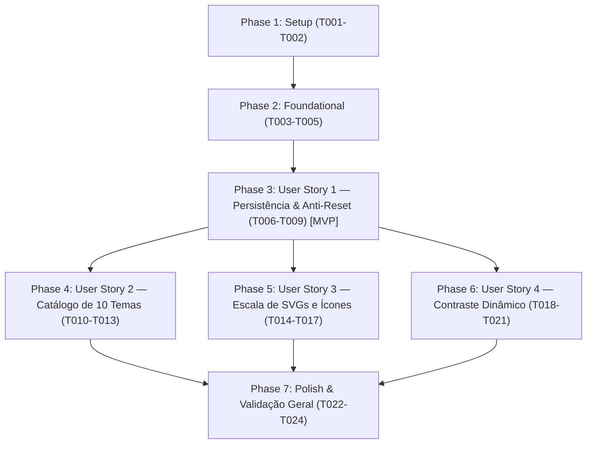

# Tasks: F09.5 — Refatoração de Temas, Persistência e Correções Visuais

**Branch**: `037-refatoracao-temas-visuais`  
**Input**: Design artifacts from `specs/037-refatoracao-temas-visuais/` (`spec.md`, `plan.md`, `data-model.md`, `contracts/`, `research.md`, `quickstart.md`)

---

## Phase 1: Setup (Shared Infrastructure)

**Purpose**: Criação de tipagem compartilhada para os 10 temas canônicos e inicialização da suíte de testes dedicada da Feature 9.5.

- [x] T001 [P] Definir tipos TypeScript para os 10 temas canônicos em caderno-leitura-0.1/frontend/src/appearance.d.ts
- [x] T002 [P] Criar suíte de testes de validação de temas, contratos cromáticos e persistência em caderno-leitura-0.1/frontend/tests/theme_refactor.test.mjs

---

## Phase 2: Foundational (Blocking Prerequisites)

**Purpose**: Infraestrutura básica no frontend (catálogo normalizado, migração automática e paletas de cores CSS) necessária para todas as user stories.

**⚠️ CRITICAL**: Nenhuma implementação de User Story visual pode ser iniciada antes da conclusão desta fase.

- [x] T003 [P] Atualizar caderno-leitura-0.1/frontend/src/appearance-bootstrap.js com o catálogo oficial de 10 temas, mapa de migração automática de temas legados e definição de papel-fosco como tema claro padrão inicial
- [x] T004 [P] Atualizar a paleta base em caderno-leitura-0.1/frontend/src/palettes.css removendo seletores e tokens dos 5 temas obsoletos (porcelana, breu, vinil, sequoia, vespera)
- [x] T005 [P] Implementar tokens CSS completos dos 5 novos temas minimalistas (papel-fosco, noite-suave, cinza-neutro, grafite, monocromatico) em caderno-leitura-0.1/frontend/src/palettes.css

**Checkpoint**: Fundação de dados e tokens de tema pronta — implementação das User Stories pode iniciar.

---

## Phase 3: User Story 1 - Persistência Imediata e Prevenção de Reset no F5 / Navegação (Priority: P1) 🎯 MVP

**Goal**: Garantir que o tema ativo seja lido e aplicado síncronamente antes da renderização e hidratação do Vue, impedindo que o tema reverta ao padrão em recargas (F5) ou perca o estado durante a navegação entre rotas.

**Independent Test**: Definir qualquer tema no aplicativo, recarregar a página com F5 e navegar entre rotas (`/`, `/livro/1`, `/ajustes`); constatar que o tema ativo não pisca, não é sobrescrito por valores genéricos e permanece ininterrupto.

### Tests for User Story 1

- [x] T006 [P] [US1] Adicionar testes automatizados para verificar leitura síncrona no bootstrap, preservação de tema no reload e ausência de reset em caderno-leitura-0.1/frontend/tests/theme_refactor.test.mjs

### Implementation for User Story 1

- [x] T007 [US1] Atualizar caderno-leitura-0.1/frontend/src/main.ts para ler a preferência síncrona de caderno.aparencia.v2 antes de chamar app.mount('#app')
- [x] T008 [US1] Ajustar caderno-leitura-0.1/frontend/src/composables/usePreferences.ts para alinhar theme_mode com o ID nominal do tema e desativar sobrescrita arbitrária de data-theme com valores genéricos
- [x] T009 [US1] Garantir persistência bidirecional unificada em caderno-leitura-0.1/frontend/src/views/SettingsView.vue ao comutar temas

**Checkpoint**: User Story 1 totalmente funcional e testável de forma independente (MVP consolidado).

---

## Phase 4: User Story 2 - Simplificação de Nomenclatura, Exclusão de Temas e Novos Temas (Priority: P2)

**Goal**: Simplificar os nomes dos temas removendo prefixos longos, expurgar completamente os 5 temas obsoletos e disponibilizar os 5 novos temas minimalistas com baixo contraste e conforto ocular.

**Independent Test**: Abrir o seletor de temas nos Ajustes; verificar a exibição exata de 10 opções com nomes simples (Sépia, E-Ink, Solarized, Nord, Cyber, Papel Fosco, Noite Suave, Cinza Neutro, Grafite, Monocromático) e ativar cada um confirmando a paleta aplicada.

### Tests for User Story 2

- [x] T010 [P] [US2] Adicionar testes automatizados para verificar a presença exclusiva dos 10 temas e ausência dos 5 temas excluídos em caderno-leitura-0.1/frontend/tests/theme_refactor.test.mjs

### Implementation for User Story 2

- [x] T011 [P] [US2] Atualizar o seletor de temas em caderno-leitura-0.1/frontend/src/views/SettingsView.vue exibindo os 10 temas com nomes simplificados e agrupamento limpo
- [x] T012 [P] [US2] Purgar menções e seletores dos 5 temas obsoletos em caderno-leitura-0.1/frontend/src/appearance-advanced.css e caderno-leitura-0.1/frontend/src/style.css
- [x] T013 [P] [US2] Atualizar seletores de temas escuros no calendário de calor em caderno-leitura-0.1/frontend/src/components/HeatmapCalendar.vue para incluir noite-suave e grafite

**Checkpoint**: User Stories 1 e 2 funcionais e integradas de forma independente.

---

## Phase 5: User Story 3 - Correção Dimensional e Blindagem de SVGs e Ícones (Priority: P3)

**Goal**: Travar as dimensões físicas de elementos vetoriais SVG e botões para impedir ícones desproporcionais, quebra de linha em textos de botões e deformação de layouts em modais.

**Independent Test**: Abrir a aba de estudos compartilhados, a tela de leitura de um estudo e o modal de exportação; constatar que o ícone do empty state tem no máximo 120px, o botão "Compartilhar" mantém texto em uma linha única e os rádios/checkboxes do modal de exportação estão travados em 24px.

### Tests for User Story 3

- [x] T014 [P] [US3] Adicionar testes de regras CSS e dimensões para o botão Compartilhar, empty state e modal de exportação em caderno-leitura-0.1/frontend/tests/theme_refactor.test.mjs

### Implementation for User Story 3

- [x] T015 [P] [US3] Aplicar contenção dimensional física (max-width: 120px; max-height: 120px; width: 100%; height: auto; margin: 0 auto;) no SVG do estado vazio em caderno-leitura-0.1/frontend/src/components/library/SharedStudiesList.vue
- [x] T016 [P] [US3] Reestruturar o botão .share-action em caderno-leitura-0.1/frontend/src/views/StudyView.vue com display: inline-flex, align-items: center, gap: 8px, white-space: nowrap e ícone fixado em 1.2em
- [x] T017 [P] [US3] Travar os seletores (inputs/radios/checkboxes) em 24x24px com alinhamento flex sem sobreposição em caderno-leitura-0.1/frontend/src/components/ExportModal.vue

**Checkpoint**: User Stories 1, 2 e 3 operando de forma autônoma e combinada.

---

## Phase 6: User Story 4 - Contraste Dinâmico e Legibilidade em Modais, Tags e Acordeões (Priority: P4)

**Goal**: Assegurar legibilidade absoluta e taxa de contraste mínima de 4.5:1 (WCAG AA) em textos de modais, menus suspensos de status e cabeçalhos de agrupamento de estudos.

**Independent Test**: Inspecionar o modal de exportação, o componente StudyStatusBadge e o botão de colapso de grupos sob temas claros e escuros; verificar que nenhum texto ou ícone fica ilegível ou camuflado contra o fundo.

### Tests for User Story 4

- [x] T018 [P] [US4] Adicionar testes automatizados de variáveis de cor e contraste para ExportModal, StudyStatusBadge e GroupSection em caderno-leitura-0.1/frontend/tests/theme_refactor.test.mjs

### Implementation for User Story 4

- [x] T019 [P] [US4] Atualizar caderno-leitura-0.1/frontend/src/components/ExportModal.vue para usar exclusivamente variáveis canônicas do tema ativo (--color-surface, --color-text, --color-muted, --color-border)
- [x] T020 [P] [US4] Calibrar classes dos badges e menu suspenso em caderno-leitura-0.1/frontend/src/components/StudyStatusBadge.vue para contraste adaptativo de texto e fundo em temas claros e escuros
- [x] T021 [P] [US4] Aplicar contraste dinâmico em caderno-leitura-0.1/frontend/src/components/views/GroupSection.vue para .group-toggle-btn, .group-title e .group-chevron-wrap com garantia de contraste em fundos saturados e escuros

**Checkpoint**: Todas as 4 User Stories concluídas e testáveis.

---

## Phase 7: Polish & Validação Geral

**Purpose**: Verificação de acessibilidade, preservação de regras anti-emoji, documentação técnica e aprovação de todas as suítes de testes.

- [x] T022 [P] Validar conformidade contra emojis informais em todos os arquivos modificados via caderno-leitura-0.1/frontend/tests/visual_system.test.mjs
- [x] T023 [P] Atualizar documentação de arquitetura visual em docs/contexto/TEMAS-E-SISTEMA-VISUAL.md e sincronizar com caderno-leitura-0.1/docs/contexto/TEMAS-E-SISTEMA-VISUAL.md
- [x] T024 Executar suíte completa de testes automatizados e compilação (npm test, npm run build, pytest backend/tests) conforme specs/037-refatoracao-temas-visuais/quickstart.md

---

## Dependencies & Execution Order

### Phase Dependencies

### User Story Dependencies

- **User Story 1 (P1 - MVP)**: Inicia imediatamente após a Fase 2 (Foundational). Foco na persistência síncrona sem perda no F5.
- **User Story 2 (P2)**: Depende da infraestrutura de tokens da Fase 2 e consolidação de persistência da US1.
- **User Story 3 (P3)**: Depende dos componentes base; pode ser desenvolvida em paralelo com US2.
- **User Story 4 (P4)**: Depende dos contratos de tokens da Fase 2 e componentes inspecionados da US3.
- **Polish (Final)**: Requer que todas as user stories planejadas estejam concluídas.

---

## Parallel Opportunities

- **Setup**: `T001` (appearance.d.ts) e `T002` (test suite) podem ser criados em paralelo.
- **Foundational**: `T003` (bootstrap) e `T004`/`T005` (palettes.css) podem rodar em paralelo.
- **User Story 1**: `T006` (testes) pode ser escrito antes da implementação. `T007` (main.ts) e `T008` (usePreferences.ts) possuem clara divisão de arquivos.
- **User Stories 2, 3 e 4**: Uma vez concluída a US1, as histórias 2, 3 e 4 possuem independência de arquivos e podem ser executadas em paralelo.

---

## Implementation Strategy

### MVP First (User Story 1 Only)

1. Concluir Fase 1 (Setup) e Fase 2 (Foundational).
2. Concluir Fase 3 (User Story 1 - Persistência Síncrona).
3. **Validar MVP**: Selecionar tema, dar F5 e verificar retenção contínua sem piscar ou resetar.

### Incremental Delivery

1. Setup + Foundational → Catálogo e tokens prontos.
2. US1 → Persistência blindada no F5 e navegação de rotas (MVP!).
3. US2 → 10 temas simplificados com 5 novos minimalistas.
4. US3 → Botão Compartilhar, empty state e modais com ícones perfeitamente contidos.
5. US4 → Contraste dinâmico absoluto em tags, dropdowns e acordeões.
6. Polish → Testes 100% aprovados, sem emojis, build limpo.
