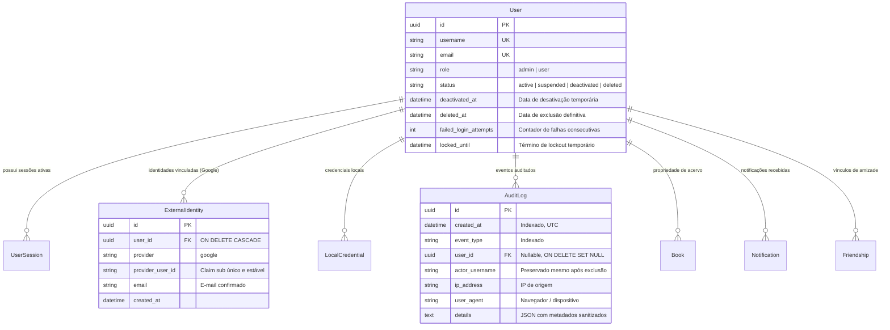
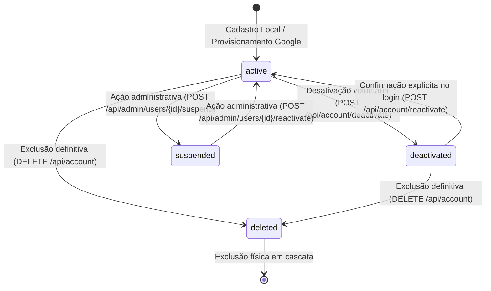

# Data Model: F10 — Segurança, Auditoria, Ciclo de Vida da Conta e Google OAuth

**Feature**: [spec.md](spec.md)  
**Date**: 2026-09-26  
**Status**: Ready  

## 1. Diagrama Entidade-Relacionamento

---

## 2. Especificação das Tabelas e Campos

### Tabela: `audit_logs` (Nova)

| Coluna | Tipo | Nulo | Padrão | Descrição |
|---|---|---|---|---|
| `id` | `CHAR(36)` (UUID) | Não | `gen_random_uuid()` | Chave primária única |
| `created_at` | `DATETIME` | Não | `CURRENT_TIMESTAMP` | Data e hora em UTC |
| `event_type` | `VARCHAR(50)` | Não | — | Tipo de evento estruturado |
| `user_id` | `CHAR(36)` | Sim | `NULL` | FK para `users.id` (nulo em tentativas anônimas ou após exclusão) |
| `actor_username` | `VARCHAR(100)` | Sim | `NULL` | Nome de usuário associado ou informado na requisição |
| `ip_address` | `VARCHAR(45)` | Sim | `NULL` | Endereço IP do cliente (IPv4 ou IPv6) |
| `user_agent` | `VARCHAR(512)` | Sim | `NULL` | Cabeçalho User-Agent |
| `details` | `TEXT` | Sim | `NULL` | JSON serializado com metadados sem segredos |

**Índices**:
- `ix_audit_logs_created_at` (`created_at DESC`): para consultas cronológicas no painel administrativo.
- `ix_audit_logs_event_type` (`event_type`): para filtragem rápida por tipo de evento.
- `ix_audit_logs_user_id` (`user_id`): para rastreabilidade de histórico por usuário.

**Eventos Válidos (`event_type`)**:
- `login_success`: Login local bem-sucedido.
- `login_failed`: Falha de autenticação (credenciais inválidas).
- `login_google_success`: Login via Google OAuth 2.0 / GIS bem-sucedido.
- `login_google_failed`: Falha na verificação de token ou autorização Google.
- `account_created_google`: Nova conta provisionada implicitamente via Google.
- `password_changed`: Senha local alterada pelo usuário.
- `role_changed`: Privilégio de usuário alterado (`USER` $\leftrightarrow$ `ADMIN`).
- `account_deactivated`: Conta desativada temporariamente pelo titular.
- `account_reactivated`: Conta reativada pelo titular.
- `account_deleted`: Conta e acervo excluídos definitivamente.
- `account_exported`: Acervo exportado em arquivo ZIP (LGPD).
- `rate_limit_exceeded`: Bloqueio temporário disparado por excesso de requisições.

---

### Tabela: `users` (Campos Estendidos via Migração Alembic)

| Coluna | Tipo | Nulo | Padrão | Descrição |
|---|---|---|---|---|
| `status` | `VARCHAR(20)` | Não | `'active'` | Status da conta: `active`, `suspended`, `deactivated`, `deleted` |
| `deactivated_at` | `DATETIME` | Sim | `NULL` | Timestamp da última desativação |
| `deleted_at` | `DATETIME` | Sim | `NULL` | Timestamp da exclusão definitiva |
| `failed_login_attempts` | `INTEGER` | Não | `0` | Contador de tentativas de login incorretas consecutivas |
| `locked_until` | `DATETIME` | Sim | `NULL` | Timestamp limite do bloqueio temporário |

---

## 3. Regras de Transição de Estado da Conta

---

## 4. Ordem e Semântica de Exclusão em Cascata (Transação Atômica)

Quando a exclusão definitiva é confirmada via `DELETE /api/account`:
1. `audit_service.log_event("account_deleted", actor_username=user.username, details={"action": "purge_account"})`
2. `DELETE FROM user_sessions WHERE user_id = :user_id`
3. `DELETE FROM external_identities WHERE user_id = :user_id`
4. `DELETE FROM local_credentials WHERE user_id = :user_id`
5. `DELETE FROM notifications WHERE user_id = :user_id OR actor_id = :user_id`
6. `DELETE FROM friendships WHERE user_id = :user_id OR friend_id = :user_id`
7. `DELETE FROM study_shares WHERE user_id = :user_id OR shared_with_id = :user_id`
8. `DELETE FROM study_relations WHERE user_id = :user_id`
9. `DELETE FROM canvas_positions WHERE user_id = :user_id`
10. `DELETE FROM studies WHERE user_id = :user_id`
11. `DELETE FROM chapters WHERE book_id IN (SELECT id FROM books WHERE user_id = :user_id)`
12. `DELETE FROM books WHERE user_id = :user_id`
13. `DELETE FROM categories WHERE user_id = :user_id`
14. `DELETE FROM user_profiles WHERE user_id = :user_id`
15. `DELETE FROM user_preferences WHERE user_id = :user_id`
16. `DELETE FROM users WHERE id = :user_id`
17. Limpeza de eventuais arquivos físicos de imagem de capa em `uploads/covers/` associados aos livros deletados.
18. `COMMIT` transacional; se qualquer etapa falhar, `ROLLBACK` total.
