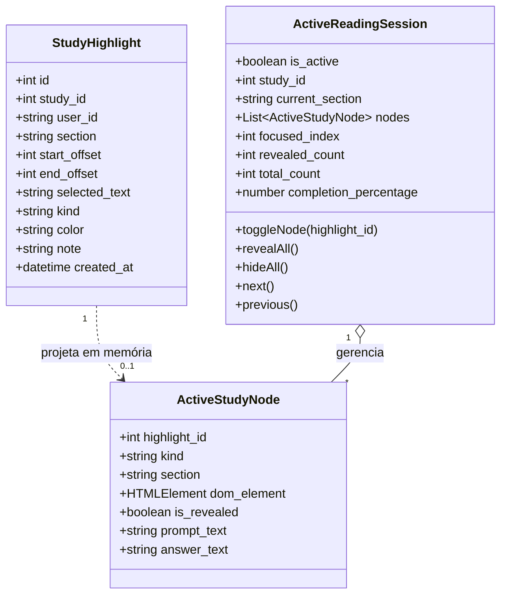
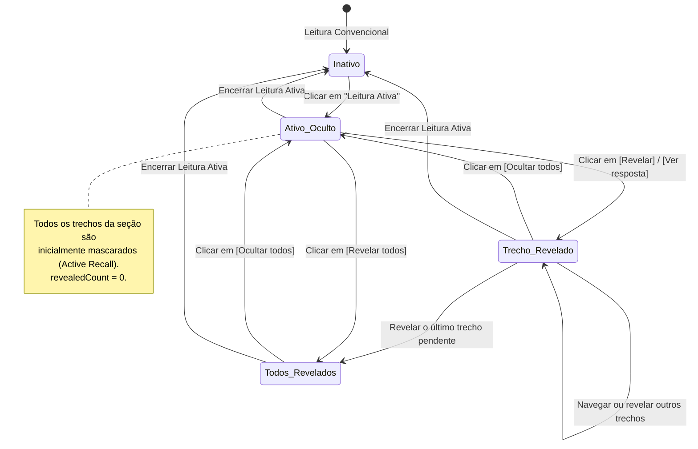

# Data Model: F0.6.3 — Leitura Ativa

**Feature**: [spec.md](spec.md) | **Date**: 2026-09-27

---

## 1. Entidades de Dados e Modelagem Conceitual

A Leitura Ativa opera como uma camada dinâmica sobre o modelo de dados de destaques (`study_highlights`) consolidado na feature F0.6.2, mantendo o estado de treino estritamente efêmero na sessão de leitura do navegador.

---

## 2. Descrição das Entidades

### 2.1. `ActiveStudyNode` (Trecho Interativo na Sessão)

Representação em memória no frontend de cada trecho marcado como oclusão (`hidden`) ou pergunta ativa (`question`) presente no texto renderizado.

| Campo | Tipo | Descrição |
| :--- | :--- | :--- |
| `highlight_id` | `number` | Identificador do destaque persistido no banco de dados. |
| `kind` | `'hidden' \| 'question'` | Tipo de interação de leitura ativa. |
| `section` | `StudySectionKey` | Seção da análise em que o trecho está localizado. |
| `dom_element` | `HTMLElement \| null` | Referência direta ao nó DOM do trecho para rolagem e foco. |
| `is_revealed` | `boolean` | `true` se o conteúdo/resposta está visível; `false` se mascarado. |
| `prompt_text` | `string` | Enunciado da pergunta (quando `kind === 'question'`) ou vazio. |
| `answer_text` | `string` | Texto da resposta ou trecho ocultado original. |

---

### 2.2. `ActiveReadingSession` (Estado da Sessão de Estudo Ativo)

Gerenciado pelo composable `useActiveReadingSession.ts` em tempo de execução.

| Propriedade / Método | Tipo | Descrição |
| :--- | :--- | :--- |
| `isActive` | `Ref<boolean>` | Define se a barra de estudo ativo está exposta na tela. |
| `currentSection` | `Ref<StudySectionKey>` | Seção ativa atual do leitor (`summary`, `explanation`, etc.). |
| `nodes` | `ComputedRef<ActiveStudyNode[]>` | Lista ordenada de trechos interativos da aba ativa. |
| `focusedIndex` | `Ref<number>` | Índice do trecho selecionado na navegação sequencial (-1 se nenhum). |
| `revealedCount` | `ComputedRef<number>` | Contagem de trechos da seção atual que estão com `is_revealed === true`. |
| `totalCount` | `ComputedRef<number>` | Total de trechos interativos presentes na seção ativa. |
| `completionPercentage`| `ComputedRef<number>` | Percentual inteiro de conclusão: `round((revealedCount / totalCount) * 100)`. |
| `toggleNode(id)` | `(id: number) => void` | Inverte o estado de revelação de um trecho específico. |
| `revealAll()` | `() => void` | Revela todos os trechos interativos da seção corrente. |
| `hideAll()` | `() => void` | Mascara todos os trechos interativos da seção corrente. |
| `next()` | `() => void` | Rola e focaliza suavemente o próximo trecho interativo. |
| `previous()` | `() => void` | Rola e focaliza suavemente o trecho interativo anterior. |

---

## 3. Máquina de Estados da Leitura Ativa

---

## 4. Integridade e Preservação de Dados

1. **Zero Mutação no Banco**: Nenhuma operação da sessão altera o modelo `Study` ou `StudyHighlight` no SQLite.
2. **Isolamento por Leitor**: Dois leitores (ou o proprietário e um convidado) navegando simultaneamente possuem sessões totalmente independentes na memória de seus navegadores.
3. **Resiliência a Troca de Abas**: Ao alternar entre as abas do leitor, os nós da nova aba são identificados automaticamente sem redefinir ou corromper a sessão geral.
