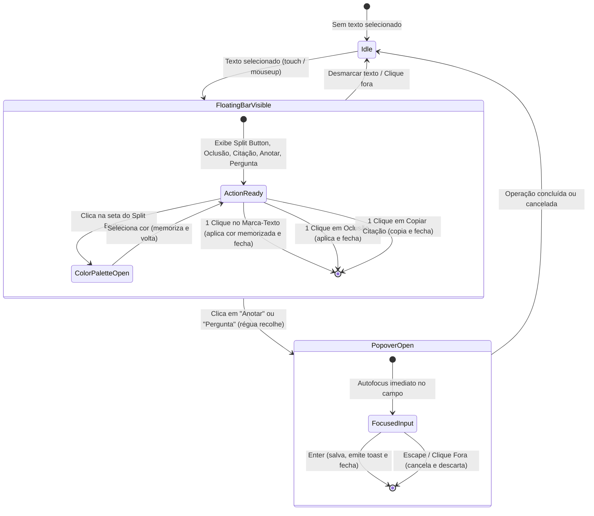

# Data Model: F 0.7.3 — Refatoração Dinâmica da Floating Actions Toolbar

**Feature**: F 0.7.3 — Refatoração Dinâmica da Floating Actions Toolbar  
**Status**: Completed  
**Artifact**: `data-model.md`

---

## 1. Entidades e Tipos TypeScript

### 1.1 Cores de Marca-Texto (`HighlightColor`)
```typescript
export type HighlightColor = 'yellow' | 'green' | 'blue' | 'pink' | 'purple'

export const HIGHLIGHT_COLORS: HighlightColor[] = [
  'yellow',
  'green',
  'blue',
  'pink',
  'purple'
]

export const HIGHLIGHT_COLOR_HEX: Record<HighlightColor, string> = {
  yellow: '#fef08a',
  green: '#bbf7d0',
  blue: '#bae6fd',
  pink: '#fbcfe8',
  purple: '#e9d5ff',
}

export const HIGHLIGHT_COLOR_LABELS: Record<HighlightColor, string> = {
  yellow: 'Amarelo',
  green: 'Verde',
  blue: 'Azul',
  pink: 'Rosa',
  purple: 'Roxo',
}
```

### 1.2 Modo de Operação da Régua Flutuante (`ToolbarMode`)
```typescript
export type ToolbarMode =
  | 'idle'              // Régua visível com ações imediatas
  | 'color_palette'     // Paleta rápida suspensa aberta
  | 'note_popover'      // Régua recolhida; popover de anotação ativo
  | 'question_popover'  // Régua recolhida; popover de pergunta ativo
```

### 1.3 Tipo de Operação do Popover (`PopoverKind`)
```typescript
export type PopoverKind = 'note' | 'question'
```

### 1.4 Coordenadas Geométricas e Ancoragem (`PopoverPosition`)
```typescript
export interface PopoverPosition {
  top: number
  left: number
  placement: 'top' | 'bottom'
  isMobile: boolean
  visualViewportOffsetBottom?: number
}
```

### 1.5 Contexto da Seleção de Texto (`SelectionContext`)
```typescript
export interface SelectionContext {
  section: StudySectionKey
  start_offset: number
  end_offset: number
  selected_text: string
  prefix: string
  suffix: string
}
```

---

## 2. Máquina de Estados da Interação de Seleção



---

## 3. Regras de Validação e Persistência

1. **Persistência de Cor (`localStorage`):**
   - Chave canônica: `caderno_last_highlight_color`.
   - Se o valor armazenado for inválido ou nulo, o fallback é estritamente `'yellow'`.
   - Ao selecionar uma nova cor via paleta rápida, o valor é gravado de forma síncrona no `localStorage`.
2. **Validação de Texto em Anotação/Pergunta:**
   - Texto vazio ou com apenas espaços em branco desabilita o botão de confirmação.
   - Pressionar `Enter` com campo vazio não dispara submissão de anotação vazia.
   - Comprimento máximo seguro: 5.000 caracteres.
