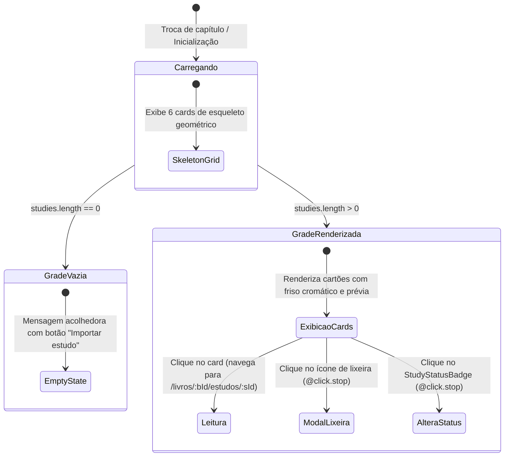

# Data Model: F 0.7.4 — Redesenho da Grid View: Reconhecimento Visual e Cartografia de Leitura

**Feature**: F 0.7.4 — Redesenho da Grid View  
**Status**: Completed  
**Artifact**: `data-model.md`

---

## 1. Extensões de Esquema (Backend Pydantic & SQLAlchemy)

### 1.1 Modelo `StudySummary` (`backend/app/schemas/study.py`)

O modelo de retorno de estudos de um capítulo/livro é estendido com métricas agregadas leves e a prévia do resumo:

```python
class StudySummary(OutputModel):
    id: int
    chapter_id: int
    title: str
    location: str
    parent_study_id: int | None = None
    position: int = 0
    reading_status: str = "rascunho"
    version: int = 1
    created_at: datetime
    updated_at: datetime
    deleted_at: datetime | None = None
    book_id: int | None = None
    visibility: str = "inherit"
    effective_visibility: str = "private"
    can_edit: bool = True
    owner: ResourceOwnerSummary | None = None

    # Novos campos agregados (F 0.7.4)
    summary_preview: str = Field(
        default="",
        description="Prévia tipográfica do resumo (ou da explicação como fallback), truncada em até 240 caracteres."
    )
    highlights_count: int = Field(
        default=0,
        description="Quantidade total de trechos destacados ou anotados no estudo."
    )
    relations_count: int = Field(
        default=0,
        description="Quantidade total de relações semânticas ativas (de saída ou de entrada)."
    )
```

---

## 2. Tipos TypeScript (`frontend/src/types.ts`)

```typescript
export interface StudySummary {
  id: number
  chapter_id: number
  title: string
  location: string
  parent_study_id?: number | null
  position?: number
  reading_status?: ReadingStatus
  created_at: string
  updated_at: string
  deleted_at?: string | null
  version?: number
  book_id?: number | null
  visibility?: 'inherit' | 'private' | 'friends' | 'custom' | 'public'
  effective_visibility?: 'inherit' | 'private' | 'friends' | 'custom' | 'public'
  can_edit?: boolean

  // Campos analíticos estendidos (F 0.7.4)
  summary_preview?: string
  highlights_count?: number
  relations_count?: number
}
```

---

## 3. Mapeamento Cromático e Semântico dos Cartões

| Status | Rótulo Canônico | Cor da Borda Lateral (Friso) | Fundo Suave no Badge |
|---|---|---|---|
| `rascunho` | Rascunho | `#a1a1aa` (Cinza Neutro) | `rgba(161, 161, 170, 0.12)` |
| `em_andamento` | Em Andamento | `#f59e0b` (Âmbar) | `rgba(245, 158, 11, 0.12)` |
| `revisado` | Revisado | `#3b82f6` (Azul Sereno) | `rgba(59, 130, 246, 0.12)` |
| `concluido` | Concluído | `#10b981` (Esmeralda) | `rgba(16, 185, 129, 0.12)` |

---

## 4. Máquina de Estados da Visualização em Grade


