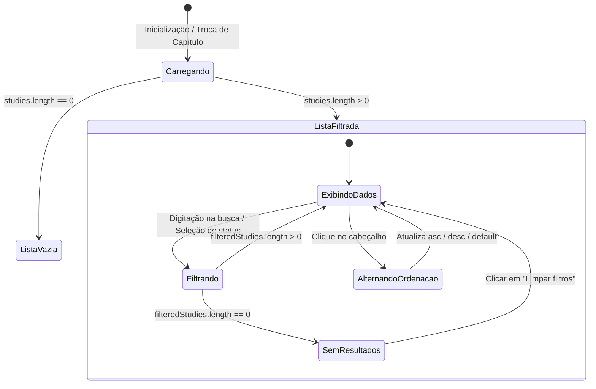

# Data Model: F 0.7.5 — Redesenho da List View: Busca Rápida, Filtragem e Comparação Analítica

**Feature**: F 0.7.5 — Redesenho da List View  
**Status**: Completed  
**Artifact**: `data-model.md`

---

## 1. Extensões no Esquema Pydantic (`backend/app/schemas/study.py`)

O modelo `StudySummary` é estendido com flags booleanas de presença de conteúdo analítico:

```python
class StudySummary(OutputModel):
    id: int
    chapter_id: int
    title: str
    location: str
    parent_study_id: int | None = None
    position: int = 0
    reading_status: str = "rascunho"
    version: int = 1
    created_at: datetime
    updated_at: datetime
    deleted_at: datetime | None = None
    book_id: int | None = None
    visibility: str = "inherit"
    effective_visibility: str = "private"
    can_edit: bool = True
    owner: ResourceOwnerSummary | None = None
    summary_preview: str = Field(default="")
    highlights_count: int = Field(default=0)
    relations_count: int = Field(default=0)

    # Flags booleanas de completude analítica (F 0.7.5)
    has_summary: bool = Field(
        default=False,
        description="Indica se o estudo possui resumo analítico preenchido."
    )
    has_explanation: bool = Field(
        default=False,
        description="Indica se o estudo possui explicação detalhada preenchida."
    )
    has_concepts: bool = Field(
        default=False,
        description="Indica se o estudo possui conceitos-chave preenchidos."
    )
    has_references: bool = Field(
        default=False,
        description="Indica se o estudo possui referências ou fontes preenchidas."
    )
```

---

## 2. Tipagens no Frontend TypeScript (`frontend/src/types.ts`)

```typescript
export interface StudySummary {
  id: number
  chapter_id: number
  title: string
  location: string
  parent_study_id?: number | null
  position?: number
  reading_status?: ReadingStatus
  created_at: string
  updated_at: string
  deleted_at?: string | null
  version?: number
  book_id?: number | null
  visibility?: 'inherit' | 'private' | 'friends' | 'custom' | 'public'
  effective_visibility?: 'inherit' | 'private' | 'friends' | 'custom' | 'public'
  can_edit?: boolean
  owner?: { id: string; username: string; display_name: string; avatar_url?: string | null } | null
  summary_preview?: string
  highlights_count?: number
  relations_count?: number

  // Flags analíticas de completude (F 0.7.5)
  has_summary?: boolean
  has_explanation?: boolean
  has_concepts?: boolean
  has_references?: boolean
}
```

---

## 3. Estado de Filtros e Ordenação (`frontend/src/composables/useStudyListFilters.ts`)

```typescript
export type SortColumn = 'natural' | 'title' | 'status' | 'date'
export type SortDirection = 'asc' | 'desc' | 'default'

export interface StudyListFilterState {
  searchQuery: string
  statusFilter: ReadingStatus | 'all'
  sortColumn: SortColumn
  sortDirection: SortDirection
}

export interface StoredListSortPreference {
  column: SortColumn
  direction: SortDirection
}
```

---

## 4. Máquina de Estados da List View


