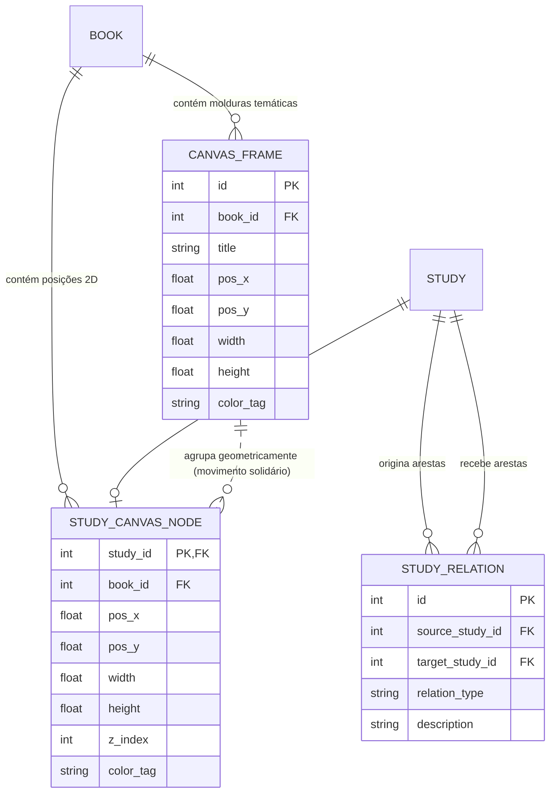
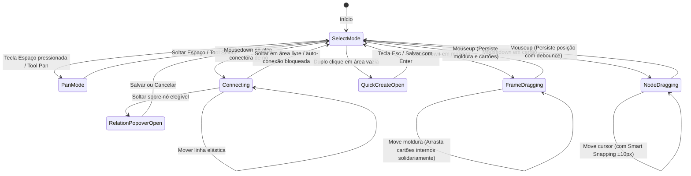

# Data Model: F 0.7.8 — Redesenho do Canvas: Espaço Livre de Pensamento e Criação Espacial

**Feature**: F 0.7.8 — Redesenho do Canvas  
**Date**: 2026-10-04  
**Status**: Completed  

---

## 1. Entidades de Domínio e Modelo Espacial

### `CanvasCard` (Cartão Espacial de Estudo)
Representa a projeção bidimensional cartesiana de um estudo na mesa espacial do Canvas.

- **Campos**:
  - `study_id` (`number`, chave primária / FK para `studies.id`): Identificador do estudo representado.
  - `book_id` (`number`, FK para `books.id`): Livro ao qual o nó pertence.
  - `pos_x` (`number`, float/int): Posição horizontal no espaço de mundo virtual (px).
  - `pos_y` (`number`, float/int): Posição vertical no espaço de mundo virtual (px).
  - `width` (`number`, opcional, default: 280): Largura do cartão (px).
  - `height` (`number`, opcional, default: 200): Altura do cartão (px).
  - `z_index` (`number`, default: 1): Ordem de empilhamento de camadas no plano cartesiano.
  - `color_tag` (`string | null`): Cor de destaque temático opcional.
  - `updated_at` (`string`, ISO 8601): Registro temporal da última movimentação.
- **Validação**:
  - `pos_x` e `pos_y` devem ser números finitos válidos.
  - `width >= 180` e `height >= 120`.

---

### `CanvasFrame` (Moldura Temática Delimitadora)
Representa um agrupamento retangular temático no fundo do Canvas que delimita e organiza visualmente áreas de raciocínio.

- **Campos**:
  - `id` (`number`, chave primária): Identificador da moldura.
  - `book_id` (`number`, FK para `books.id`): Livro ao qual a moldura está associada.
  - `title` (`string`, default: "Nova Moldura"): Nome descritivo da área temática.
  - `pos_x` (`number`): Posição horizontal do canto superior esquerdo no mundo virtual (px).
  - `pos_y` (`number`): Posição vertical do canto superior esquerdo no mundo virtual (px).
  - `width` (`number`, default: 600): Largura da moldura (px).
  - `height` (`number`, default: 400): Altura da moldura (px).
  - `color_tag` (`string`, default: "blue"): Paleta de cor da borda e fundo translúcido (ex.: "blue", "green", "purple", "amber", "red", "neutral").
  - `z_index` (`number`, default: 0): Molduras permanecem no plano de fundo (abaixo dos cartões).
- **Validação**:
  - `width >= 160` e `height >= 100` (limites mínimos para evitar inversão ou colapso).
  - `title` não pode ser vazio (máximo de 80 caracteres).

---

### `CanvasEdge` (Aresta Direcionada entre Cartões)
Representa a conexão visual direcionada entre dois cartões de estudo no Canvas, integrada ao subsistema de relações semânticas.

- **Campos**:
  - `id` (`number`, chave primária / FK para `study_relations.id`): Identificador da relação.
  - `source_study_id` (`number`, FK): Estudo de origem do argumento.
  - `target_study_id` (`number`, FK): Estudo de destino do argumento.
  - `relation_type` (`string`): Tipo canônico da relação (`depende_de`, `desdobramento_de`, `contradiz`, `complementa`, `mesmo_tema`, `relacionado_com`).
  - `description` (`string | null`): Justificativa conceitual do vínculo.
  - `is_semantic` (`boolean`, default: true): Indica integração com a base conceitual de estudos.
  - `path` (`string`): Traçado vetorial SVG (Curva Bézier cúbica ou quadrática calculada).
  - `badge_x` e `badge_y` (`number`): Posição cartesiana calculada para o rótulo da aresta.

---

### `CanvasViewportState` (Estado da Câmera 2D)
Representa as transformações de translação e escala do viewport no navegador.

- **Campos**:
  - `pan_x` (`number`, default: 0): Deslocamento horizontal da câmera (px).
  - `pan_y` (`number`, default: 0): Deslocamento vertical da câmera (px).
  - `zoom_level` (`number`, default: 1.0): Nível de ampliação escalar ($0.25 \le \text{zoom} \le 2.5$).
- **Ciclo de Vida e Persistência**:
  - Armazenado temporariamente no `localStorage` por `book_id` para preservar a visualização entre sessões de leitura.

---

### `SmartGuide` (Guia Magnética Transitória)
Estrutura efêmera em memória para projeção de linhas de alinhamento magnético.

- **Campos**:
  - `type` (`'horizontal' | 'vertical'`): Orientação da linha guia.
  - `coordinate` (`number`): Coordenada espacial no eixo alinhado (px).
  - `start` (`number`): Início do segmento visual.
  - `end` (`number`): Fim do segmento visual.
  - `snapped_node_id` (`number`): Nó de referência que causou o snap.

---

## 2. Diagrama de Relacionamento de Entidades

---

## 3. Máquina de Estados da Interação no Canvas

---
