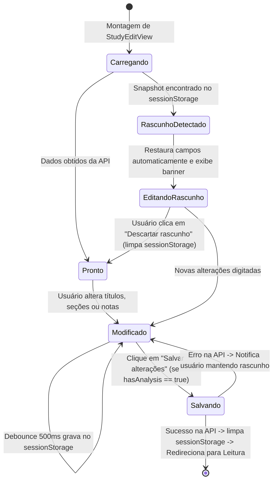
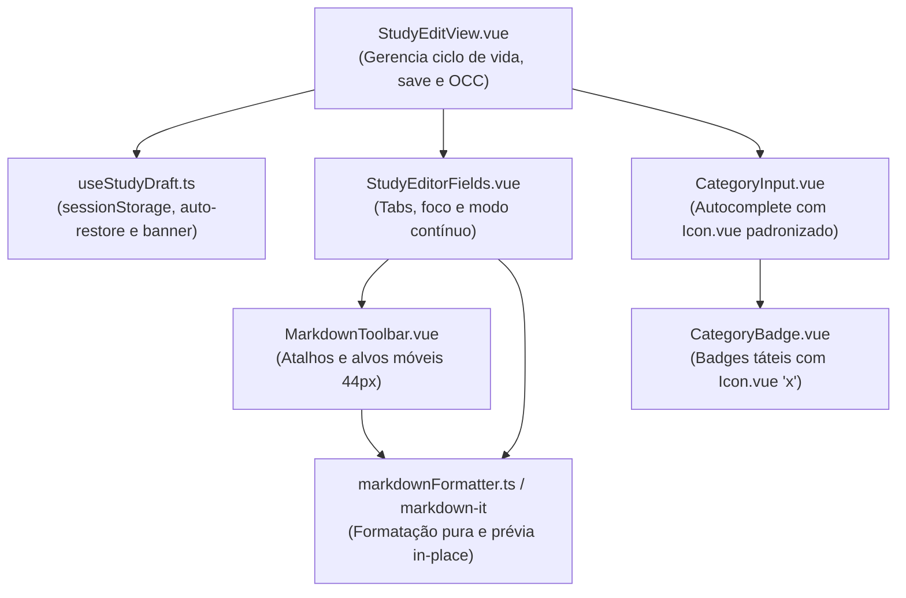

# Data Model: F 0.7.9 — Refinamento do Editor de Estudos e Correção de Ícones de Categorias

**Feature**: F 0.7.9 — Refinamento do Editor de Estudos  
**Branch**: `058-refinamento-editor`  
**Date**: 2026-10-04  

---

## Entidades e Modelos de Estado

### 1. Entidade: `StudyEditorDraft` (Armazenamento Volátil em Sessão)

Representa o snapshot de segurança mantido em `sessionStorage` (`caderno_draft_study_<id>`) durante a digitação:

| Campo | Tipo | Descrição | Regras de Validação |
|---|---|---|---|
| `studyId` | `number` | ID do estudo associado | Obrigatório, inteiro positivo |
| `title` | `string` | Título do estudo digitado | Máximo 200 caracteres |
| `location` | `string` | Localização no livro (página/parágrafo) | Opcional |
| `sections` | `AnalysisSections` | Conteúdo das 4 seções analíticas | Objeto contendo `summary`, `explanation`, `concepts`, `references` |
| `notes` | `string` | Anotações e reflexões livres do leitor | Opcional |
| `savedAt` | `number` | Timestamp Epoch em ms do rascunho | Obrigatório para comparação temporal |

---

### 2. Entidade: `EditorSectionTab` (Modelo de Navegação e Foco)

Representa o estado de cada aba no cabeçalho de navegação por seções:

| Campo | Tipo | Descrição |
|---|---|---|
| `key` | `'summary' \| 'explanation' \| 'concepts' \| 'references' \| 'notes'` | Identificador da seção |
| `label` | `string` | Rótulo canônico em português (ex.: 'Resumo', 'Conceitos') |
| `hasContent` | `boolean` | Flag indicando se a seção já possui texto preenchido |
| `isPreviewing` | `boolean` | Flag booleana indicando se a prévia Markdown está ativa para a seção |

---

### 3. Máquina de Estados da Sessão de Edição e Rascunho

---

## Diagrama de Relacionamento de Componentes

