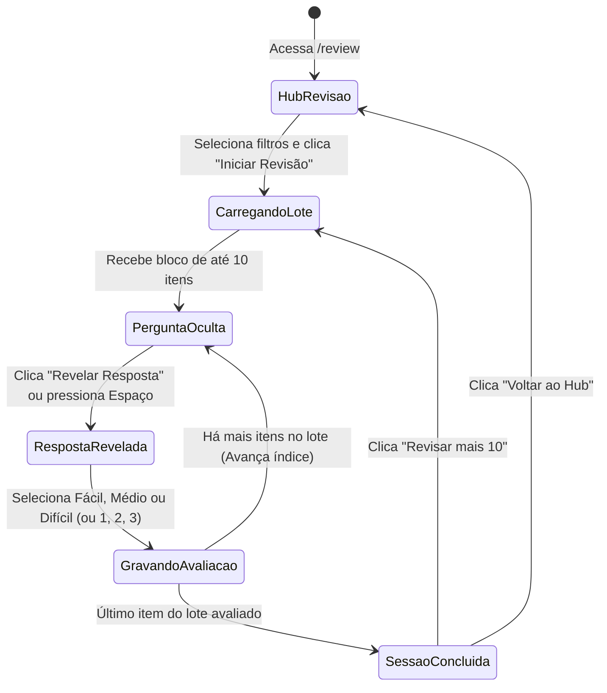

# Data Model: F 0.7.10 — Central de Revisão de Perguntas e Clozes

**Feature**: F 0.7.10 — Central de Revisão de Perguntas e Clozes  
**Branch**: `059-central-de-revisao`  
**Date**: 2026-10-04  

---

## 1. Modelo de Persistência (Extensão de `study_highlights`)

A tabela existente `study_highlights` é estendida com 3 novas colunas leves e um índice otimizado para as consultas do Hub de Revisão:

| Coluna | Tipo SQLite / SQLAlchemy | Nullable | Padrão | Descrição |
|---|---|---|---|---|
| `last_reviewed_at` | `DATETIME` (`UTCDateTime`) | Sim | `NULL` | Timestamp UTC do momento da última avaliação pelo leitor |
| `review_count` | `INTEGER` | Não | `0` | Número cumulativo de vezes que o item foi exercitado |
| `last_rating` | `VARCHAR(20)` | Sim | `NULL` | Última classificação atribuída (`easy`, `medium`, `hard`) |

### Índices e Restrições Adicionais
- **Constraint de Avaliação**: `CheckConstraint("last_rating IS NULL OR last_rating IN ('easy', 'medium', 'hard')", name="chk_highlight_last_rating")`
- **Índice Composto**: `Index("ix_study_highlights_review", "user_id", "kind", "last_reviewed_at")`

---

## 2. Entidades de Transferência e API (Schemas Pydantic)

### 2.1. `ReviewItemRead` (Card para o Frontend)
Representa um item individual carregado para a sessão de revisão:

```python
class ReviewItemRead(BaseModel):
    id: int                     # ID do highlight
    study_id: int               # ID do estudo de origem
    study_title: str            # Título do estudo
    book_id: int                # ID do livro
    book_title: str             # Título do livro
    chapter_id: int             # ID do capítulo
    chapter_name: str           # Nome do capítulo
    kind: str                   # 'question' | 'hidden'
    section: str                # 'summary' | 'explanation' | 'concepts' | 'references'
    
    # Conteúdo cognitivo
    question_text: str          # Se kind=='question': note; Se kind=='hidden': frase com [...]
    expected_answer: str        # Resposta revelada (selected_text)
    context_prefix: str         # Trecho anterior imediato
    context_suffix: str         # Trecho posterior imediato
    
    # Histórico de revisão
    last_reviewed_at: datetime | None
    review_count: int
    last_rating: str | None     # 'easy' | 'medium' | 'hard'
```

### 2.2. `ReviewRecordRequest` (Registro de Avaliação)
Payload enviado ao concluir a reflexão de um card:

```python
class ReviewRecordRequest(BaseModel):
    rating: Literal["easy", "medium", "hard"]
```

### 2.3. `ReviewStatsResponse` (Painel do Hub de Revisão)
Estatísticas agregadas de disponibilidade para o leitor:

```python
class ReviewStatsResponse(BaseModel):
    total_eligible: int         # Total de itens interativos ativos
    total_questions: int        # Total de perguntas
    total_hidden: int           # Total de clozes/termos ocultos
    reviewed_today: int         # Itens já revisados hoje
    pending_review: int         # Itens prioritários aguardando revisão
    books: list[ReviewBookItem] # Livros com contagens para filtro rápido
```

---

## 3. Máquina de Estados da Sessão de Revisão



---

## 4. Heurística de Priorização no Banco de Dados

A consulta SQL executada pelo serviço de revisão ordena os itens da seguinte forma:

```sql
SELECT sh.*, s.title AS study_title, b.id AS book_id, b.title AS book_title, c.id AS chapter_id, c.name AS chapter_name
FROM study_highlights sh
JOIN studies s ON sh.study_id = s.id
JOIN chapters c ON s.chapter_id = c.id
JOIN books b ON c.book_id = b.id
WHERE sh.user_id = :user_id
  AND sh.kind IN ('hidden', 'question')
  AND s.deleted_at IS NULL
  AND b.deleted_at IS NULL
ORDER BY
  -- Prioridade 1: Itens que nunca foram revisados
  CASE WHEN sh.last_reviewed_at IS NULL THEN 0 ELSE 1 END ASC,
  -- Prioridade 2: Itens classificados como difíceis
  CASE WHEN sh.last_rating = 'hard' THEN 0 ELSE 1 END ASC,
  -- Prioridade 3: Mais antigos na fila de revisão
  sh.last_reviewed_at ASC,
  sh.id ASC
LIMIT :limit;
```
