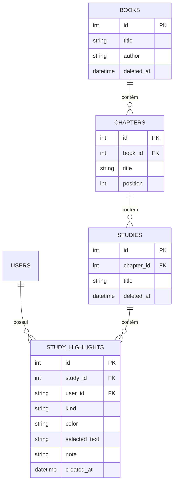

# Data Model: F0.7.11 — Biblioteca Transversal de Highlights e Anotações

**Feature**: [spec.md](spec.md) | **Branch**: `060-biblioteca-highlights-anotacoes` | **Date**: 2026-10-06

Este documento define as entidades de dados, esquemas de entrada e saída, relacionamentos relacionais e migração de suporte para a Biblioteca Transversal de Highlights e Anotações.

---

## 1. Modelo Relacional e Entidades

A feature opera sobre os dados existentes na tabela `study_highlights`, enriquecendo os resultados com metadados das tabelas `studies`, `chapters` e `books`.

### Tabela Existente: `study_highlights`
- `id`: `Integer` (PK, autoincrement)
- `study_id`: `Integer` (FK -> `studies.id`, ON DELETE CASCADE)
- `user_id`: `String(36)` (FK -> `users.id`, ON DELETE CASCADE)
- `section`: `String(30)` ('summary', 'explanation', 'concepts', 'references', 'source_response')
- `start_offset`: `Integer`
- `end_offset`: `Integer`
- `selected_text`: `Text`
- `prefix`: `String(150)`
- `suffix`: `String(150)`
- `color`: `String(30)` ('yellow', 'green', 'blue', 'pink', 'purple')
- `kind`: `String(30)` ('highlight', 'note', 'quote', 'hidden', 'question')
- `note`: `Text`
- `last_reviewed_at`: `UTCDateTime` (nullable)
- `review_count`: `Integer`
- `last_rating`: `String(20)` (nullable)
- `created_at`: `UTCDateTime`
- `updated_at`: `UTCDateTime`

### Relacionamentos de Junção na Consulta


---

## 2. Nova Migração Alembic (Índice de Consulta Transversal)

Para assegurar consultas de alta performance com filtragem combinada de usuário, tipo e cor:
- **Nome da Migração**: `0025_add_highlight_library_index.py`
- **Operação**:
  ```python
  op.create_index(
      "ix_study_highlights_user_kind_color",
      "study_highlights",
      ["user_id", "kind", "color"],
  )
  ```

---

## 3. Esquemas Pydantic (Backend)

Localização: `backend/app/schemas/study_highlight.py`

### 3.1. Item da Biblioteca: `HighlightLibraryItemRead`
```python
class HighlightLibraryItemRead(BaseModel):
    id: int
    study_id: int
    study_title: str
    chapter_id: int
    chapter_title: str
    book_id: int
    book_title: str
    book_author: str | None = None
    section: str
    start_offset: int
    end_offset: int
    selected_text: str
    prefix: str = ""
    suffix: str = ""
    color: str
    kind: str
    note: str = ""
    created_at: datetime
    updated_at: datetime

    model_config = ConfigDict(from_attributes=True)
```

### 3.2. Resposta Paginada da Biblioteca: `HighlightLibraryResponse`
```python
class HighlightLibraryFilterOption(BaseModel):
    id: int
    title: str
    count: int

class HighlightLibrarySummary(BaseModel):
    total_highlights: int
    total_notes: int
    total_quotes: int
    total_hidden: int
    total_questions: int

class HighlightLibraryResponse(BaseModel):
    items: list[HighlightLibraryItemRead]
    total: int
    page: int
    per_page: int
    pages: int
    has_next: bool
    has_prev: bool
    available_books: list[HighlightLibraryFilterOption]
    summary: HighlightLibrarySummary
```

---

## 4. Tipos TypeScript (Frontend)

Localização: `frontend/src/types.ts`

```typescript
export type HighlightViewMode = 'recent' | 'by_book'

export interface HighlightLibraryItem {
  id: number
  study_id: number
  study_title: string
  chapter_id: number
  chapter_title: string
  book_id: number
  book_title: string
  book_author?: string | null
  section: string
  start_offset: number
  end_offset: number
  selected_text: string
  prefix: string
  suffix: string
  color: HighlightColor
  kind: HighlightKind
  note: string
  created_at: string
  updated_at: string
}

export interface HighlightLibraryFilterOption {
  id: number
  title: string
  count: number
}

export interface HighlightLibrarySummary {
  total_highlights: number
  total_notes: number
  total_quotes: number
  total_hidden: number
  total_questions: number
}

export interface HighlightLibraryResponse {
  items: HighlightLibraryItem[]
  total: number
  page: number
  per_page: number
  pages: number
  has_next: boolean
  has_prev: boolean
  available_books: HighlightLibraryFilterOption[]
  summary: HighlightLibrarySummary
}

export interface HighlightLibraryQuery {
  q?: string
  book_id?: number | null
  chapter_id?: number | null
  kind?: HighlightKind | null
  color?: HighlightColor | null
  view_mode?: HighlightViewMode
  page?: number
  per_page?: number
}
```
